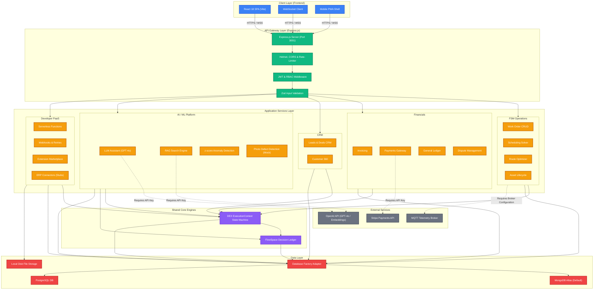

# Guardian Flow — Architecture Document

**Version:** 7.0 | **Last Updated:** April 2026  
**Status:** Accurate as of branch `copilot/sprint-29-through-52`

---

## 1. Overview

Guardian Flow is a multi-tenant enterprise field service management platform with PaaS capabilities. The core stack is:

- **Frontend:** React 18 SPA (Vite 5), TypeScript, Tailwind CSS, shadcn/ui, React Router 6
- **Backend:** Node.js 20+, Express.js 4, MongoDB (default) or PostgreSQL
- **Auth:** JWT (jsonwebtoken), bcryptjs, RBAC middleware
- **Real-time:** WebSocket (`ws` library, JWT-authenticated)

---

## 2. High-Level Architecture



---

## 3. Frontend Architecture

### 3.1 Domain Structure (15 domains)

```
src/
├── App.tsx                    # Route definitions (~120 routes)
├── domains/
│   ├── auth/                  # JWT auth, RBAC, MFA, 8 role variants
│   ├── workOrders/            # Work orders, service orders, dispatch, scheduler
│   ├── tickets/               # Ticket lifecycle
│   ├── financial/             # Invoices, payments, GL, AR, penalties
│   ├── analytics/             # BI, forecasting, anomaly detection, platform metrics
│   ├── fraud/                 # Fraud investigation, forgery detection, compliance
│   ├── inventory/             # Equipment, stock, procurement
│   ├── customers/             # Customer + partner portals, customer360
│   ├── knowledge/             # Knowledge base, FAQ, RAG engine
│   ├── marketplace/           # Extension marketplace
│   ├── training/              # Training platform
│   ├── crm/                   # Accounts, contacts, leads, deals, pipeline
│   ├── org/                   # Organisation Management Console (MAC)
│   ├── dex/                   # DEX ExecutionContext UI
│   ├── flowspace/             # FlowSpace decision ledger UI
│   └── shared/                # AppLayout, Dashboard, AdminConsole, cross-cutting
├── components/ui/             # shadcn/ui (40+ components)
├── styles/tokens.css          # --gf-* design tokens (dark mode via .dark / [data-theme="dark"])
└── i18n/                      # i18n scaffold — English only, no translations built yet
```

### 3.2 State Management

| Layer | Tool |
|-------|------|
| Server state / caching | TanStack Query v5 |
| Form state | React Hook Form + Zod |
| Auth context | React Context (`AuthContext`, `RBACContext`) |
| Theme | next-themes + `useTheme` hook |

### 3.3 Key UI Libraries

| Library | Use |
|---------|-----|
| shadcn/ui + Radix UI | Component primitives |
| Tailwind CSS | Utility styling |
| Recharts | Charts and analytics |
| dnd-kit | Drag-and-drop (CRM pipeline, scheduler) |
| Lucide React | Icons |
| jsPDF | PDF generation |
| react-day-picker | Date selection |

---

## 4. Backend Architecture

### 4.1 Express.js Server (`server/server.js`)

All routes follow this middleware chain:
```
correlationId → metrics → helmet → cors → express.json
  → rate-limit → jwt-auth (protected routes) → route handler
```

### 4.2 Database Abstraction (`server/db/`)

```
server/db/
├── interface.js       # DbAdapter contract (interface definition)
├── factory.js         # getAdapter() singleton — reads DB_ADAPTER env var
└── adapters/
    ├── mongodb.js     # Default — MongoDB native driver
    └── postgresql.js  # Alternate — pg library
```

All routes use `getAdapter()` and call the abstract interface. Switching `DB_ADAPTER=postgresql` in the environment fully redirects all queries.

### 4.3 AI / ML Services (`server/services/ai/`)

> **Important:** All AI features default to mock mode. Real mode activates with `OPENAI_API_KEY` + `AI_PROVIDER=openai`.

| Service | File | Real Mode | Mock Mode |
|---------|------|-----------|-----------|
| LLM (chat, completion) | `llm.js` | GPT-4o via OpenAI API | Keyword-match response generator |
| Embeddings | `embeddings.js` | OpenAI `text-embedding-3-small` | Zero vectors → poor search quality |
| RAG engine | `rag.js` | Cosine similarity on stored chunk embeddings | Returns empty / low-quality results |
| Anomaly detection | `anomaly.js` | **Always real** — z-score statistical analysis | N/A |
| Vision / CV | `vision.js` | **Always mock** — `Math.random()` defect generator | N/A |
| Governance | `governance.js` | Logs all LLM decisions to `ai_governance_logs` | |
| Prompts | `prompts.js` | System + user prompt templates | |

### 4.4 Platform Services (`server/services/`)

| Service | File | Status |
|---------|------|--------|
| FlowSpace decision ledger | `flowspace.js` | ✅ Production-ready |
| Scheduler (constraint solver) | `scheduler.js` | ✅ Greedy; Euclidean distance |
| Route optimiser | `routeOptimizer.js` | ✅ Nearest-neighbour TSP; haversine, not Google Maps |
| MQTT broker | `mqttBroker.js` | 🔲 Stub — activates with `MQTT_BROKER_URL` |
| Analytics | `analytics.js` | ✅ `trackEvent()` + `flushHourlyAggregate()` |
| PM Scheduler | `pmScheduler.js` | 🔧 Preventive maintenance scheduling |
| SLA Monitor | `slaMonitor.js` | ✅ |
| Anomaly (stats) | `ai/anomaly.js` | ✅ z-score on work orders + financials |
| ERP connectors | `connectors/` | 🔲 **Stubs** — SAP, Salesforce, QuickBooks log-only |

### 4.5 ERP Connector Stubs

The `server/services/connectors/` directory contains:
- `sap.js` — SAPConnector: configured but all `sync()` calls log rather than hitting SAP RFC/OData APIs
- `salesforce.js` — SalesforceConnector: stub
- `quickbooks.js` — QuickBooksConnector: stub

The route framework (`/api/connectors`) is fully built and tenant-scoped. The connectors themselves need real API client implementations.

---

## 5. Platform-Specific Services

### 5.1 FlowSpace Decision Ledger

```
server/services/flowspace.js

Exports:
  writeDecisionRecord(record)     — append-only write
  listDecisionRecords(tenantId)   — tenant-scoped list
  getDecisionRecord(id, tenantId) — single record fetch
  getDecisionLineage(entityId)    — lineage trace

Required fields: tenantId, domain, actorType, actorId, action
Records are immutable once written.
Collection: decision_records
```

FlowSpace is called from AI routes (every LLM decision), DEX transitions, and agentic actions.

### 5.2 DEX ExecutionContext State Machine

```
server/routes/dex.js  ·  API: /api/dex/contexts

Stage transitions:
  created → assigned → in_progress → pending_review → completed → closed
  created → failed (terminal)
  created → cancelled (terminal)
```

### 5.3 Org Management Console (MAC)

- Backend: `server/routes/org.js` at `/api/org`
- Frontend: `src/domains/org/pages/OrgManagementConsole.tsx` at `/org-console`
- Accessible to: `sys_admin`, `tenant_admin`

---

## 6. Authentication & RBAC

```
JWT Flow:
  POST /api/auth/login → returns { token, user, roles, permissions, tenant_id }
  All protected routes: Authorization: Bearer <token>
  Token validated by authenticateToken middleware
  Roles/permissions fetched from: user_roles, role_permissions collections

Roles: sys_admin, tenant_admin, ops_manager, dispatcher, technician,
       finance_manager, fraud_investigator, support_agent, partner_admin,
       ml_ops, customer

Tenant isolation:
  Every query includes { tenant_id: req.user.tenantId }
  sys_admin can cross tenants; all other roles are hard-scoped
```

---

## 7. Data Model (Key Collections)

| Collection | Purpose |
|------------|---------|
| `profiles` | User profiles with tenant_id |
| `user_roles` | User → role mapping (with tenant context) |
| `role_permissions` | Role → permission mapping |
| `work_orders` | Work order lifecycle |
| `tickets` | Support tickets |
| `service_orders` | Generated service orders |
| `invoices` | Invoice records |
| `ledger_entries` | Double-entry bookkeeping |
| `audit_logs` | 7-year immutable audit trail |
| `decision_records` | FlowSpace append-only decision ledger |
| `dex_contexts` | DEX ExecutionContext state machine instances |
| `knowledge_base_articles` | KB content |
| `knowledge_base_chunks` | Chunked + embedded KB content for RAG |
| `ai_governance_logs` | All LLM call audit records |
| `connector_configs` | ERP connector configurations |
| `crm_accounts` | CRM accounts |
| `crm_contacts` | CRM contacts |
| `crm_leads` | CRM leads |
| `crm_deals` | CRM deals |
| `crm_pipeline_stages` | Pipeline stage configuration |
| `schema_migrations` | Migration tracking (idempotent) |

---

## 8. DB Migrations

```bash
node server/scripts/phase0-migration.js
```

Contains migrations 003–010 covering all Phase 0–5 collections. Idempotent via `schema_migrations` collection.

---

## 9. Real-Time (WebSocket)

- Library: `ws` (native Node.js WebSocket)
- Auth: JWT token required on connection
- Pattern: Channel-based subscriptions (work orders, dispatch updates)

---

## 10. Key Gaps (Architecture Implications)

| Gap | Impact |
|-----|--------|
| No vector DB (Atlas Vector Search or pgvector) | RAG uses brute-force cosine similarity across all chunks — scales poorly beyond ~10k documents |
| No real driving-time API | Route optimisation underestimates travel time in dense urban areas |
| Connector stubs | ERP sync routes exist but do nothing |
| No PWA service worker | No offline capability despite UI scaffolding |
| No GraphQL layer | All queries must use REST; no flexible client-driven queries |
| Vision mock | Photo validation returns random defect scores |

---

*See `docs/PLATFORM_COMPREHENSIVE_AUDIT.md` for the full enterprise readiness gap analysis and 18-sprint build plan.*
