# Architecture and System Design

**Guardian Flow v6.1.0**  
**Date:** November 1, 2025

---

## Table of Contents

1. [System Architecture Overview](#system-architecture-overview)
2. [High-Level Architecture Diagram](#high-level-architecture-diagram)
3. [Component Architecture](#component-architecture)
4. [Data Flow Architecture](#data-flow-architecture)
5. [Multi-Tenant Architecture](#multi-tenant-architecture)
6. [Service Architecture](#service-architecture)
7. [Integration Architecture](#integration-architecture)
8. [AI/ML Architecture](#aiml-architecture)
9. [Security Architecture](#security-architecture)
10. [Scalability and Performance](#scalability-and-performance)

---

## System Architecture Overview

Guardian Flow is built on a modern, cloud-native architecture that emphasizes:
- **Multi-tenancy**: Complete data isolation between organizations
- **Microservices**: Loosely coupled services for specific domains
- **Event-driven**: Asynchronous processing for scalability
- **API-first**: RESTful APIs for all operations
- **Serverless**: Edge functions for scalable compute
- **Real-time**: WebSocket connections for live updates

### Architecture Principles

1. **Separation of Concerns**: Frontend, backend, and data layers are clearly separated
2. **Stateless Services**: All services are stateless for horizontal scaling
3. **Idempotent Operations**: All operations can be safely retried
4. **Defense in Depth**: Multiple layers of security controls
5. **Observability**: Comprehensive logging, monitoring, and tracing

---

## High-Level Architecture Diagram

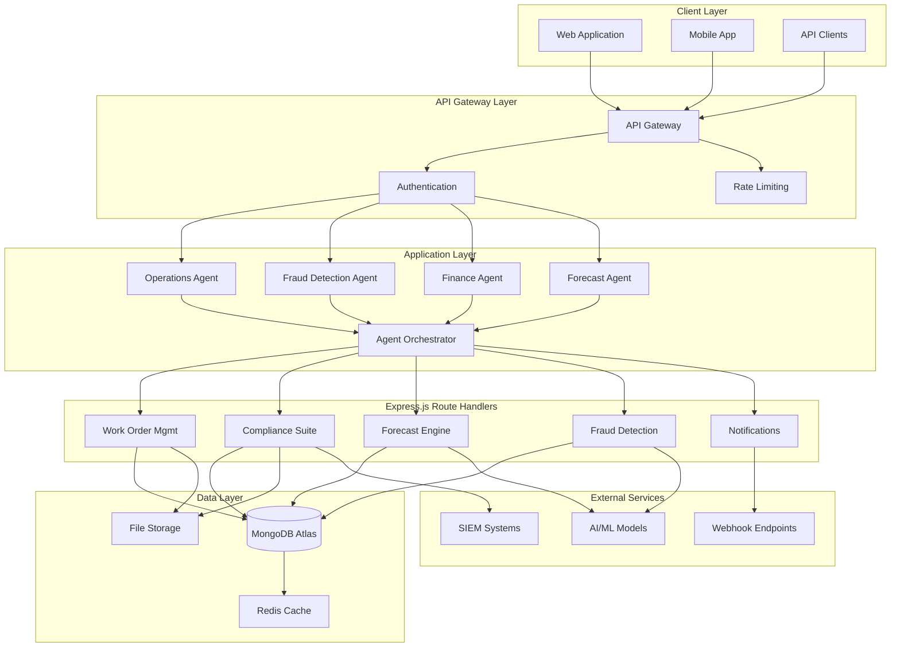

---

## Component Architecture

### Frontend Components

**React Application Structure**
- **Pages**: Top-level route components
- **Components**: Reusable UI components
- **Hooks**: Custom React hooks for business logic
- **Contexts**: Global state management
- **Services**: API client integrations

**Component Hierarchy**
```
App
├── AuthContext
├── RBACContext
├── AppLayout
│   ├── AppSidebar
│   ├── UserMenu
│   └── NotificationCenter
└── Routes
    ├── Dashboard
    ├── WorkOrders
    ├── Compliance
    ├── Analytics
    └── [Protected Routes]
```

### Backend Components

**Express.js Route Handlers Architecture**
- **API Gateway**: Central routing and authentication
- **Agent Services**: Domain-specific business logic
- **Worker Functions**: Background job processing
- **Utility Functions**: Shared helper functions

**Express.js Route Handler Categories**
1. **Core Operations**: Work orders, dispatch, scheduling
2. **Financial**: Invoicing, penalties, billing
3. **Compliance**: Audit logs, access control, evidence
4. **Fraud**: Document verification, anomaly detection
5. **AI/ML**: Forecasting, predictions, orchestration
6. **Integration**: Webhooks, external syncs, notifications

---

## Data Flow Architecture

### Request Flow

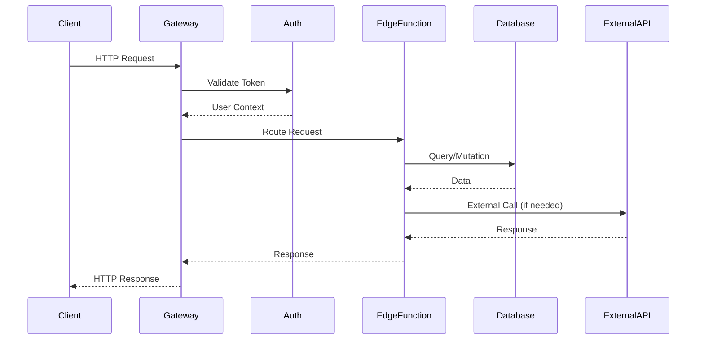

### Event Flow

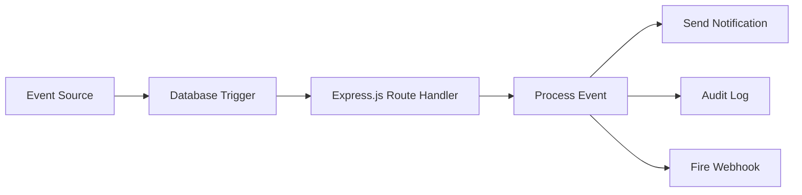

### Data Sync Flow

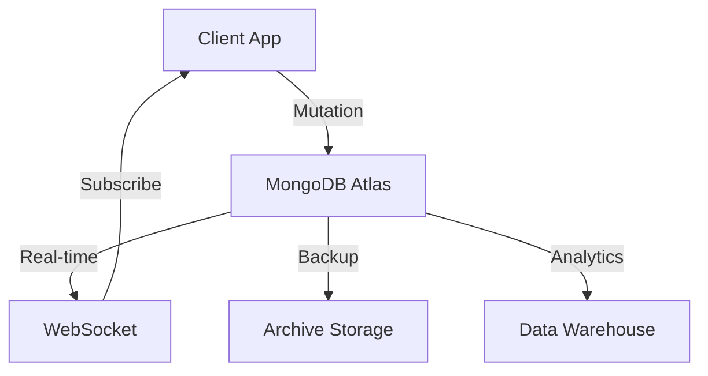

---

## Multi-Tenant Architecture

### Tenant Isolation Strategy

**Database-Level Isolation**
- Every table includes `tenant_id` column
- Application-Level Tenant Isolation policies enforce isolation
- No cross-tenant queries possible
- Automated enforcement via database constraints

**Tenant Hierarchy**
```
Platform
└── Tenant (Organization)
    ├── Users
    ├── Roles
    ├── Work Orders
    ├── Customers
    ├── Equipment
    └── Financial Records
```

### Tenant Isolation Pattern

```sql
-- Example Tenant Isolation Policy
CREATE POLICY "tenant_isolation"
ON public.work_orders
FOR ALL
USING (
  tenant_id = (
    SELECT tenant_id 
    FROM public.profiles 
    WHERE id = auth.uid()
  )
);
```

### Tenant Onboarding Flow

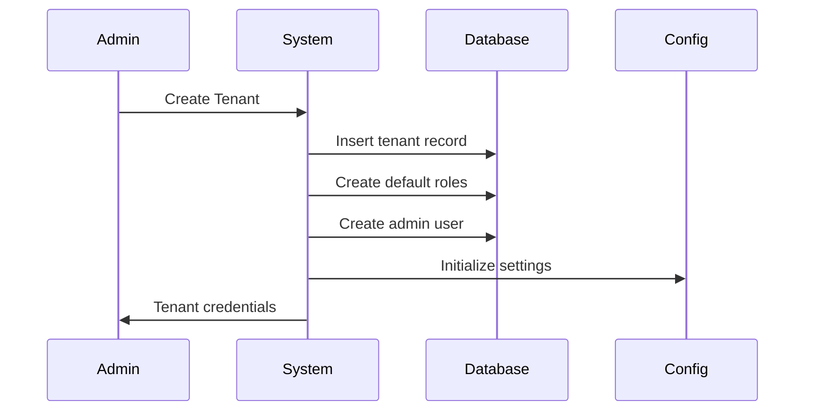

---

## Service Architecture

### Agent Service Pattern

Each agent service follows a consistent pattern:

**Structure**
```typescript
interface AgentService {
  authenticate(): Promise<User>;
  authorize(permission: string): Promise<boolean>;
  validate(input: unknown): Promise<ValidInput>;
  execute(input: ValidInput): Promise<Output>;
  log(operation: string, result: any): Promise<void>;
}
```

**Implementation Flow**
1. **Authentication**: Verify JWT token
2. **Authorization**: Check RBAC permissions
3. **Validation**: Validate input schema
4. **Execution**: Perform business logic
5. **Logging**: Record audit trail
6. **Response**: Return standardized response

### Orchestration Pattern

**Agent Orchestrator**
- Coordinates multiple agent services
- Manages complex workflows
- Handles inter-agent communication
- Provides unified error handling

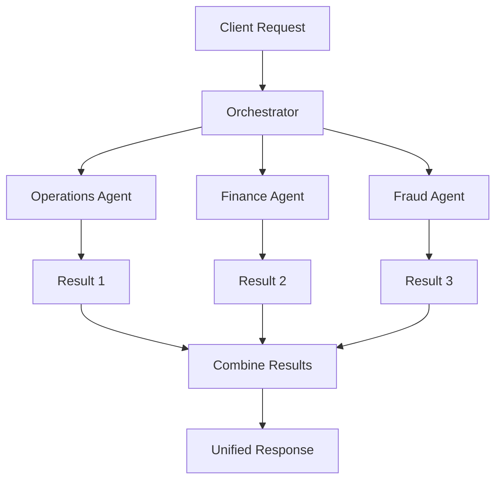

---

## Integration Architecture

### External System Integration

**Integration Patterns**
1. **REST APIs**: For synchronous operations
2. **Webhooks**: For asynchronous events
3. **Batch Sync**: For bulk data operations
4. **Real-time Streams**: For continuous data flow

### Webhook Architecture

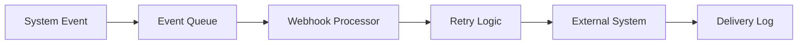

**Webhook Features**
- Automatic retries with exponential backoff
- Signature verification for security
- Delivery status tracking
- Custom headers and payloads

### Third-Party Integration Points

1. **ERP Systems**: SAP, Oracle, Microsoft Dynamics
2. **SIEM Tools**: Splunk, IBM QRadar, Azure Sentinel
3. **Calendar Services**: Google Calendar, Outlook
4. **Payment Gateways**: Stripe, PayPal
5. **Mapping Services**: Google Maps, Mapbox
6. **AI Providers**: OpenAI, Google Gemini

---

## AI/ML Architecture

### Forecasting Architecture

**Hierarchical Forecasting System**
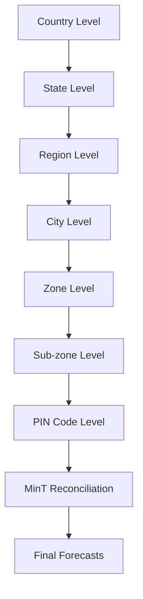

**7-Level Geographic Hierarchy**
1. Country → 2. State → 3. Region → 4. City → 5. Zone → 6. Sub-zone → 7. PIN Code

**Forecast Pipeline**
1. **Data Collection**: Gather historical data
2. **Feature Engineering**: Create predictive features
3. **Model Training**: Train at each hierarchy level
4. **Prediction**: Generate forecasts
5. **Reconciliation**: Apply MinT algorithm
6. **Distribution**: Publish to agents

### AI Agent Architecture

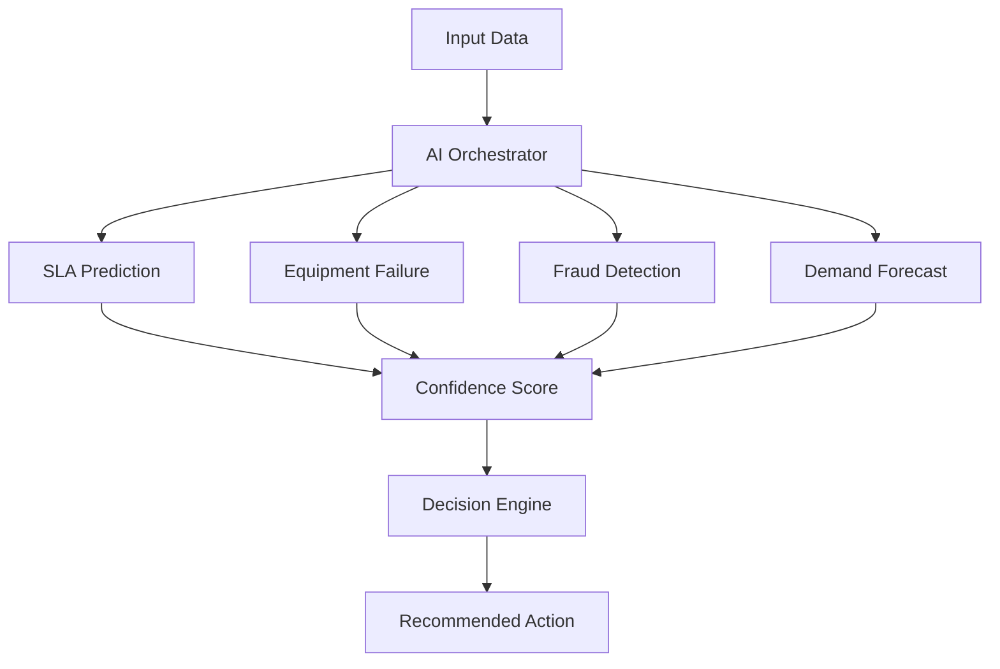

---

## Security Architecture

### Defense in Depth

**Security Layers**
1. **Network**: WAF, DDoS protection, TLS encryption
2. **Application**: JWT authentication, RBAC authorization
3. **Database**: application-level tenant isolation policies, encryption at rest
4. **Data**: Field-level encryption, PII masking
5. **Audit**: Immutable logs, 7-year retention

### Authentication Flow

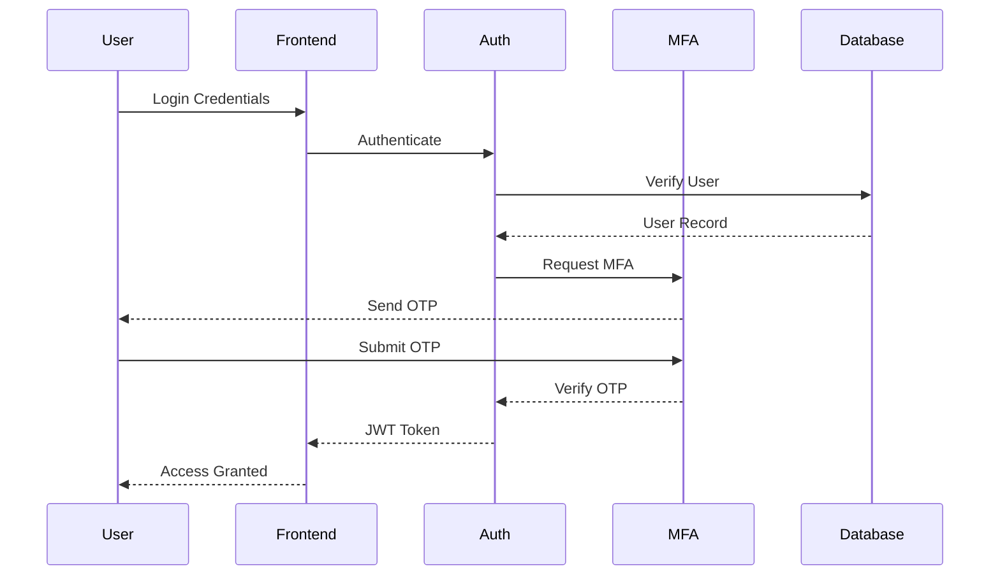

### Authorization Model

**Role-Based Access Control (RBAC)**
- Roles: Super Admin, Org Admin, Manager, Technician, etc.
- Permissions: Granular action-based permissions
- Policies: Application-level tenant isolation

---

## Scalability and Performance

### Horizontal Scaling

**Stateless Services**
- All Express.js route handlers are stateless
- Can scale horizontally without limits
- Load balancing across multiple instances

**Database Scaling**
- Read replicas for analytics queries
- Connection pooling for efficiency
- Automatic failover for high availability

### Performance Optimizations

1. **Caching Strategy**
   - Redis for session data
   - CDN for static assets
   - Query result caching

2. **Database Optimization**
   - Indexed columns for fast lookups
   - Materialized views for complex queries
   - Partitioning for large tables

3. **Code Optimization**
   - Code splitting for faster loads
   - Lazy loading for routes
   - Image optimization and compression

### Monitoring and Observability

**Metrics Collection**
- Response time tracking
- Error rate monitoring
- Resource utilization
- Business KPIs

**Distributed Tracing**
- Correlation IDs across services
- Request flow visualization
- Performance bottleneck identification

---

## Disaster Recovery

### Backup Strategy

**Database Backups**
- Continuous WAL archiving
- Daily full backups
- 30-day retention policy
- Point-in-time recovery capability

**Application Backups**
- Git repository for code
- Container image registry
- Configuration backups

### Failover Architecture

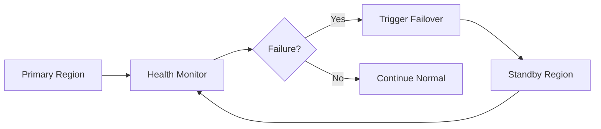

---

## Conclusion

Guardian Flow's architecture is designed for:
- **Reliability**: 99.9% uptime SLA
- **Scalability**: Handle millions of users
- **Security**: Enterprise-grade protection
- **Performance**: Sub-second response times
- **Maintainability**: Clean, modular design

This architecture supports current operations and provides a foundation for future growth and innovation.
