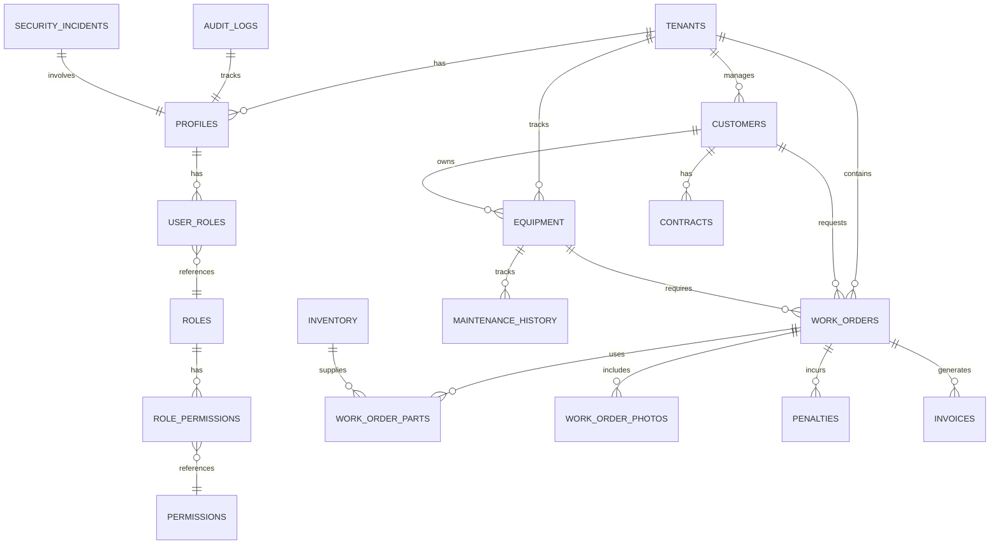

# Data Models and Database Schema

**Guardian Flow v6.1.0**
**Date:** November 1, 2025

---

## Table of Contents

1. [Database Overview](#database-overview)
2. [Entity Relationship Diagram](#entity-relationship-diagram)
3. [Core Collections](#core-collections)
4. [Compliance Collections](#compliance-collections)
5. [Financial Collections](#financial-collections)
6. [Forecasting Collections](#forecasting-collections)
7. [AI/ML Collections](#aiml-collections)
8. [Security Collections](#security-collections)
9. [Indexes and Constraints](#indexes-and-constraints)
10. [Data Retention Policies](#data-retention-policies)

---

## Database Overview

Guardian Flow uses **MongoDB Atlas 7.x** as its primary database, leveraging modern features:
- **Application-Level Isolation**: Tenant isolation via `tenant_id` field filtering
- **Flexible Schema**: JSON document storage with optional schema validation
- **Text Search**: Built-in text indexes for search capabilities
- **Aggregation Pipeline**: Powerful data transformation and analysis
- **TTL Indexes**: Automatic document expiration

### Database Organization

- **guardianflow**: Main application database
- Collections organized by domain (users, work_orders, invoices, etc.)

### Multi-Tenancy

All tenant-scoped collections include a `tenant_id` field with application-level filtering.

```javascript
// Example tenant filtering
const workOrders = await db.collection('work_orders').find({
  tenant_id: userTenantId
}).toArray();
```

---

## Entity Relationship Diagram



---

## Core Tables

### tenants

Multi-tenant organization table.

```sql
CREATE TABLE public.tenants (
  id UUID PRIMARY KEY DEFAULT gen_random_uuid(),
  name TEXT NOT NULL,
  slug TEXT UNIQUE NOT NULL,
  settings JSONB DEFAULT '{}',
  created_at TIMESTAMPTZ NOT NULL DEFAULT now(),
  updated_at TIMESTAMPTZ NOT TIMENOW() DEFAULT now()
);
```

**Indexes**
- `idx_tenants_slug` on `slug`

---

### profiles

User profiles with tenant association.

```sql
CREATE TABLE public.profiles (
  id UUID PRIMARY KEY REFERENCES auth.users(id) ON DELETE CASCADE,
  tenant_id UUID REFERENCES public.tenants(id),
  email TEXT NOT NULL,
  full_name TEXT,
  avatar_url TEXT,
  phone TEXT,
  created_at TIMESTAMPTZ NOT NULL DEFAULT now(),
  updated_at TIMESTAMPTZ NOT NULL DEFAULT now()
);
```

**Indexes**
- `idx_profiles_tenant_id` on `tenant_id`
- `idx_profiles_email` on `email`

**Tenant Isolation Policies**
- Users can read their own profile
- Users can update their own profile
- Admins can read all profiles in tenant

---

### work_orders

Core work order management.

```sql
CREATE TABLE public.work_orders (
  id UUID PRIMARY KEY DEFAULT gen_random_uuid(),
  tenant_id UUID NOT NULL REFERENCES public.tenants(id),
  wo_number TEXT NOT NULL GENERATED ALWAYS AS (generate_wo_number()) STORED,
  title TEXT NOT NULL,
  description TEXT,
  status TEXT NOT NULL DEFAULT 'draft',
  priority TEXT NOT NULL DEFAULT 'medium',
  customer_id UUID REFERENCES public.customers(id),
  equipment_id UUID REFERENCES public.equipment(id),
  assigned_technician_id UUID REFERENCES public.profiles(id),
  scheduled_start TIMESTAMPTZ,
  scheduled_end TIMESTAMPTZ,
  actual_start TIMESTAMPTZ,
  actual_end TIMESTAMPTZ,
  sla_deadline TIMESTAMPTZ,
  part_status TEXT,
  parts_reserved BOOLEAN DEFAULT false,
  location_lat NUMERIC,
  location_lng NUMERIC,
  created_by UUID REFERENCES public.profiles(id),
  created_at TIMESTAMPTZ NOT NULL DEFAULT now(),
  updated_at TIMESTAMPTZ NOT NULL DEFAULT now(),
  CONSTRAINT valid_status CHECK (status IN ('draft', 'scheduled', 'in_progress', 'completed', 'cancelled')),
  CONSTRAINT valid_priority CHECK (priority IN ('low', 'medium', 'high', 'critical'))
);
```

**Indexes**
- `idx_work_orders_tenant_id` on `tenant_id`
- `idx_work_orders_customer_id` on `customer_id`
- `idx_work_orders_status` on `status`
- `idx_work_orders_assigned_technician_id` on `assigned_technician_id`
- `idx_work_orders_scheduled_start` on `scheduled_start`

**Triggers**
- `update_updated_at_column` on UPDATE
- `validate_work_order_parts` on INSERT/UPDATE

---

### customers

Customer master data.

```sql
CREATE TABLE public.customers (
  id UUID PRIMARY KEY DEFAULT gen_random_uuid(),
  tenant_id UUID NOT NULL REFERENCES public.tenants(id),
  name TEXT NOT NULL,
  email TEXT,
  phone TEXT,
  address JSONB,
  notes TEXT,
  created_at TIMESTAMPTZ NOT NULL DEFAULT now(),
  updated_at TIMESTAMPTZ NOT NULL DEFAULT now()
);
```

**Indexes**
- `idx_customers_tenant_id` on `tenant_id`
- `idx_customers_email` on `email`

---

### equipment

Equipment registry.

```sql
CREATE TABLE public.equipment (
  id UUID PRIMARY KEY DEFAULT gen_random_uuid(),
  tenant_id UUID NOT NULL REFERENCES public.tenants(id),
  customer_id UUID REFERENCES public.customers(id),
  serial_number TEXT NOT NULL,
  model TEXT,
  manufacturer TEXT,
  installation_date DATE,
  warranty_expiry DATE,
  location JSONB,
  specifications JSONB,
  created_at TIMESTAMPTZ NOT NULL DEFAULT now(),
  updated_at TIMESTAMPTZ NOT NULL DEFAULT now(),
  UNIQUE(tenant_id, serial_number)
);
```

**Indexes**
- `idx_equipment_tenant_id` on `tenant_id`
- `idx_equipment_customer_id` on `customer_id`
- `idx_equipment_serial_number` on `serial_number`

---

### inventory

Parts and materials inventory.

```sql
CREATE TABLE public.inventory (
  id UUID PRIMARY KEY DEFAULT gen_random_uuid(),
  tenant_id UUID NOT NULL REFERENCES public.tenants(id),
  part_number TEXT NOT NULL,
  description TEXT,
  quantity INTEGER NOT NULL DEFAULT 0,
  unit_cost NUMERIC(10,2),
  location TEXT,
  reorder_point INTEGER,
  created_at TIMESTAMPTZ NOT NULL DEFAULT now(),
  updated_at TIMESTAMPTZ NOT NULL DEFAULT now(),
  UNIQUE(tenant_id, part_number, location)
);
```

**Indexes**
- `idx_inventory_tenant_id` on `tenant_id`
- `idx_inventory_part_number` on `part_number`

---

## Compliance Tables

### audit_logs

Immutable audit trail (7-year retention).

```sql
CREATE TABLE public.audit_logs (
  id UUID PRIMARY KEY DEFAULT gen_random_uuid(),
  tenant_id UUID NOT NULL REFERENCES public.tenants(id),
  user_id UUID REFERENCES public.profiles(id),
  action TEXT NOT NULL,
  resource_type TEXT NOT NULL,
  resource_id UUID,
  old_values JSONB,
  new_values JSONB,
  ip_address INET,
  user_agent TEXT,
  correlation_id UUID,
  created_at TIMESTAMPTZ NOT NULL DEFAULT now()
);

-- Immutability: No UPDATE or DELETE policies
ALTER TABLE public.audit_logs ENABLE ROW LEVEL SECURITY;

CREATE POLICY "audit_logs_insert"
ON public.audit_logs
FOR INSERT
WITH CHECK (true);

CREATE POLICY "audit_logs_select"
ON public.audit_logs
FOR SELECT
USING (
  tenant_id = (SELECT tenant_id FROM public.profiles WHERE id = auth.uid())
  AND has_permission(auth.uid(), 'audit_logs:read')
);
```

**Indexes**
- `idx_audit_logs_tenant_id` on `tenant_id`
- `idx_audit_logs_user_id` on `user_id`
- `idx_audit_logs_action` on `action`
- `idx_audit_logs_created_at` on `created_at`
- `idx_audit_logs_correlation_id` on `correlation_id`

**Partitioning**
- Partitioned by year for performance
- Automatic archiving after 7 years

---

### jit_access_grants

Just-in-Time privileged access.

```sql
CREATE TABLE public.jit_access_grants (
  id UUID PRIMARY KEY DEFAULT gen_random_uuid(),
  tenant_id UUID NOT NULL REFERENCES public.tenants(id),
  user_id UUID NOT NULL REFERENCES public.profiles(id),
  permission TEXT NOT NULL,
  granted_by UUID NOT NULL REFERENCES public.profiles(id),
  justification TEXT NOT NULL,
  expires_at TIMESTAMPTZ NOT NULL,
  revoked_at TIMESTAMPTZ,
  created_at TIMESTAMPTZ NOT NULL DEFAULT now()
);
```

**Indexes**
- `idx_jit_access_tenant_id` on `tenant_id`
- `idx_jit_access_user_id` on `user_id`
- `idx_jit_access_expires_at` on `expires_at`

---

### security_incidents

Security incident tracking.

```sql
CREATE TABLE public.security_incidents (
  id UUID PRIMARY KEY DEFAULT gen_random_uuid(),
  tenant_id UUID NOT NULL REFERENCES public.tenants(id),
  incident_type TEXT NOT NULL,
  severity TEXT NOT NULL,
  description TEXT NOT NULL,
  affected_resource TEXT,
  detected_at TIMESTAMPTZ NOT NULL DEFAULT now(),
  resolved_at TIMESTAMPTZ,
  assigned_to UUID REFERENCES public.profiles(id),
  status TEXT NOT NULL DEFAULT 'open',
  CONSTRAINT valid_severity CHECK (severity IN ('low', 'medium', 'high', 'critical'))
);
```

**Indexes**
- `idx_security_incidents_tenant_id` on `tenant_id`
- `idx_security_incidents_status` on `status`
- `idx_security_incidents_severity` on `severity`

---

### vulnerability_scans

Vulnerability management.

```sql
CREATE TABLE public.vulnerability_scans (
  id UUID PRIMARY KEY DEFAULT gen_random_uuid(),
  tenant_id UUID NOT NULL REFERENCES public.tenants(id),
  scan_date TIMESTAMPTZ NOT NULL DEFAULT now(),
  scanner_name TEXT NOT NULL,
  findings JSONB NOT NULL,
  summary JSONB,
  created_at TIMESTAMPTZ NOT NULL DEFAULT now()
);
```

---

### compliance_evidence

Compliance evidence collection.

```sql
CREATE TABLE public.compliance_evidence (
  id UUID PRIMARY KEY DEFAULT gen_random_uuid(),
  tenant_id UUID NOT NULL REFERENCES public.tenants(id),
  evidence_type TEXT NOT NULL,
  control_id TEXT,
  description TEXT,
  collected_at TIMESTAMPTZ NOT NULL DEFAULT now(),
  file_url TEXT,
  metadata JSONB,
  created_at TIMESTAMPTZ NOT NULL DEFAULT now()
);
```

---

## Financial Tables

### penalties

SLA penalty tracking.

```sql
CREATE TABLE public.penalties (
  id UUID PRIMARY KEY DEFAULT gen_random_uuid(),
  tenant_id UUID NOT NULL REFERENCES public.tenants(id),
  work_order_id UUID NOT NULL REFERENCES public.work_orders(id),
  amount NUMERIC(10,2) NOT NULL,
  currency TEXT NOT NULL DEFAULT 'USD',
  reason TEXT NOT NULL,
  calculated_at TIMESTAMPTZ NOT NULL DEFAULT now(),
  applied_at TIMESTAMPTZ,
  created_at TIMESTAMPTZ NOT NULL DEFAULT now()
);
```

**Indexes**
- `idx_penalties_tenant_id` on `tenant_id`
- `idx_penalties_work_order_id` on `work_order_id`

---

### invoices

Invoice generation and tracking.

```sql
CREATE TABLE public.invoices (
  id UUID PRIMARY KEY DEFAULT gen_random_uuid(),
  tenant_id UUID NOT NULL REFERENCES public.tenants(id),
  invoice_number TEXT NOT NULL,
  customer_id UUID NOT NULL REFERENCES public.customers(id),
  subtotal NUMERIC(10,2) NOT NULL,
  tax NUMERIC(10,2) DEFAULT 0,
  total NUMERIC(10,2) NOT NULL,
  currency TEXT NOT NULL DEFAULT 'USD',
  due_date DATE NOT NULL,
  status TEXT NOT NULL DEFAULT 'draft',
  paid_at TIMESTAMPTZ,
  created_at TIMESTAMPTZ NOT NULL DEFAULT now(),
  updated_at TIMESTAMPTZ NOT NULL DEFAULT now(),
  CONSTRAINT valid_status CHECK (status IN ('draft', 'sent', 'paid', 'overdue', 'cancelled'))
);
```

**Indexes**
- `idx_invoices_tenant_id` on `tenant_id`
- `idx_invoices_customer_id` on `customer_id`
- `idx_invoices_status` on `status`

---

### invoice_line_items

Invoice line items.

```sql
CREATE TABLE public.invoice_line_items (
  id UUID PRIMARY KEY DEFAULT gen_random_uuid(),
  invoice_id UUID NOT NULL REFERENCES public.invoices(id) ON DELETE CASCADE,
  work_order_id UUID REFERENCES public.work_orders(id),
  description TEXT NOT NULL,
  quantity INTEGER NOT NULL DEFAULT 1,
  unit_price NUMERIC(10,2) NOT NULL,
  total NUMERIC(10,2) NOT NULL,
  created_at TIMESTAMPTZ NOT NULL DEFAULT now()
);
```

---

### disputes

Billing dispute management.

```sql
CREATE TABLE public.disputes (
  id UUID PRIMARY KEY DEFAULT gen_random_uuid(),
  tenant_id UUID NOT NULL REFERENCES public.tenants(id),
  invoice_id UUID NOT NULL REFERENCES public.invoices(id),
  reason TEXT NOT NULL,
  requested_adjustment NUMERIC(10,2),
  status TEXT NOT NULL DEFAULT 'pending',
  resolved_at TIMESTAMPTZ,
  resolution_notes TEXT,
  created_at TIMESTAMPTZ NOT NULL DEFAULT now(),
  updated_at TIMESTAMPTZ NOT NULL DEFAULT now()
);
```

---

## Forecasting Tables

### forecast_hierarchy

Geographic hierarchy (7 levels).

```sql
CREATE TABLE public.forecast_hierarchy (
  id UUID PRIMARY KEY DEFAULT gen_random_uuid(),
  tenant_id UUID NOT NULL REFERENCES public.tenants(id),
  level TEXT NOT NULL,
  name TEXT NOT NULL,
  parent_id UUID REFERENCES public.forecast_hierarchy(id),
  metadata JSONB,
  created_at TIMESTAMPTZ NOT NULL DEFAULT now(),
  CONSTRAINT valid_level CHECK (level IN ('country', 'state', 'region', 'city', 'zone', 'subzone', 'pincode'))
);
```

**Indexes**
- `idx_forecast_hierarchy_tenant_id` on `tenant_id`
- `idx_forecast_hierarchy_parent_id` on `parent_id`
- `idx_forecast_hierarchy_level` on `level`

---

### products

Product catalog for forecasting.

```sql
CREATE TABLE public.products (
  id UUID PRIMARY KEY DEFAULT gen_random_uuid(),
  tenant_id UUID NOT NULL REFERENCES public.tenants(id),
  name TEXT NOT NULL,
  category TEXT,
  unit TEXT,
  metadata JSONB,
  created_at TIMESTAMPTZ NOT NULL DEFAULT now()
);
```

---

### forecasts

Demand forecasts at each level.

```sql
CREATE TABLE public.forecasts (
  id UUID PRIMARY KEY DEFAULT gen_random_uuid(),
  tenant_id UUID NOT NULL REFERENCES public.tenants(id),
  location_id UUID NOT NULL REFERENCES public.forecast_hierarchy(id),
  product_id UUID NOT NULL REFERENCES public.products(id),
  forecast_date DATE NOT NULL,
  predicted_demand NUMERIC(10,2) NOT NULL,
  confidence_interval_lower NUMERIC(10,2),
  confidence_interval_upper NUMERIC(10,2),
  model_version TEXT,
  created_at TIMESTAMPTZ NOT NULL DEFAULT now(),
  UNIQUE(tenant_id, location_id, product_id, forecast_date)
);
```

**Indexes**
- `idx_forecasts_tenant_id` on `tenant_id`
- `idx_forecasts_location_id` on `location_id`
- `idx_forecasts_product_id` on `product_id`
- `idx_forecasts_forecast_date` on `forecast_date`

---

### forecast_actuals

Actual demand for accuracy measurement.

```sql
CREATE TABLE public.forecast_actuals (
  id UUID PRIMARY KEY DEFAULT gen_random_uuid(),
  tenant_id UUID NOT NULL REFERENCES public.tenants(id),
  location_id UUID NOT NULL REFERENCES public.forecast_hierarchy(id),
  product_id UUID NOT NULL REFERENCES public.products(id),
  actual_date DATE NOT NULL,
  actual_demand NUMERIC(10,2) NOT NULL,
  created_at TIMESTAMPTZ NOT NULL DEFAULT now(),
  UNIQUE(tenant_id, location_id, product_id, actual_date)
);
```

---

## AI/ML Tables

### forgery_predictions

Document forgery detection results.

```sql
CREATE TABLE public.forgery_predictions (
  id UUID PRIMARY KEY DEFAULT gen_random_uuid(),
  tenant_id UUID NOT NULL REFERENCES public.tenants(id),
  image_url TEXT NOT NULL,
  prediction TEXT NOT NULL,
  confidence NUMERIC(5,4) NOT NULL,
  analysis JSONB,
  human_verified BOOLEAN,
  actual_label TEXT,
  created_at TIMESTAMPTZ NOT NULL DEFAULT now()
);
```

---

### sla_predictions

SLA breach predictions.

```sql
CREATE TABLE public.sla_predictions (
  id UUID PRIMARY KEY DEFAULT gen_random_uuid(),
  tenant_id UUID NOT NULL REFERENCES public.tenants(id),
  work_order_id UUID NOT NULL REFERENCES public.work_orders(id),
  breach_probability NUMERIC(5,4) NOT NULL,
  predicted_completion TIMESTAMPTZ,
  risk_factors JSONB,
  created_at TIMESTAMPTZ NOT NULL DEFAULT now()
);
```

---

### equipment_failure_predictions

Equipment failure predictions.

```sql
CREATE TABLE public.equipment_failure_predictions (
  id UUID PRIMARY KEY DEFAULT gen_random_uuid(),
  tenant_id UUID NOT NULL REFERENCES public.tenants(id),
  equipment_id UUID NOT NULL REFERENCES public.equipment(id),
  failure_probability NUMERIC(5,4) NOT NULL,
  predicted_failure_date DATE,
  recommended_action TEXT,
  created_at TIMESTAMPTZ NOT NULL DEFAULT now()
);
```

---

## Security Tables

### user_roles

User role assignments (separate from profiles for security).

```sql
CREATE TYPE public.app_role AS ENUM (
  'super_admin', 'org_admin', 'finance_manager', 'operations_manager',
  'compliance_officer', 'fraud_investigator', 'technician', 'customer'
);

CREATE TABLE public.user_roles (
  id UUID PRIMARY KEY DEFAULT gen_random_uuid(),
  user_id UUID NOT NULL REFERENCES auth.users(id) ON DELETE CASCADE,
  role public.app_role NOT NULL,
  created_at TIMESTAMPTZ NOT NULL DEFAULT now(),
  UNIQUE(user_id, role)
);
```

---

### permissions

Permission definitions.

```sql
CREATE TABLE public.permissions (
  id UUID PRIMARY KEY DEFAULT gen_random_uuid(),
  name TEXT UNIQUE NOT NULL,
  description TEXT,
  resource TEXT NOT NULL,
  action TEXT NOT NULL,
  created_at TIMESTAMPTZ NOT NULL DEFAULT now()
);
```

---

### role_permissions

Role-permission mappings.

```sql
CREATE TABLE public.role_permissions (
  id UUID PRIMARY KEY DEFAULT gen_random_uuid(),
  role public.app_role NOT NULL,
  permission_id UUID NOT NULL REFERENCES public.permissions(id) ON DELETE CASCADE,
  created_at TIMESTAMPTZ NOT NULL DEFAULT now(),
  UNIQUE(role, permission_id)
);
```

---

## Indexes and Constraints

### Foreign Key Constraints

All foreign keys are defined with appropriate `ON DELETE` actions:
- `CASCADE`: Delete dependent rows (e.g., invoice line items)
- `SET NULL`: Set to NULL when parent deleted (e.g., assigned technician)
- `RESTRICT`: Prevent deletion if references exist (default)

### Composite Indexes

For common query patterns:

```sql
-- Work orders by tenant and status
CREATE INDEX idx_work_orders_tenant_status 
ON public.work_orders(tenant_id, status);

-- Audit logs by tenant and date range
CREATE INDEX idx_audit_logs_tenant_date 
ON public.audit_logs(tenant_id, created_at DESC);

-- Forecasts lookup
CREATE INDEX idx_forecasts_lookup 
ON public.forecasts(tenant_id, location_id, product_id, forecast_date);
```

### Unique Constraints

Ensure data integrity:

```sql
-- One profile per user
ALTER TABLE public.profiles 
ADD CONSTRAINT profiles_id_unique UNIQUE(id);

-- Unique work order numbers per tenant
ALTER TABLE public.work_orders 
ADD CONSTRAINT work_orders_wo_number_unique UNIQUE(tenant_id, wo_number);
```

---

## Data Retention Policies

### Audit Logs
- **Retention**: 7 years (SOC 2 / ISO 27001 compliance)
- **Strategy**: Partitioned by year, archived to cold storage

### Operational Data
- **Work Orders**: Indefinite (business records)
- **Invoices**: 7 years (tax compliance)
- **Forecasts**: 2 years (historical analysis)

### Transient Data
- **Session Data**: 24 hours
- **Cache**: 1 hour
- **Temporary Files**: 7 days

---

## Conclusion

Guardian Flow's database schema provides:
- **Security**: Tenant isolation policies, RBAC enforcement
- **Compliance**: Immutable audit logs, 7-year retention
- **Performance**: Strategic indexing, partitioning
- **Scalability**: Normalized design, efficient queries
- **Flexibility**: JSONB for dynamic data

This schema supports all platform functionality while maintaining data integrity, security, and performance.
