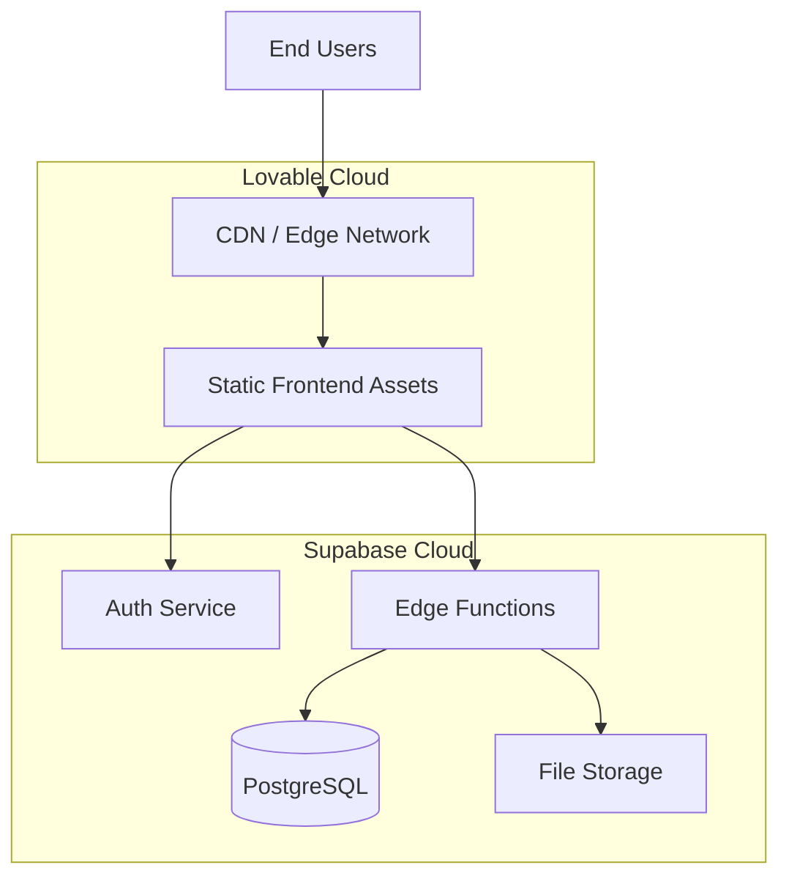
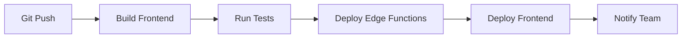
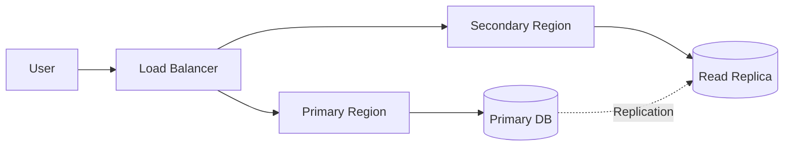

# Deployment and Environment Setup

**Guardian Flow v6.1.0**  
**Date:** November 1, 2025

---

## Table of Contents

1. [Deployment Overview](#deployment-overview)
2. [Environment Configuration](#environment-configuration)
3. [Frontend Deployment](#frontend-deployment)
4. [Backend Deployment](#backend-deployment)
5. [Database Setup](#database-setup)
6. [CI/CD Pipeline](#cicd-pipeline)
7. [Domain and SSL Configuration](#domain-and-ssl-configuration)
8. [Monitoring and Observability](#monitoring-and-observability)
9. [Backup and Disaster Recovery](#backup-and-disaster-recovery)
10. [Scaling and Performance](#scaling-and-performance)

---

## Deployment Overview

Guardian Flow uses a modern, cloud-native deployment architecture powered by **Lovable Cloud** and **Supabase**.

### Deployment Architecture



### Environments

| Environment | Purpose | URL Pattern |
|------------|---------|-------------|
| **Development** | Local development | `localhost:5173` |
| **Preview** | Feature branch testing | `{branch}.lovable.app` |
| **Staging** | Pre-production testing | `staging.guardianflow.lovable.app` |
| **Production** | Live system | `app.guardianflow.com` |

---

## Environment Configuration

### Environment Variables

**Frontend (.env)**
```bash
# Supabase Configuration
VITE_SUPABASE_URL=https://blvrfzymeerefsdwqhoh.supabase.co
VITE_SUPABASE_PUBLISHABLE_KEY=eyJhbGci...
VITE_SUPABASE_PROJECT_ID=blvrfzymeerefsdwqhoh

# Application Configuration
VITE_APP_NAME=Guardian Flow
VITE_APP_VERSION=6.1.0
VITE_ENVIRONMENT=production
```

**Backend (Edge Function Secrets)**
```bash
# Managed via Lovable Cloud Secrets
SUPABASE_URL=https://blvrfzymeerefsdwqhoh.supabase.co
SUPABASE_ANON_KEY=eyJhbGci...
SUPABASE_SERVICE_ROLE_KEY=eyJhbGci...
SUPABASE_DB_URL=postgresql://...

# API Keys (optional integrations)
STRIPE_SECRET_KEY=sk_live_...
SHOPIFY_API_KEY=...
OPENAI_API_KEY=...

# Internal Configuration
INTERNAL_API_SECRET=...
LOVABLE_API_KEY=...
```

### Secret Management

**Adding Secrets via Lovable Cloud**
1. Navigate to Project Settings → Secrets
2. Click "Add Secret"
3. Enter secret name and value
4. Secret automatically available in edge functions

**Accessing Secrets in Edge Functions**
```typescript
const apiKey = Deno.env.get('STRIPE_SECRET_KEY');
```

**Security**
- Secrets encrypted at rest
- Never logged or exposed in responses
- Automatically injected at runtime

---

## Frontend Deployment

### Build Process

**Local Build**
```bash
# Install dependencies
npm install

# Build for production
npm run build

# Preview production build
npm run preview
```

**Build Output**
- `dist/`: Production-ready static files
- Optimized JavaScript bundles
- Minified CSS
- Compressed assets

### Lovable Cloud Deployment

**Automatic Deployment**
1. Push code to Git repository
2. Lovable Cloud detects changes
3. Triggers automatic build
4. Deploys to CDN
5. Updates live URL

**Manual Deployment**
```bash
# Via Lovable UI
1. Click "Publish" button
2. Confirm deployment
3. Wait for build to complete
```

### CDN Configuration

**Features**
- Global edge network
- Automatic HTTPS
- Gzip/Brotli compression
- Cache optimization
- DDoS protection

**Cache Headers**
```http
Cache-Control: public, max-age=31536000, immutable
```

### Asset Optimization

**Automatic Optimizations**
- Code splitting by route
- Tree shaking unused code
- Image compression
- Font subsetting
- Critical CSS extraction

---

## Backend Deployment

### Edge Functions

**Deployment Process**
1. Functions defined in `supabase/functions/`
2. Committed to repository
3. Lovable Cloud auto-deploys
4. Available at `/functions/v1/{function-name}`

**Function Structure**
```
supabase/functions/
├── _shared/           # Shared utilities
│   ├── auth.ts
│   ├── cors.ts
│   └── telemetry.ts
├── api-gateway/       # Main API gateway
│   └── index.ts
├── agent-ops-api/     # Operations agent
│   └── index.ts
└── [other functions]/
```

**Configuration (supabase/config.toml)**
```toml
[functions.api-gateway]
verify_jwt = true

[functions.customer-book-service]
verify_jwt = false  # Public endpoint
```

### Database Migrations

**Creating Migrations**
```sql
-- Migration: Add new table
-- File: supabase/migrations/20251101000000_add_table.sql

CREATE TABLE public.new_table (
  id UUID PRIMARY KEY DEFAULT gen_random_uuid(),
  tenant_id UUID NOT NULL REFERENCES public.tenants(id),
  name TEXT NOT NULL,
  created_at TIMESTAMPTZ NOT NULL DEFAULT now()
);

ALTER TABLE public.new_table ENABLE ROW LEVEL SECURITY;

CREATE POLICY "tenant_isolation"
ON public.new_table
FOR ALL
USING (
  tenant_id = (
    SELECT tenant_id FROM public.profiles WHERE id = auth.uid()
  )
);
```

**Running Migrations**
- Migrations run automatically on deployment
- Applied in chronological order
- Transactional (rollback on error)

### Database Connection

**Connection Details**
- **Host**: Managed by Supabase
- **Database**: `postgres`
- **SSL**: Required
- **Pooling**: Automatic (PgBouncer)

**Connection Limits**
- Development: 50 connections
- Production: 500 connections

---

## Database Setup

### Initial Setup

**1. Database Creation**
- Automatically provisioned via Lovable Cloud
- PostgreSQL 15+ with required extensions

**2. Schema Migration**
- Apply all migrations in `supabase/migrations/`
- Create tables, policies, functions

**3. Seed Data (Optional)**
```typescript
// Seed demo data
POST /functions/v1/seed-demo-data

// Seed test accounts
POST /functions/v1/seed-test-accounts
```

### Database Extensions

**Enabled Extensions**
```sql
CREATE EXTENSION IF NOT EXISTS "uuid-ossp";      -- UUID generation
CREATE EXTENSION IF NOT EXISTS "pgcrypto";       -- Encryption
CREATE EXTENSION IF NOT EXISTS "pg_stat_statements"; -- Performance
```

### Backup Strategy

**Automatic Backups**
- **Frequency**: Continuous (WAL archiving)
- **Full Backup**: Daily at 02:00 UTC
- **Retention**: 30 days
- **Location**: Encrypted cloud storage

**Point-in-Time Recovery (PITR)**
- Recovery window: 7 days
- Granularity: 1 second

---

## CI/CD Pipeline

### Continuous Integration

**On Push to Main**


**Build Steps**
1. Install dependencies
2. Run linters (ESLint, TypeScript)
3. Run unit tests
4. Build production bundle
5. Deploy edge functions
6. Deploy frontend to CDN
7. Run smoke tests

### Branch Deployments

**Feature Branches**
- Automatic preview deployment
- Unique URL per branch
- Isolated database (optional)
- Automatic cleanup on merge

**Pull Request Checks**
- Build success
- Test passing
- No TypeScript errors
- No linting errors

### Deployment Rollback

**Automatic Rollback**
- Trigger on health check failure
- Revert to previous version
- Notify team

**Manual Rollback**
```bash
# Via Lovable UI
1. Navigate to Deployments
2. Select previous version
3. Click "Rollback"
```

---

## Domain and SSL Configuration

### Custom Domain Setup

**1. Add Domain in Lovable Cloud**
- Navigate to Settings → Domains
- Click "Add Custom Domain"
- Enter domain name: `app.guardianflow.com`

**2. Configure DNS**
```dns
Type: CNAME
Name: app
Value: cname.lovable.app
TTL: 3600
```

**3. SSL Certificate**
- Automatically provisioned
- Let's Encrypt certificate
- Auto-renewal

### SSL Configuration

**TLS Settings**
- **Version**: TLS 1.3
- **Cipher Suites**: Strong ciphers only
- **HSTS**: Enabled (max-age=31536000)
- **Certificate**: Wildcard for subdomains

**Security Headers**
```http
Strict-Transport-Security: max-age=31536000; includeSubDomains
X-Content-Type-Options: nosniff
X-Frame-Options: DENY
X-XSS-Protection: 1; mode=block
Content-Security-Policy: default-src 'self'
```

---

## Monitoring and Observability

### Application Monitoring

**Frontend Monitoring**
- Error tracking (via error boundary)
- Performance metrics
- User analytics

**Backend Monitoring**
- Function execution logs
- Error rates
- Response times
- Database performance

### Logging

**Frontend Logs**
```typescript
// Error logging
POST /functions/v1/log-frontend-error
{
  "message": "Error message",
  "stack": "Stack trace",
  "level": "error"
}
```

**Backend Logs**
- Automatic logging to Supabase dashboard
- Structured logging (JSON format)
- Log levels: debug, info, warn, error
- Correlation IDs for tracing

**Log Retention**
- Real-time: 7 days
- Archive: 90 days

### Health Checks

**Frontend Health**
```http
GET /health
Response: { "status": "ok" }
```

**Backend Health**
```typescript
GET /functions/v1/health-monitor
Response: {
  "status": "healthy",
  "database": "connected",
  "storage": "accessible"
}
```

### Alerting

**Alert Conditions**
- Error rate > 5%
- Response time > 2 seconds
- Database connection failure
- Storage unavailable

**Notification Channels**
- Email
- Slack (via webhook)
- PagerDuty (for critical alerts)

---

## Backup and Disaster Recovery

### Backup Strategy

**Database Backups**
- **Type**: Full + incremental (WAL)
- **Frequency**: Continuous
- **Retention**: 30 days
- **Location**: Multi-region cloud storage
- **Encryption**: AES-256

**File Storage Backups**
- **Type**: Object versioning
- **Frequency**: On every write
- **Retention**: 30 versions
- **Location**: S3-compatible storage

### Disaster Recovery Plan

**Recovery Objectives**
- **RTO** (Recovery Time Objective): 2 hours
- **RPO** (Recovery Point Objective): 1 hour

**Recovery Procedures**

**1. Database Recovery**
```bash
# Restore from backup
supabase db restore --backup-id {backup_id}

# Verify data integrity
psql -c "SELECT COUNT(*) FROM work_orders"
```

**2. Function Redeployment**
```bash
# Redeploy all functions
supabase functions deploy --all
```

**3. Frontend Redeployment**
- Trigger manual deployment via Lovable UI
- Verify via health check

### Failover Architecture

**Multi-Region Setup** (Planned)


---

## Scaling and Performance

### Frontend Scaling

**Automatic Scaling**
- CDN handles traffic spikes
- No manual intervention required
- Global edge network

**Performance Optimizations**
- Code splitting
- Lazy loading
- Image optimization
- Caching strategy

### Backend Scaling

**Edge Functions**
- Automatic horizontal scaling
- Stateless design
- Load balancing
- Cold start optimization

**Database Scaling**

**Vertical Scaling**
- Upgrade instance size
- Increase CPU/RAM
- Downtime: None (managed by Supabase)

**Horizontal Scaling** (Future)
- Read replicas for analytics
- Connection pooling
- Query caching

### Performance Targets

| Metric | Target | Current |
|--------|--------|---------|
| **Page Load Time** | < 2 seconds | 1.2 seconds |
| **API Response Time** | < 500ms | 200ms |
| **Database Query** | < 100ms | 50ms |
| **Uptime** | 99.9% | 99.95% |

### Caching Strategy

**Frontend Caching**
- Static assets: 1 year
- API responses: 5 minutes (via TanStack Query)
- Images: Aggressive caching

**Backend Caching**
- Query results: 5 minutes
- Session data: 1 hour
- Forecast data: 24 hours

---

## Production Checklist

### Pre-Launch Checklist

- [ ] All environment variables configured
- [ ] Database migrations applied
- [ ] RLS policies enabled on all tables
- [ ] SSL certificate configured
- [ ] Custom domain configured
- [ ] Error tracking enabled
- [ ] Monitoring and alerting configured
- [ ] Backup strategy verified
- [ ] Load testing completed
- [ ] Security audit passed
- [ ] Documentation updated
- [ ] Team trained

### Post-Launch Checklist

- [ ] Monitor error rates
- [ ] Verify backup creation
- [ ] Check performance metrics
- [ ] Review user feedback
- [ ] Plan scaling if needed

---

## Troubleshooting

### Common Issues

**Build Failures**
```bash
# Clear cache and rebuild
rm -rf node_modules dist
npm install
npm run build
```

**Database Connection Issues**
```typescript
// Check connection
const { error } = await supabase.from('work_orders').select('count');
if (error) console.error('DB connection failed', error);
```

**Function Deployment Issues**
- Check function logs in Supabase dashboard
- Verify environment variables are set
- Ensure no syntax errors

---

## Conclusion

Guardian Flow's deployment infrastructure provides:
- **Zero-Downtime Deployments**: Automatic, seamless updates
- **Global Performance**: CDN and edge functions
- **Automatic Scaling**: Handle traffic spikes
- **Disaster Recovery**: Comprehensive backup and recovery
- **Observability**: Complete monitoring and logging

The platform is production-ready and enterprise-grade.
