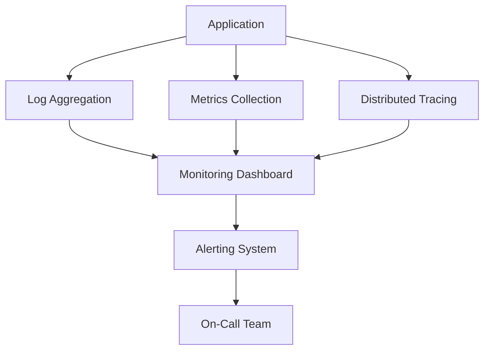
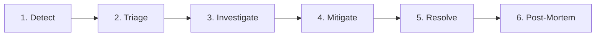
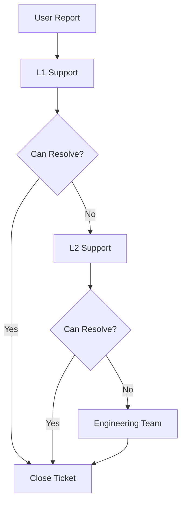

# Maintenance and Monitoring

**Guardian Flow v6.1.0**  
**Date:** November 1, 2025

---

## Table of Contents

1. [Monitoring Overview](#monitoring-overview)
2. [Application Monitoring](#application-monitoring)
3. [Infrastructure Monitoring](#infrastructure-monitoring)
4. [Logging Strategy](#logging-strategy)
5. [Alerting and Incident Response](#alerting-and-incident-response)
6. [Performance Monitoring](#performance-monitoring)
7. [Security Monitoring](#security-monitoring)
8. [Maintenance Procedures](#maintenance-procedures)
9. [Support and SLAs](#support-and-slas)
10. [Continuous Improvement](#continuous-improvement)

---

## Monitoring Overview

Guardian Flow implements comprehensive monitoring to ensure system health, performance, and security.

### Monitoring Stack



### Monitoring Principles

1. **Observability**: Understand system behavior from outputs
2. **Proactive**: Detect issues before users notice
3. **Actionable**: Alerts lead to clear actions
4. **Context-Rich**: Provide enough context for debugging
5. **Automated**: Minimize manual monitoring

---

## Application Monitoring

### Frontend Monitoring

**Error Tracking**
```typescript
// Error boundary captures React errors
class ErrorBoundary extends React.Component {
  componentDidCatch(error: Error, errorInfo: React.ErrorInfo) {
    // Log to backend
    fetch('/functions/v1/log-frontend-error', {
      method: 'POST',
      headers: { 'Content-Type': 'application/json' },
      body: JSON.stringify({
        message: error.message,
        stack: error.stack,
        component: errorInfo.componentStack,
        level: 'error'
      })
    });
  }
}
```

**User Analytics**
```typescript
// Track page views
useEffect(() => {
  analytics.track('page_view', {
    path: window.location.pathname,
    timestamp: Date.now()
  });
}, [location]);
```

**Performance Metrics**
```typescript
// Measure component render time
const renderStart = performance.now();
// ... component rendering
const renderTime = performance.now() - renderStart;

if (renderTime > 100) {
  console.warn(`Slow render: ${renderTime}ms`);
}
```

### Backend Monitoring

**Function Execution Logs**
```typescript
// Structured logging in edge functions
console.log(JSON.stringify({
  level: 'info',
  function: 'api-gateway',
  action: 'create_work_order',
  user_id: user.id,
  tenant_id: user.tenant_id,
  duration_ms: 123,
  correlation_id: correlationId,
  timestamp: new Date().toISOString()
}));
```

**Error Logging**
```typescript
// Catch and log errors
try {
  await createWorkOrder(payload);
} catch (error) {
  console.error(JSON.stringify({
    level: 'error',
    function: 'api-gateway',
    action: 'create_work_order',
    error: error.message,
    stack: error.stack,
    correlation_id: correlationId
  }));
  throw error;
}
```

### Database Monitoring

**Query Performance**
```sql
-- Enable pg_stat_statements extension
CREATE EXTENSION IF NOT EXISTS pg_stat_statements;

-- View slow queries
SELECT
  query,
  calls,
  total_time,
  mean_time,
  max_time
FROM pg_stat_statements
WHERE mean_time > 100
ORDER BY mean_time DESC
LIMIT 20;
```

**Connection Monitoring**
```sql
-- Active connections
SELECT
  datname,
  usename,
  client_addr,
  state,
  query_start,
  state_change
FROM pg_stat_activity
WHERE state = 'active';
```

---

## Infrastructure Monitoring

### System Health Checks

**Frontend Health**
```typescript
// Health endpoint
export async function GET() {
  return new Response(JSON.stringify({
    status: 'ok',
    timestamp: new Date().toISOString(),
    version: '6.1.0'
  }), {
    headers: { 'Content-Type': 'application/json' }
  });
}
```

**Backend Health**
```typescript
// Edge function health check
Deno.serve(async (req) => {
  const url = new URL(req.url);
  
  if (url.pathname === '/health') {
    // Check database connection
    const dbHealthy = await checkDatabase();
    
    // Check storage connection
    const storageHealthy = await checkStorage();
    
    return new Response(JSON.stringify({
      status: dbHealthy && storageHealthy ? 'healthy' : 'degraded',
      database: dbHealthy ? 'connected' : 'disconnected',
      storage: storageHealthy ? 'accessible' : 'inaccessible',
      timestamp: new Date().toISOString()
    }), {
      status: dbHealthy && storageHealthy ? 200 : 503,
      headers: { 'Content-Type': 'application/json' }
    });
  }
});
```

### Resource Monitoring

**CPU and Memory**
- Monitored via Supabase dashboard
- Alerts on > 80% utilization
- Automatic scaling recommendations

**Database Storage**
- Monitor disk usage
- Alert on > 85% capacity
- Automatic cleanup jobs

**File Storage**
- Track storage usage by tenant
- Alert on quota limits
- Automatic archiving

---

## Logging Strategy

### Log Levels

| Level | Usage | Example |
|-------|-------|---------|
| **DEBUG** | Detailed diagnostic info | Variable values, execution flow |
| **INFO** | General information | Operation started/completed |
| **WARN** | Potential issues | Deprecated API usage |
| **ERROR** | Error conditions | Failed operations |
| **FATAL** | Critical failures | System crash |

### Structured Logging

**Log Format**
```json
{
  "level": "info",
  "timestamp": "2025-11-01T10:30:45.123Z",
  "service": "api-gateway",
  "action": "create_work_order",
  "user_id": "user_uuid",
  "tenant_id": "tenant_uuid",
  "correlation_id": "corr_uuid",
  "duration_ms": 123,
  "message": "Work order created successfully"
}
```

### Log Aggregation

**Supabase Edge Function Logs**
- Accessible via Supabase dashboard
- Filter by function, level, time range
- Search by correlation ID

**Query Logs**
```bash
# Filter by correlation ID
correlation_id:corr_uuid

# Filter by error level
level:error

# Filter by time range
timestamp:[2025-11-01 TO 2025-11-02]
```

### Log Retention

| Log Type | Retention | Storage |
|----------|-----------|---------|
| **Application Logs** | 90 days | Hot storage |
| **Audit Logs** | 7 years | Archive |
| **Security Logs** | 2 years | Archive |
| **Debug Logs** | 7 days | Hot storage |

---

## Alerting and Incident Response

### Alert Configuration

**Critical Alerts**
```typescript
// High error rate
if (errorRate > 5) {
  sendAlert({
    severity: 'critical',
    title: 'High Error Rate Detected',
    description: `Error rate: ${errorRate}%`,
    team: 'engineering',
    escalation: 'immediate'
  });
}

// Database connection failure
if (!dbConnected) {
  sendAlert({
    severity: 'critical',
    title: 'Database Connection Lost',
    team: 'engineering',
    escalation: 'immediate'
  });
}
```

**Warning Alerts**
```typescript
// Slow response time
if (avgResponseTime > 1000) {
  sendAlert({
    severity: 'warning',
    title: 'Slow API Response Time',
    description: `Avg: ${avgResponseTime}ms`,
    team: 'engineering',
    escalation: 'standard'
  });
}
```

### Alert Channels

**Notification Methods**
- Email: All alerts
- Slack: Critical + warning
- PagerDuty: Critical only (24/7)
- Dashboard: All alerts

### Incident Response Process



**Incident Severity**

| Severity | Response Time | Example |
|----------|---------------|---------|
| **P0 (Critical)** | 15 minutes | Production outage, data loss |
| **P1 (High)** | 1 hour | Major feature broken |
| **P2 (Medium)** | 4 hours | Minor feature issue |
| **P3 (Low)** | 24 hours | Cosmetic issue |

**On-Call Rotation**
- 24/7 on-call coverage
- Weekly rotation
- Primary + secondary on-call
- Escalation after 15 minutes

---

## Performance Monitoring

### Key Performance Indicators

**Response Time**
```typescript
// Track API response time
const start = Date.now();
await handleRequest(req);
const duration = Date.now() - start;

// Log if slow
if (duration > 500) {
  console.warn(`Slow request: ${duration}ms`);
}
```

**Throughput**
```typescript
// Track requests per minute
let requestCount = 0;
setInterval(() => {
  console.log(`Requests/min: ${requestCount}`);
  requestCount = 0;
}, 60000);
```

**Error Rate**
```typescript
// Track error percentage
const errorRate = (errorCount / totalRequests) * 100;

if (errorRate > 5) {
  console.error(`High error rate: ${errorRate}%`);
}
```

### Performance Targets

| Metric | Target | Current | Status |
|--------|--------|---------|--------|
| **Page Load Time** | < 2s | 1.2s | ✅ |
| **API Response** | < 500ms | 200ms | ✅ |
| **Database Query** | < 100ms | 50ms | ✅ |
| **Uptime** | 99.9% | 99.95% | ✅ |

### Performance Optimization

**Database Query Optimization**
```sql
-- Add indexes for common queries
CREATE INDEX idx_work_orders_tenant_status 
ON work_orders(tenant_id, status);

-- Analyze query performance
EXPLAIN ANALYZE
SELECT * FROM work_orders
WHERE tenant_id = 'uuid' AND status = 'in_progress';
```

**Caching Strategy**
```typescript
// Cache forecast data
const cacheKey = `forecast:${locationId}:${productId}`;
const cached = await cache.get(cacheKey);

if (cached) {
  return JSON.parse(cached);
}

const forecast = await generateForecast(locationId, productId);
await cache.set(cacheKey, JSON.stringify(forecast), { ttl: 86400 });
return forecast;
```

---

## Security Monitoring

### Security Events

**Failed Login Attempts**
```typescript
// Track failed logins
if (loginFailed) {
  incrementCounter('failed_logins', userId);
  
  const failedAttempts = getCounter('failed_logins', userId);
  
  if (failedAttempts > 5) {
    sendSecurityAlert({
      type: 'brute_force_attempt',
      user_id: userId,
      ip_address: clientIp
    });
  }
}
```

**Unauthorized Access Attempts**
```typescript
// Log unauthorized access
if (!hasPermission) {
  logSecurityEvent({
    type: 'unauthorized_access',
    user_id: userId,
    resource: resourceType,
    action: requestedAction
  });
}
```

**Data Breach Detection**
```typescript
// Detect unusual data access patterns
const accessCount = await getAccessCount(userId, last24Hours);

if (accessCount > 1000) {
  sendSecurityAlert({
    type: 'unusual_data_access',
    user_id: userId,
    access_count: accessCount
  });
}
```

### Compliance Monitoring

**Audit Log Monitoring**
- Daily review of high-risk actions
- Weekly compliance report
- Monthly security audit

**Access Review**
```sql
-- Users with elevated privileges
SELECT
  u.email,
  ur.role,
  ur.created_at
FROM user_roles ur
JOIN profiles u ON u.id = ur.user_id
WHERE ur.role IN ('super_admin', 'org_admin')
ORDER BY ur.created_at DESC;
```

---

## Maintenance Procedures

### Regular Maintenance

**Daily Tasks**
- Review error logs
- Check system health
- Monitor performance metrics

**Weekly Tasks**
- Database maintenance (VACUUM)
- Review security logs
- Performance report
- Backup verification

**Monthly Tasks**
- Security audit
- Access review
- Dependency updates
- Capacity planning

### Database Maintenance

**Vacuum and Analyze**
```sql
-- Run weekly
VACUUM ANALYZE;

-- Check table bloat
SELECT
  schemaname,
  tablename,
  pg_size_pretty(pg_total_relation_size(schemaname||'.'||tablename)) AS size
FROM pg_tables
WHERE schemaname = 'public'
ORDER BY pg_total_relation_size(schemaname||'.'||tablename) DESC;
```

**Index Maintenance**
```sql
-- Rebuild fragmented indexes
REINDEX TABLE work_orders;

-- Check for missing indexes
SELECT
  schemaname,
  tablename,
  attname,
  n_distinct,
  correlation
FROM pg_stats
WHERE schemaname = 'public'
  AND n_distinct > 100
  AND correlation < 0.1;
```

### Dependency Updates

**Monthly Updates**
```bash
# Check for outdated packages
npm outdated

# Update dependencies
npm update

# Audit for vulnerabilities
npm audit fix

# Test after updates
npm test
npm run test:e2e
```

### Data Archiving

**Archive Old Data**
```sql
-- Archive audit logs older than 1 year
INSERT INTO audit_logs_archive
SELECT * FROM audit_logs
WHERE created_at < NOW() - INTERVAL '1 year';

DELETE FROM audit_logs
WHERE created_at < NOW() - INTERVAL '1 year';
```

---

## Support and SLAs

### Support Tiers

| Tier | Availability | Response Time | Channels |
|------|-------------|---------------|----------|
| **Enterprise** | 24/7 | 1 hour | Phone, Email, Slack |
| **Business** | Business hours | 4 hours | Email, Portal |
| **Standard** | Best effort | 24 hours | Email, Portal |

### Service Level Agreements

**Uptime SLA**
- Target: 99.9% uptime
- Measurement: Monthly
- Exclusions: Planned maintenance

**Response Time SLA**
- API: < 500ms (95th percentile)
- Database: < 100ms (95th percentile)
- Page Load: < 2 seconds

**Support SLA**
- P0: 15 minute response
- P1: 1 hour response
- P2: 4 hour response
- P3: 24 hour response

### Escalation Process



---

## Continuous Improvement

### Performance Reviews

**Weekly Metrics Review**
- Error rates
- Response times
- User satisfaction
- Incident count

**Monthly Business Review**
- SLA compliance
- Capacity planning
- Cost optimization
- Feature requests

### Post-Mortem Process

**After Every P0/P1 Incident**
1. **Timeline**: What happened when?
2. **Root Cause**: Why did it happen?
3. **Impact**: Who was affected?
4. **Resolution**: How was it fixed?
5. **Prevention**: How to prevent recurrence?
6. **Action Items**: Specific tasks with owners

**Post-Mortem Template**
```markdown
# Incident Post-Mortem

## Summary
- **Date**: 2025-11-01
- **Duration**: 2 hours
- **Severity**: P1
- **Impact**: 500 users affected

## Timeline
- 10:00 - Issue detected
- 10:15 - Team notified
- 10:30 - Root cause identified
- 11:45 - Fix deployed
- 12:00 - Issue resolved

## Root Cause
Database connection pool exhausted due to long-running queries

## Resolution
- Killed long-running queries
- Increased connection pool size
- Added query timeout

## Prevention
- [ ] Add query performance monitoring
- [ ] Implement automatic query timeout
- [ ] Review all queries for optimization

## Lessons Learned
- Need better query monitoring
- Connection pool too small for traffic
```

### Continuous Monitoring Improvements

**Quarterly Goals**
- Reduce MTTR (Mean Time To Recovery)
- Improve alert signal-to-noise ratio
- Increase test coverage
- Optimize performance

---

## Conclusion

Guardian Flow's maintenance and monitoring strategy ensures:
- **Proactive Monitoring**: Detect issues before users
- **Fast Response**: Rapid incident resolution
- **High Availability**: 99.9%+ uptime
- **Continuous Improvement**: Learn from incidents
- **Comprehensive Support**: 24/7 coverage for enterprise

The system is designed for operational excellence and continuous improvement.
