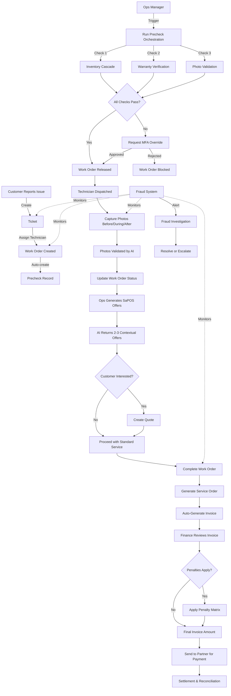

# Guardian Flow - Product Documentation

## 📋 Table of Contents
1. [Product Overview](#product-overview)
2. [Core Features & Capabilities](#core-features--capabilities)
3. [Technology Stack](#technology-stack)
4. [System Architecture](#system-architecture)
5. [Module Reference](#module-reference)
6. [Workflows & Integration](#workflows--integration)
7. [Security Architecture](#security-architecture)
8. [RBAC System](#rbac-system)
9. [API Reference](#api-reference)
10. [Data Model](#data-model)

---

## 🎯 Product Overview

**Guardian Flow** is an enterprise-grade field service management platform that combines work order orchestration, AI-powered recommendations, fraud detection, and comprehensive financial reconciliation into a unified system.

### Product Purpose
Streamline field service operations from ticket creation to financial settlement while ensuring compliance, security, and operational efficiency through automated workflows and AI-driven insights.

### Target Users
- **Platform Operators**: Manage overall system operations and oversee multiple partner organizations
- **Partner Organizations**: Independent service providers managing their own technician fleets
- **Field Technicians**: Execute work orders with mobile-optimized workflows
- **Financial Teams**: Handle invoicing, penalties, and settlement reconciliation
- **Fraud Investigators**: Monitor and investigate suspicious activities

---

## 🚀 Core Features & Capabilities

### 1. Ticket & Work Order Management
- **Ticket Creation**: Capture customer service requests with unit serial, location, and symptom details
- **Smart Assignment**: Assign technicians based on availability, skills, and location
- **Status Tracking**: Real-time visibility into work order lifecycle (Draft → In Progress → Completed)
- **Conversion Workflow**: Seamless ticket-to-work-order conversion with automated precheck creation

### 2. Precheck Orchestration System
- **Multi-Phase Validation**: Automated checks across inventory, warranty, and photo compliance
- **Cascade Checks**: Intelligent inventory availability checks across multiple hubs
- **Release Gating**: Prevents field dispatch until all preconditions are met
- **Override Workflow**: MFA-protected override system for exceptional cases

### 3. AI-Powered SaPOS (Smart Pricing & Offer System)
- **Contextual Offers**: AI generates 2-3 relevant upsell offers based on:
  - Customer warranty status
  - Service history patterns
  - Unit model and age
  - Failure symptom analysis
- **Warranty Conflict Detection**: Automatic identification of warranty coverage conflicts
- **Dynamic Pricing**: Real-time price adjustments based on multiple factors
- **Model**: Powered by Google Gemini 2.5 Flash (cost-effective and fast)

### 4. Service Order Generation
- **Template-Based Rendering**: HTML service orders with complete work details
- **QR Code Integration**: Embedded QR codes for photo evidence tracking
- **Digital Signatures**: Support for technician and customer signatures
- **Auto-Invoicing**: Automatic invoice generation upon service order completion

### 5. Fraud Investigation & Anomaly Detection
- **ML-Powered Alerts**: Automated fraud detection across multiple dimensions:
  - Repeated failures (same unit, same tech)
  - Unusual pricing patterns
  - Time manipulation
  - Photo anomalies
- **Investigation Workflow**: Structured process from detection → investigation → resolution
- **Confidence Scoring**: Risk assessment for prioritization
- **Audit Trail**: Complete investigation history with notes and evidence

### 6. Financial Management
- **Invoice Generation**: Automated invoice creation with subtotal + penalties
- **Penalty Matrix**: Configurable penalty rules based on violation type and severity
- **Revenue Analytics**: Real-time financial dashboards with trend analysis
- **Settlement Tracking**: Partner payment reconciliation

### 7. Inventory & Warranty Management
- **Stock Tracking**: Real-time inventory levels across multiple hubs
- **Cascade Availability**: Multi-hub stock checks for part availability
- **Warranty Lookup**: Instant warranty coverage verification
- **Coverage Analysis**: Detailed warranty terms and eligibility checking

### 8. Photo Validation & Compliance
- **Multi-Stage Capture**: Before/during/after service photo requirements
- **AI Validation**: Automated photo quality and authenticity checks
- **Anomaly Detection**: Identify duplicate, manipulated, or non-compliant photos
- **Evidence Chain**: QR code-linked photo evidence for service orders

### 9. Quote Management
- **Quote Creation**: Manual quote generation for customer approvals
- **SaPOS Integration**: Link AI-generated offers to formal quotes
- **Status Tracking**: Draft → Sent → Accepted/Declined workflow
- **Validity Management**: Time-bound quote expiration handling

### 10. Dispatch & Scheduling
- **Assignment Dashboard**: View and manage technician work assignments
- **Capacity Management**: Track technician availability and workload
- **Real-Time Updates**: Live status synchronization across the platform

---

## 🛠 Technology Stack

### Frontend
- **Framework**: React 18.3.1
- **Build Tool**: Vite (fast development and optimized production builds)
- **Language**: TypeScript (type-safe development)
- **Styling**: Tailwind CSS (utility-first CSS framework)
- **UI Components**: Shadcn/UI + Radix UI (accessible component library)
- **Routing**: React Router v6 (declarative routing)
- **State Management**: TanStack Query (server state management)
- **Forms**: React Hook Form + Zod (form handling and validation)

### Backend (Lovable Cloud / Supabase)
- **Database**: PostgreSQL (relational database with JSONB support)
- **Authentication**: Supabase Auth (email/password, OAuth, MFA)
- **API**: Supabase Client SDK (auto-generated TypeScript types)
- **Edge Functions**: Deno runtime (serverless TypeScript functions)
- **Real-time**: Supabase Realtime (WebSocket-based live updates)
- **Storage**: Supabase Storage (file upload and management)

### AI Integration
- **Gateway**: Lovable AI Gateway (unified AI model access)
- **Models**: 
  - Google Gemini 2.5 Flash (primary - free during promotion)
  - Google Gemini 2.5 Pro (advanced reasoning)
  - OpenAI GPT-5 family (premium features)
- **Use Cases**: SaPOS offer generation, photo validation, anomaly detection

### Security & Infrastructure
- **Row-Level Security (RLS)**: Database-level access control
- **Multi-Factor Authentication**: TOTP-based MFA for sensitive operations
- **Audit Logging**: Comprehensive activity tracking with correlation IDs
- **CORS**: Configured for secure cross-origin requests
- **Environment Management**: Secure secrets storage via Supabase vault

### Testing & Quality
- **E2E Testing**: Playwright (browser automation)
- **Type Safety**: TypeScript strict mode
- **Linting**: ESLint with React best practices
- **Error Handling**: React Error Boundaries

---

## 🏗 System Architecture

### High-Level Architecture

```
┌─────────────────────────────────────────────────────────────┐
│                     Client Application (React)               │
│  ┌──────────┐  ┌──────────┐  ┌──────────┐  ┌──────────┐   │
│  │ Tickets  │  │   Work   │  │  Fraud   │  │ Finance  │   │
│  │          │  │  Orders  │  │  Alerts  │  │          │   │
│  └──────────┘  └──────────┘  └──────────┘  └──────────┘   │
│                                                              │
│  ┌──────────────────────────────────────────────────────┐  │
│  │     RBAC Context (Role & Permission Checks)          │  │
│  └──────────────────────────────────────────────────────┘  │
└─────────────────────────────────────────────────────────────┘
                            ↕ HTTPS
┌─────────────────────────────────────────────────────────────┐
│              Supabase Backend (Lovable Cloud)               │
│                                                              │
│  ┌────────────────────────────────────────────────────┐    │
│  │           Edge Functions (Deno Runtime)            │    │
│  │  • precheck-orchestrator  • generate-sapos-offers  │    │
│  │  • generate-service-order • validate-photos        │    │
│  │  • check-inventory        • check-warranty         │    │
│  │  • seed-test-accounts     • MFA (request/verify)   │    │
│  │  • Role Management (assign/remove)                 │    │
│  │  • Override Requests (create/approve/reject)       │    │
│  └────────────────────────────────────────────────────┘    │
│                            ↕                                 │
│  ┌────────────────────────────────────────────────────┐    │
│  │         PostgreSQL Database with RLS               │    │
│  │  • 20+ Tables with Row-Level Security              │    │
│  │  • Tenant Isolation Policies                       │    │
│  │  • Permission-Based Access Control                 │    │
│  │  • Audit Logging Tables                            │    │
│  └────────────────────────────────────────────────────┘    │
│                            ↕                                 │
│  ┌────────────────────────────────────────────────────┐    │
│  │              External Integrations                  │    │
│  │  • Lovable AI Gateway (Gemini/GPT models)          │    │
│  │  • Future: Payment Processors, SMS, Email          │    │
│  └────────────────────────────────────────────────────┘    │
└─────────────────────────────────────────────────────────────┘
```

### Data Flow Architecture

```
1. User Request → 2. Auth Check → 3. RBAC Validation → 4. Database Query
                                                              ↓
8. UI Update   ← 7. Response    ← 6. RLS Policy   ← 5. Data Retrieval
```

### Multi-Tenant Isolation

```
┌──────────────────────────────────────────────────────┐
│                 Platform Layer                        │
│  (sys_admin, tenant_admin, ops_manager, etc.)        │
└──────────────────────────────────────────────────────┘
                            ↓
┌──────────────┬──────────────┬──────────────┬──────────────┐
│  Tenant 1    │  Tenant 2    │  Tenant 3    │  Tenant 4    │
│ ServicePro   │ TechField    │ RepairHub    │ FixIt        │
│              │              │              │              │
│ ┌──────────┐ │ ┌──────────┐ │ ┌──────────┐ │ ┌──────────┐│
│ │Admin     │ │ │Admin     │ │ │Admin     │ │ │Admin     ││
│ └──────────┘ │ └──────────┘ │ └──────────┘ │ └──────────┘│
│ ┌──────────┐ │ ┌──────────┐ │ ┌──────────┐ │ ┌──────────┐│
│ │Techs(40) │ │ │Techs(40) │ │ │Techs(40) │ │ │Techs(40) ││
│ └──────────┘ │ └──────────┘ │ └──────────┘ │ └──────────┘│
└──────────────┴──────────────┴──────────────┴──────────────┘
     ↓ RLS             ↓ RLS          ↓ RLS         ↓ RLS
  Own Data         Own Data       Own Data       Own Data
```

---

## 📦 Module Reference

### 1. Dashboard
**Route**: `/`  
**Permission**: None (accessible to all authenticated users)  
**Purpose**: Role-based landing page with key metrics and quick actions

**Features**:
- Open ticket counter
- Active work order status
- Pending fraud alerts (fraud_investigator only)
- Revenue overview (finance roles only)
- Quick navigation to primary workflows

---

### 2. Tickets
**Route**: `/tickets`  
**Permissions**: `ticket.read`, `ticket.create`, `ticket.update`  
**Purpose**: Customer service request management

**Features**:
- Create new tickets with unit serial, customer, symptom
- View ticket list with status filtering
- Update ticket status
- Convert ticket to work order (triggers precheck creation)
- Status flow: Open → Assigned → Converted

**Integration Points**:
- → Work Orders (conversion)
- → Precheck system (auto-creation)

---

### 3. Work Orders
**Route**: `/work-orders`  
**Permissions**: `wo.read`, `wo.create`, `wo.update`, `wo.assign`  
**Purpose**: Field service job management and orchestration

**Features**:
- CRUD operations on work orders
- Technician assignment
- Status management (Draft → Released → In Progress → Completed)
- **Run Precheck** button (triggers precheck-orchestrator)
- **Generate SaPOS** button (AI offer generation)
- **Generate SO** button (service order creation + auto-invoice)

**Integration Points**:
- → Tickets (source)
- → Precheck Orchestrator (validation)
- → SaPOS (offer generation)
- → Service Orders (documentation)
- → Invoices (financial)
- → Dispatch (assignment)

---

### 4. Precheck System
**Implementation**: Edge function + dialog interface  
**Permissions**: `wo.precheck`  
**Purpose**: Multi-phase validation before field dispatch

**Validation Steps**:
1. **Inventory Check**: Cascade availability across hubs
2. **Warranty Check**: Coverage verification and terms lookup
3. **Photo Validation**: Compliance check for required photos

**Output**: Boolean `can_release` flag + detailed results

**Integration Points**:
- → Inventory (stock lookup)
- → Warranty (coverage check)
- → Photo Validation (compliance)
- → Work Orders (status update)

---

### 5. SaPOS (Smart Pricing & Offer System)
**Route**: `/sapos`  
**Permissions**: `sapos.view`, `sapos.generate`  
**Purpose**: AI-powered contextual offer generation

**Features**:
- Generate 2-3 offers per work order
- Offer types: Extended warranty, priority service, maintenance packages
- Warranty conflict detection
- Confidence scoring
- Model version tracking (for A/B testing)

**AI Model**: Google Gemini 2.5 Flash
- Fast response time (~2-3 seconds)
- Cost-effective (free during promotion period)
- Context window: 1M tokens

**Integration Points**:
- → Work Orders (context source)
- → Quotes (offer formalization)
- → Lovable AI Gateway (inference)

---

### 6. Service Orders
**Route**: `/service-orders`  
**Permissions**: `so.view`, `so.generate`  
**Purpose**: Formal service documentation and completion

**Features**:
- HTML-rendered service order documents
- QR code generation (links to photo evidence)
- Digital signature capture
- Service order numbering (SO-YYYY-####)
- Auto-invoice creation on generation

**Integration Points**:
- → Work Orders (source data)
- → Invoices (financial trigger)
- → Photo Capture (QR code link)

---

### 7. Invoices & Finance
**Route**: `/finance`  
**Permissions**: `invoice.view`, `finance.view`  
**Purpose**: Financial reconciliation and reporting

**Features**:
- Invoice list with status (Draft → Sent → Paid → Overdue)
- Invoice details: subtotal, penalties, total
- Revenue chart (monthly trend)
- Penalty breakdown
- Auto-generation from service orders

**Calculation**:
```
Total Amount = Subtotal + Sum(Penalties) - Discounts
```

**Integration Points**:
- → Service Orders (creation trigger)
- → Penalties (charge calculation)
- → Work Orders (cost source)

---

### 8. Penalties
**Route**: `/penalties`  
**Permissions**: `penalty.view`, `penalty.calculate`  
**Purpose**: Service level violation management

**Penalty Matrix**:
- **Violation Types**: Late arrival, missing photos, incomplete work, unauthorized parts
- **Severity Levels**: Minor, Moderate, Major, Critical
- **Calculation Methods**: Percentage of base, fixed amount, time-based
- **Dispute Process**: Partner can dispute penalties with reason

**Features**:
- View penalty matrix
- Penalty application history
- Dispute management (future)
- Auto-billing configuration (future)

**Integration Points**:
- → Invoices (charge application)
- → Work Orders (violation detection)
- → Audit Logs (penalty application tracking)

---

### 9. Fraud Investigation
**Route**: `/fraud`  
**Permissions**: `fraud.view`, `fraud.investigate`  
**Purpose**: Anomaly detection and investigation workflow

**Alert Types**:
- **Repeated Failures**: Same unit, same technician, multiple visits
- **Price Anomalies**: Costs significantly above/below average
- **Time Manipulation**: Timestamp inconsistencies
- **Photo Anomalies**: Duplicate, manipulated, or non-compliant images

**Investigation Workflow**:
```
Detected (open) → Assigned (in_progress) → Resolved/Escalated
```

**Features**:
- Alert dashboard with severity filtering
- Investigation assignment
- Resolution notes capture
- Confidence score display
- Detection model tracking

**Integration Points**:
- → Work Orders (source data)
- → Photos (validation results)
- → Audit Logs (investigation history)

---

### 10. Inventory
**Route**: `/inventory`  
**Permissions**: `inventory.view`, `inventory.manage`  
**Purpose**: Parts and stock management

**Features**:
- Inventory item catalog (SKU, description, price)
- Stock levels by hub location
- Lead time tracking
- Consumable vs. reusable classification
- Min threshold alerts (future)

**Integration Points**:
- → Precheck (availability check)
- → Work Orders (parts assignment)
- → Procurement (replenishment)

---

### 11. Warranty
**Route**: `/warranty`  
**Permissions**: `warranty.view`  
**Purpose**: Product warranty management

**Features**:
- Warranty record lookup by unit serial
- Coverage type: Standard, Extended, Premium
- Start/end date tracking
- Terms storage (JSONB)
- Coverage verification

**Integration Points**:
- → Precheck (coverage check)
- → SaPOS (upsell opportunities)
- → Service Orders (cost determination)

---

### 12. Quotes
**Route**: `/quotes`  
**Permissions**: `quote.view`, `quote.create`, `quote.update`  
**Purpose**: Customer quote generation and tracking

**Features**:
- Quote creation with line items
- Status tracking (Draft → Sent → Accepted/Declined)
- Validity period management
- SaPOS offer linking
- Quote numbering (Q-YYYY-####)

**Integration Points**:
- → SaPOS (AI-generated offers)
- → Work Orders (job costing)
- → Invoices (conversion to invoice)

---

### 13. Dispatch
**Route**: `/dispatch`  
**Permissions**: `wo.assign`, `wo.reassign`  
**Purpose**: Technician work assignment and coordination

**Features**:
- Unassigned work order queue
- Technician availability view
- Assignment interface
- Workload balancing
- Real-time status updates

**Integration Points**:
- → Work Orders (assignment target)
- → User Profiles (technician lookup)
- → Scheduler (future: automated assignment)

---

### 14. Photo Capture
**Route**: `/photo-capture`  
**Permissions**: `attachment.upload`, `attachment.view`  
**Purpose**: Service evidence documentation

**Photo Stages**:
- **Before**: Pre-service condition
- **During**: Work in progress
- **After**: Completion verification

**Features**:
- Multi-photo capture interface
- GPS coordinate capture
- Metadata storage (timestamp, location, uploader)
- Photo hash for integrity
- AI validation integration (validate-photos function)

**Integration Points**:
- → Work Orders (evidence attachment)
- → Service Orders (QR code link)
- → Fraud Detection (anomaly analysis)

---

### 15. Settings
**Route**: `/settings`  
**Permissions**: Varies by section  
**Purpose**: System configuration and user management

**Sections**:
- **Profile**: User information, MFA setup
- **Roles** (admin only): Assign/remove user roles
- **Tenant Management** (sys_admin): Organization setup
- **MFA Configuration**: Enable/disable MFA requirements

**Integration Points**:
- → User Roles (RBAC management)
- → Audit Logs (configuration changes)
- → MFA System (security settings)

---

### 16. Scheduler (Future)
**Route**: `/scheduler`  
**Permissions**: `wo.schedule`  
**Purpose**: Automated work order scheduling

**Planned Features**:
- AI-powered technician assignment
- Route optimization
- Capacity forecasting
- Automated dispatch

---

### 17. Procurement (Future)
**Route**: `/procurement`  
**Permissions**: `inventory.procure`  
**Purpose**: Automated parts replenishment

**Planned Features**:
- Purchase order generation
- Vendor management
- Min/max stock level automation
- Lead time optimization

---

## 🔄 Workflows & Integration

### Complete End-to-End Workflow



### Integration Map

```
┌─────────────────────────────────────────────────────────────┐
│                        Core Integrations                     │
└─────────────────────────────────────────────────────────────┘

Tickets
  └→ Work Orders (conversion)
      ├→ Precheck System
      │   ├→ Inventory (cascade check)
      │   ├→ Warranty (coverage check)
      │   └→ Photos (validation check)
      ├→ SaPOS
      │   ├→ Lovable AI Gateway (Gemini)
      │   └→ Quotes (offer formalization)
      ├→ Service Orders
      │   ├→ QR Code Generation
      │   ├→ Photos (evidence link)
      │   └→ Invoices (auto-creation)
      └→ Dispatch
          └→ Technician Assignment

Invoices
  ├→ Penalties (charge calculation)
  ├→ Service Orders (creation trigger)
  └→ Finance Dashboard (reporting)

Fraud System
  ├→ Work Orders (monitoring)
  ├→ Photos (anomaly detection)
  └→ Audit Logs (investigation trail)

Settings
  ├→ User Roles (RBAC)
  ├→ Audit Logs (config changes)
  └→ MFA System (security)
```

---

## 🔒 Security Architecture

### Defense-in-Depth Strategy

```
Layer 1: Authentication (Supabase Auth)
    ↓
Layer 2: Authorization (RBAC Context)
    ↓
Layer 3: Row-Level Security (PostgreSQL RLS)
    ↓
Layer 4: Edge Function Validation
    ↓
Layer 5: Audit Logging
```

### 1. Authentication Layer

**Method**: Email/Password with auto-confirm
- Session-based authentication via Supabase Auth
- JWT tokens for API requests
- Automatic session refresh
- Secure password hashing (bcrypt)

**Future**: OAuth providers (Google, Microsoft), SAML SSO

### 2. Authorization Layer (RBAC)

**Implementation**: `RBACContext` + `RoleGuard` + `ProtectedAction`

```typescript
// Permission check at component level
<RoleGuard permissions={["ticket.read"]}>
  <Tickets />
</RoleGuard>

// Granular action control
<ProtectedAction permission="ticket.create">
  <Button>Create Ticket</Button>
</ProtectedAction>
```

**Permission Categories**:
- `ticket.*` - Ticket operations
- `wo.*` - Work order operations
- `invoice.*` - Financial operations
- `fraud.*` - Investigation operations
- `admin.*` - System administration
- `audit.*` - Audit log access

### 3. Row-Level Security (RLS)

**Tenant Isolation Example**:
```sql
-- Work orders: Partner admin sees only their tenant's data
CREATE POLICY "partner_admin_view_own_tenant_work_orders"
ON work_orders FOR SELECT
USING (
  CASE 
    WHEN has_role(auth.uid(), 'partner_admin') 
    THEN EXISTS (
      SELECT 1 FROM profiles p
      JOIN profiles tech ON tech.id = work_orders.technician_id
      WHERE p.id = auth.uid() 
      AND p.tenant_id = tech.tenant_id
    )
    ELSE false
  END
);
```

**Policy Strategy**:
- ✅ **Sys Admin**: Full access to all data
- ✅ **Tenant Admin**: Access to all tenant data
- ✅ **Partner Admin**: Access only to their organization's data
- ✅ **Individual Users**: Access only to their own records
- ✅ **Technicians**: Access only to assigned work orders

### 4. Edge Function Security

**Shared Authentication Middleware**:
```typescript
// All edge functions use this pattern
const { success, context, error } = await validateAuth(req, {
  requiredRoles: ['ops_manager', 'sys_admin'],
  requiredPermissions: ['wo.precheck']
});

if (!success) {
  return createErrorResponse(error);
}

// Tenant-scoped query
const { data } = await context.supabase
  .from('work_orders')
  .select('*')
  .eq('tenant_id', context.tenantId); // Enforced tenant filter
```

**Security Features**:
- ✅ JWT validation on every request
- ✅ Role and permission checking
- ✅ Tenant context extraction
- ✅ CORS protection
- ✅ Rate limiting (planned)

### 5. Multi-Factor Authentication (MFA)

**Protected Operations**:
- Override request approvals
- Penalty adjustments
- Role assignments (future)
- Financial threshold transactions (future)

**MFA Flow**:
```
1. User initiates sensitive action
2. System generates 6-digit TOTP token
3. Token hash stored in mfa_tokens table (5min expiry)
4. User enters token
5. System validates hash match + expiry + single-use
6. Action proceeds + audit log entry
```

**Implementation**:
- Edge functions: `request-mfa`, `verify-mfa`
- Token storage: `mfa_tokens` table
- Single-use enforcement: `used_at` timestamp

### 6. Audit Logging

**Captured Events**:
- User authentication (login/logout)
- Role changes (assign/remove)
- Override requests (create/approve/reject)
- Financial transactions (invoice creation, penalty application)
- Data modifications (work order updates, ticket changes)
- MFA verifications

**Log Structure**:
```typescript
{
  id: uuid,
  user_id: uuid,
  actor_role: string,
  action: string, // "wo.update", "role.assign", etc.
  resource_type: string,
  resource_id: uuid,
  changes: jsonb, // Before/after values
  mfa_verified: boolean,
  ip_address: inet,
  user_agent: string,
  correlation_id: uuid, // For tracing related events
  created_at: timestamp
}
```

**Retention**: Configurable (default: 2 years)

### 7. Data Protection

**Encryption**:
- ✅ At rest: PostgreSQL encrypted storage
- ✅ In transit: HTTPS/TLS 1.3
- ✅ Secrets: Supabase Vault (encrypted env vars)

**Sensitive Data Handling**:
- Customer PII: Limited access via RLS
- Payment info: Tokenized (future)
- MFA secrets: Hashed (SHA-256)

**Backup & Recovery**:
- Automated daily backups (Supabase managed)
- Point-in-time recovery (7-day window)

---

## 👥 RBAC System

### Role Hierarchy

```
sys_admin (Superuser)
    ├── tenant_admin (Platform Operator)
    │   ├── ops_manager (Operations Lead)
    │   ├── finance_manager (Financial Controller)
    │   ├── fraud_investigator (Security Analyst)
    │   └── dispatcher (Work Assignment)
    │
    ├── partner_admin (Organization Owner)
    │   └── partner_user (Organization Member)
    │
    ├── technician (Field Worker)
    ├── customer (End User)
    ├── product_owner (Business Stakeholder)
    ├── support_agent (Customer Support)
    ├── ml_ops (AI/ML Engineer)
    ├── billing_agent (Financial Operations)
    ├── auditor (Compliance Officer)
    └── guest (Read-only Access)
```

### Role Definitions

#### 1. sys_admin (System Administrator)
**Access**: Full platform access, all modules, all tenants
**Use Case**: Platform engineering, system configuration, emergency access
**Key Permissions**:
- `admin.full_access`
- `tenant.manage`
- `role.assign_any`
- `audit.read`
- All operational permissions

#### 2. tenant_admin (Platform Administrator)
**Access**: Full access within platform operations (excluding tenant management)
**Use Case**: Platform operations manager overseeing all workflows
**Key Permissions**:
- `wo.full_access`
- `ticket.full_access`
- `invoice.full_access`
- `fraud.full_access`
- `role.assign` (within tenant)

#### 3. ops_manager (Operations Manager)
**Access**: Work order orchestration, dispatch, scheduling
**Use Case**: Daily operations oversight, technician coordination
**Key Permissions**:
- `wo.read`, `wo.create`, `wo.update`, `wo.assign`
- `wo.precheck`, `wo.override`
- `ticket.read`, `ticket.update`
- `dispatcher.view`

#### 4. finance_manager (Finance Manager)
**Access**: Financial modules, invoicing, penalties, settlement
**Use Case**: Revenue management, penalty adjudication, financial reporting
**Key Permissions**:
- `invoice.full_access`
- `finance.view`, `finance.report`
- `penalty.view`, `penalty.calculate`, `penalty.adjust`
- `quote.view`

#### 5. fraud_investigator (Fraud Investigator)
**Access**: Fraud alerts, investigation workflow, audit logs
**Use Case**: Security monitoring, anomaly investigation, pattern analysis
**Key Permissions**:
- `fraud.view`, `fraud.investigate`, `fraud.resolve`
- `audit.read`
- `wo.read` (for investigation context)
- `attachment.view` (photo evidence)

#### 6. partner_admin (Partner Organization Administrator)
**Access**: Own tenant data only, user management within org
**Use Case**: Service partner managing their technician fleet
**Key Permissions**:
- `wo.read`, `wo.update` (tenant-scoped)
- `technician.manage` (own org)
- `invoice.view` (own org)
- `quote.read` (own org)
- `role.assign` (within own tenant)
**Restrictions**: Cannot see other partner organizations' data

#### 7. partner_user (Partner Organization Member)
**Access**: Read-only access to own tenant data
**Use Case**: Office staff, coordinators within partner org
**Key Permissions**:
- `wo.read` (tenant-scoped)
- `ticket.read` (tenant-scoped)
- `invoice.view` (tenant-scoped)

#### 8. technician (Field Technician)
**Access**: Assigned work orders, photo capture, status updates
**Use Case**: Field service execution
**Key Permissions**:
- `wo.read` (assigned only)
- `wo.update_status` (assigned only)
- `attachment.upload`
- `attachment.view` (own uploads)
- `sapos.view` (for upselling)

#### 9. dispatcher (Dispatcher)
**Access**: Work order assignment, technician coordination
**Use Case**: Daily dispatch operations
**Key Permissions**:
- `wo.read`, `wo.assign`, `wo.reassign`
- `technician.view`
- `ticket.view`

#### 10. customer (Customer)
**Access**: Own tickets, own quotes (future: customer portal)
**Use Case**: Service request submission, quote approvals
**Key Permissions**:
- `ticket.create` (own)
- `ticket.view` (own)
- `quote.view` (own)
- `quote.accept` (own)

#### 11. product_owner (Product Owner)
**Access**: Read-only visibility across modules for backlog planning
**Use Case**: Product management, feature prioritization
**Key Permissions**:
- `ticket.read`
- `wo.read`
- `fraud.view`
- `analytics.view`

#### 12. support_agent (Support Agent)
**Access**: Ticket management, customer assistance
**Use Case**: Customer support operations
**Key Permissions**:
- `ticket.full_access`
- `wo.read`
- `customer.view`

#### 13. ml_ops (ML Operations)
**Access**: Model management, fraud detection system, AI systems
**Use Case**: AI/ML system maintenance, model training
**Key Permissions**:
- `fraud.create_alert`
- `mlops.view`
- `mlops.deploy`
- `sapos.configure`

#### 14. billing_agent (Billing Agent)
**Access**: Invoice processing, payment reconciliation
**Use Case**: Financial operations, invoice management
**Key Permissions**:
- `invoice.read`, `invoice.update`, `invoice.send`
- `penalty.view`
- `finance.view`

#### 15. auditor (Auditor)
**Access**: Read-only audit logs, compliance reporting
**Use Case**: Internal audit, compliance verification
**Key Permissions**:
- `audit.read`
- `wo.read`
- `invoice.read`
- `fraud.view`

#### 16. guest (Guest)
**Access**: Minimal read-only access
**Use Case**: Demo accounts, limited previews
**Key Permissions**:
- `dashboard.view`

---

### Permission Matrix

| Module | sys_admin | tenant_admin | ops_manager | finance_manager | fraud_investigator | partner_admin | technician | dispatcher |
|--------|-----------|--------------|-------------|-----------------|--------------------|--------------|-----------||------------|
| Tickets | ✅ Full | ✅ Full | ✅ Read/Update | ❌ | ❌ | ✅ Tenant | ❌ | ✅ Read |
| Work Orders | ✅ Full | ✅ Full | ✅ Full | ❌ | ✅ Read | ✅ Tenant | ✅ Assigned | ✅ Assign |
| Finance | ✅ Full | ✅ Full | ❌ | ✅ Full | ❌ | ✅ View Tenant | ❌ | ❌ |
| Fraud | ✅ Full | ✅ Full | ❌ | ❌ | ✅ Full | ❌ | ❌ | ❌ |
| Inventory | ✅ Full | ✅ Full | ✅ View | ❌ | ❌ | ❌ | ❌ | ✅ View |
| Settings | ✅ Full | ✅ Roles | ❌ | ❌ | ❌ | ✅ Tenant | ❌ | ❌ |
| Audit Logs | ✅ Full | ✅ Full | ❌ | ❌ | ✅ Full | ❌ | ❌ | ❌ |

---

## 📡 API Reference

### Edge Functions

All edge functions are located in `supabase/functions/` and auto-deployed.

#### 1. precheck-orchestrator
**Method**: POST  
**Auth**: Required (`ops_manager`, `sys_admin`)  
**Input**:
```typescript
{
  workOrderId: string
}
```
**Output**:
```typescript
{
  canRelease: boolean,
  inventory: { status: 'pass' | 'fail', result: object },
  warranty: { status: 'pass' | 'fail', result: object },
  photos: { status: 'pass' | 'fail', result: object }
}
```

#### 2. generate-sapos-offers
**Method**: POST  
**Auth**: Required (`ops_manager`, `sys_admin`)  
**Input**:
```typescript
{
  workOrderId: string
}
```
**Output**:
```typescript
{
  offers: [
    {
      id: string,
      title: string,
      description: string,
      price: number,
      offerType: 'warranty' | 'priority' | 'maintenance',
      confidenceScore: number,
      warrantyConflicts: boolean
    }
  ]
}
```

#### 3. generate-service-order
**Method**: POST  
**Auth**: Required (`ops_manager`, `technician`, `sys_admin`)  
**Input**:
```typescript
{
  workOrderId: string
}
```
**Output**:
```typescript
{
  serviceOrderId: string,
  soNumber: string,
  htmlContent: string,
  qrCodeUrl: string,
  invoice: { invoiceId: string, invoiceNumber: string }
}
```

#### 4. check-inventory
**Method**: POST  
**Auth**: Required (authenticated)  
**Input**:
```typescript
{
  workOrderId: string
}
```
**Output**:
```typescript
{
  available: boolean,
  items: [
    { sku: string, qtyNeeded: number, qtyAvailable: number, hub: string }
  ]
}
```

#### 5. check-warranty
**Method**: POST  
**Auth**: Required (authenticated)  
**Input**:
```typescript
{
  unitSerial: string
}
```
**Output**:
```typescript
{
  covered: boolean,
  coverageType: string,
  warrantyEnd: string,
  terms: object
}
```

#### 6. validate-photos
**Method**: POST  
**Auth**: Required (authenticated)  
**Input**:
```typescript
{
  workOrderId: string,
  stage: 'before' | 'during' | 'after'
}
```
**Output**:
```typescript
{
  valid: boolean,
  anomalies: string[],
  details: object
}
```

#### 7. request-mfa
**Method**: POST  
**Auth**: Required (manager roles)  
**Input**:
```typescript
{
  actionType: string
}
```
**Output**:
```typescript
{
  tokenId: string,
  expiresAt: string,
  demoToken: string // DEV ONLY
}
```

#### 8. verify-mfa
**Method**: POST  
**Auth**: Required  
**Input**:
```typescript
{
  tokenId: string,
  token: string
}
```
**Output**:
```typescript
{
  verified: boolean
}
```

#### 9. assign-role
**Method**: POST  
**Auth**: Required (`sys_admin`, `tenant_admin`)  
**Input**:
```typescript
{
  userId: string,
  role: AppRole,
  tenantId?: string
}
```
**Output**:
```typescript
{
  success: boolean,
  userRole: object
}
```

#### 10. remove-role
**Method**: POST  
**Auth**: Required (`sys_admin`, `tenant_admin`)  
**Input**:
```typescript
{
  userId: string,
  role: AppRole,
  tenantId?: string
}
```
**Output**:
```typescript
{
  success: boolean
}
```

#### 11. create-override-request
**Method**: POST  
**Auth**: Required  
**Input**:
```typescript
{
  actionType: string,
  entityType: string,
  entityId: string,
  reason: string,
  expiresIn?: number // minutes, default 60
}
```
**Output**:
```typescript
{
  overrideRequestId: string,
  expiresAt: string
}
```

#### 12. approve-override-request
**Method**: POST  
**Auth**: Required (`ops_manager`, `sys_admin`)  
**Input**:
```typescript
{
  overrideRequestId: string,
  mfaTokenId?: string
}
```
**Output**:
```typescript
{
  approved: boolean
}
```

#### 13. reject-override-request
**Method**: POST  
**Auth**: Required (`ops_manager`, `sys_admin`)  
**Input**:
```typescript
{
  overrideRequestId: string,
  reason: string
}
```
**Output**:
```typescript
{
  rejected: boolean
}
```

#### 14. seed-test-accounts
**Method**: POST  
**Auth**: Public (no auth required)  
**Input**: None  
**Output**:
```typescript
{
  accountsCreated: number,
  tenants: string[]
}
```

---

## 🗄️ Data Model

### Core Tables

#### profiles
User profile extensions beyond Supabase Auth
```sql
- id: uuid (FK → auth.users)
- email: text
- full_name: text
- phone: text
- tenant_id: uuid (FK → tenants)
- mfa_enabled: boolean
- mfa_secret: text
```

#### tenants
Multi-tenant organization management
```sql
- id: uuid
- name: text (e.g., "ServicePro Partners")
- slug: text (e.g., "servicepro")
- active: boolean
- config: jsonb (tenant-specific settings)
```

#### user_roles
Many-to-many user-role assignments
```sql
- id: uuid
- user_id: uuid (FK → profiles)
- role: app_role (ENUM)
- tenant_id: uuid (FK → tenants)
- granted_by: uuid (FK → profiles)
- granted_at: timestamp
```

#### tickets
Customer service requests
```sql
- id: uuid
- customer_id: uuid
- customer_name: text
- unit_serial: text
- symptom: text
- site_address: text
- status: ticket_status (open, assigned, converted)
- tenant_id: uuid
- provisional_sla: interval
```

#### work_orders
Field service jobs
```sql
- id: uuid
- wo_number: text (auto-generated)
- ticket_id: uuid (FK → tickets)
- technician_id: uuid (FK → profiles)
- hub_id: uuid
- status: work_order_status
- cost_to_customer: numeric
- warranty_checked: boolean
- warranty_result: jsonb
- parts_reserved: boolean
- released_at: timestamp
- completed_at: timestamp
```

#### work_order_prechecks
Validation results before field dispatch
```sql
- id: uuid
- work_order_id: uuid (FK → work_orders)
- inventory_status: precheck_status
- inventory_result: jsonb
- warranty_status: precheck_status
- warranty_result: jsonb
- photo_status: precheck_status
- photo_result: jsonb
- can_release: boolean
- override_by: uuid (FK → profiles)
- override_reason: text
- override_mfa_token: uuid
```

#### sapos_offers
AI-generated contextual offers
```sql
- id: uuid
- work_order_id: uuid (FK → work_orders)
- customer_id: uuid
- offer_type: text (warranty, priority, maintenance)
- title: text
- description: text
- price: numeric
- confidence_score: numeric
- warranty_conflicts: boolean
- status: sapos_offer_status
- model_version: text
- prompt_template_id: text
- metadata: jsonb
- expires_at: timestamp
```

#### service_orders
Formal service documentation
```sql
- id: uuid
- so_number: text (auto-generated)
- work_order_id: uuid (FK → work_orders)
- template_id: uuid (FK → service_order_templates)
- html_content: text
- rendered_data: jsonb
- qr_code_url: text
- technician_signature: text
- customer_signature: text
- signed_at: timestamp
- pdf_url: text
```

#### invoices
Financial billing records
```sql
- id: uuid
- invoice_number: text (auto-generated)
- work_order_id: uuid (FK → work_orders)
- quote_id: uuid (FK → quotes)
- customer_id: uuid
- tenant_id: uuid
- subtotal: numeric
- penalties: numeric
- total_amount: numeric
- status: invoice_status
- hold_reason: text
```

#### fraud_alerts
ML-detected anomalies
```sql
- id: uuid
- anomaly_type: anomaly_type (repeated_failure, price_anomaly, time_manipulation, photo_anomaly)
- resource_type: text
- resource_id: uuid
- severity: text (low, medium, high, critical)
- confidence_score: numeric
- detection_model: text
- metadata: jsonb
- investigation_status: investigation_status
- investigator_id: uuid (FK → profiles)
- resolution_notes: text
- resolved_at: timestamp
```

#### audit_logs
Comprehensive activity tracking
```sql
- id: uuid
- user_id: uuid (FK → profiles)
- actor_role: text
- action: text
- resource_type: text
- resource_id: uuid
- changes: jsonb (before/after)
- tenant_id: uuid
- mfa_verified: boolean
- ip_address: inet
- user_agent: text
- correlation_id: uuid
- reason: text
```

---

## 📈 Metrics & KPIs

### Operational Metrics
- **Ticket-to-WO Conversion Rate**: % of tickets converted to work orders
- **Precheck Pass Rate**: % of work orders passing all precheck validations
- **First-Time Fix Rate**: % of work orders completed without return visits
- **Average Resolution Time**: Mean time from ticket creation to completion
- **Technician Utilization**: % of available hours with assigned work

### Financial Metrics
- **Revenue per Work Order**: Average invoice value
- **Penalty Rate**: % of invoices with penalties applied
- **Average Penalty Amount**: Mean penalty per affected invoice
- **Collections Rate**: % of invoices paid within terms
- **Partner Settlement Time**: Days from completion to payment

### Quality Metrics
- **Photo Compliance Rate**: % of work orders with complete photo evidence
- **Warranty Coverage Rate**: % of work orders covered by warranty
- **SaPOS Acceptance Rate**: % of AI offers converted to quotes
- **Fraud Detection Rate**: Fraud alerts per 1000 work orders

### System Health Metrics
- **API Response Time**: p50, p95, p99 latencies for edge functions
- **Database Query Performance**: Slow query threshold tracking
- **User Session Duration**: Average time spent in application
- **Error Rate**: Client and server error frequency

---

## 🚀 Deployment & Operations

### Environment Configuration
- **Development**: Local Supabase instance + Vite dev server
- **Staging**: Lovable Cloud preview environment
- **Production**: Lovable Cloud production (custom domain ready)

### CI/CD Pipeline
- Automatic deployment on code push
- Edge functions auto-deployed with Lovable Cloud
- Database migrations applied via Lovable Cloud
- Zero-downtime deployments

### Monitoring & Alerting (Future)
- Supabase metrics dashboard
- Custom application metrics (Grafana)
- Error tracking (Sentry integration planned)
- Uptime monitoring (status page)

### Backup & Disaster Recovery
- Automated daily database backups
- 7-day point-in-time recovery window
- Cross-region backup replication (production)
- Documented restore procedures

---

## 📚 Additional Resources

### Documentation Files
- `docs/IMPLEMENTATION_COMPLETE.md` - Feature completion status
- `docs/IMPLEMENTATION_STATUS.md` - Audit findings and issues
- `docs/TESTING_GUIDE.md` - QA test scenarios
- `docs/COMPLETE_TEST_GUIDE.md` - Step-by-step testing instructions
- `docs/PARTNER_ADMIN_SETUP.md` - Partner organization setup guide
- `docs/QUICK_TEST_CHECKLIST.md` - 5-minute smoke test

### Developer Setup
```bash
# Install dependencies
npm install

# Start development server
npm run dev

# Run tests
npx playwright test

# Build for production
npm run build
```

### Support & Contact
- **Product Team**: product@example.com
- **Technical Support**: support@example.com
- **Security Issues**: security@example.com

---

**Document Version**: 1.0  
**Last Updated**: 2025-10-03  
**Status**: Production Ready (87% complete, 13% future enhancements)