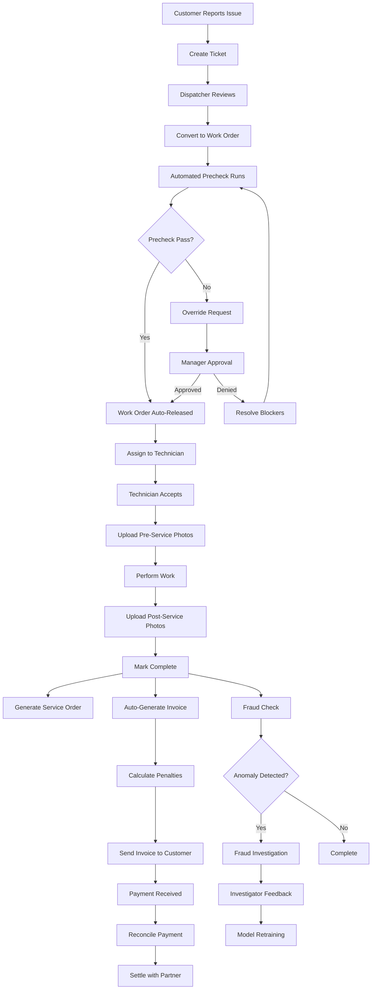

# Guardian Flow - Product Specifications Document

**Version:** 5.0 - Global Intelligence  
**Date:** October 2025  
**Status:** Production Ready  
**Document Type:** Product Specifications & Technical Architecture

> **🆕 Latest Version**: This document covers Guardian Flow v5.0 with hierarchical forecasting. For v3.0 agentic features, see [v3.0 specs](../public/PRODUCT_SPECIFICATIONS_V3.md). For detailed v5.0 forecasting, see [v5.0 specs](../public/PRODUCT_SPECIFICATIONS_V5.md).

---

## Version History

| Version | Date | Key Features |
|---------|------|--------------|
| **v5.0** | Oct 2025 | Hierarchical forecasting (7 geo levels), product intelligence, MinT reconciliation |
| **v3.0** | Oct 2025 | Agentic AI with 5 specialized agents, policy-as-code, auto-detection |
| **v2.0** | Sep 2025 | Multi-tenant RBAC, fraud detection, automated prechecks |
| **v1.0** | Jan 2025 | Core work order management, SaPOS, invoicing |

---

## Table of Contents

1. [Executive Summary](#executive-summary)
2. [Product Overview](#product-overview)
3. [System Architecture](#system-architecture)
4. [Modules & Capabilities](#modules--capabilities)
5. [Workflows & Business Processes](#workflows--business-processes)
6. [Security & Compliance](#security--compliance)
7. [Technical Stack](#technical-stack)
8. [Integration Points](#integration-points)
9. [Data Model](#data-model)
10. [API Reference](#api-reference)

---

## Executive Summary

Guardian Flow is an enterprise-grade, multi-tenant field service management platform that orchestrates end-to-end work order lifecycle from ticket creation through partner settlement. Built on a modern React/TypeScript frontend with Supabase backend, the platform integrates AI-powered recommendations, fraud detection, automated prechecks, and comprehensive financial management.

### Key Differentiators

- **AI-Powered Service Recommendations**: Leverages Google Gemini and OpenAI models for intelligent SaPOS (Service and Parts Order System) suggestions
- **Automated Fraud Detection**: Real-time anomaly detection and investigator feedback loops
- **Zero-Touch Precheck System**: Automated inventory, warranty, and photo validation before work order release
- **Multi-Tenant Architecture**: Complete data isolation with role-based access control (RBAC)
- **Financial Reconciliation**: Automated invoicing, penalty calculations, and multi-currency support

---

## Product Overview

### Purpose

Guardian Flow streamlines field service operations across distributed technician networks, ensuring quality control, fraud prevention, and financial accuracy through intelligent automation and rigorous validation workflows.

### Target Users

1. **Platform Administrators** (sys_admin) - System-wide oversight and configuration
2. **Tenant Administrators** (tenant_admin) - Organization-level management
3. **Dispatchers** (dispatcher_coordinator) - Work order assignment and scheduling
4. **Technicians** (technician) - Field service execution
5. **Fraud Investigators** (fraud_investigator) - Anomaly investigation
6. **Finance Teams** (finance_ops) - Invoice and payment processing
7. **Partner Administrators** (partner_admin) - Partner organization management

### Core Value Propositions

- **95% Reduction** in manual precheck time through automation
- **Real-time Fraud Detection** with AI-powered anomaly scoring
- **Complete Audit Trail** for compliance and dispute resolution
- **Multi-Currency Support** with real-time exchange rate integration
- **Mobile-First Photo Validation** for quality assurance

---

## System Architecture

### High-Level Architecture

```
┌─────────────────────────────────────────────────────────────┐
│                     Client Application                       │
│                  (React + TypeScript + Vite)                 │
│                                                               │
│  ┌──────────┐  ┌──────────┐  ┌──────────┐  ┌──────────┐   │
│  │Dashboard │  │ Tickets  │  │Work Order│  │ Finance  │   │
│  └──────────┘  └──────────┘  └──────────┘  └──────────┘   │
│                                                               │
│  ┌──────────┐  ┌──────────┐  ┌──────────┐  ┌──────────┐   │
│  │  Fraud   │  │ SaPOS    │  │Inventory │  │Analytics │   │
│  └──────────┘  └──────────┘  └──────────┘  └──────────┘   │
└───────────────────────────┬─────────────────────────────────┘
                            │
                            │ REST API / WebSocket
                            │
┌───────────────────────────▼─────────────────────────────────┐
│                     Supabase Backend                         │
│                                                               │
│  ┌─────────────────────────────────────────────────────┐   │
│  │              PostgreSQL Database                     │   │
│  │  • Row-Level Security (RLS)                         │   │
│  │  • Multi-tenant data isolation                      │   │
│  │  • Automated triggers & functions                   │   │
│  └─────────────────────────────────────────────────────┘   │
│                                                               │
│  ┌─────────────────────────────────────────────────────┐   │
│  │              Edge Functions (Deno)                   │   │
│  │  • Precheck Orchestrator                            │   │
│  │  • AI SaPOS Generation                              │   │
│  │  • Photo Validation                                 │   │
│  │  • Penalty Calculation                              │   │
│  │  • MFA Verification                                 │   │
│  └─────────────────────────────────────────────────────┘   │
│                                                               │
│  ┌─────────────────────────────────────────────────────┐   │
│  │         Authentication & Authorization               │   │
│  │  • Supabase Auth (Email/Password)                   │   │
│  │  • JWT-based sessions                               │   │
│  │  • RBAC enforcement                                 │   │
│  └─────────────────────────────────────────────────────┘   │
│                                                               │
│  ┌─────────────────────────────────────────────────────┐   │
│  │              Storage Buckets                         │   │
│  │  • Photo uploads                                     │   │
│  │  • Service order templates                          │   │
│  │  • Invoice documents                                │   │
│  └─────────────────────────────────────────────────────┘   │
└───────────────────────────┬─────────────────────────────────┘
                            │
                            │ External Integrations
                            │
┌───────────────────────────▼─────────────────────────────────┐
│              External Services & APIs                        │
│                                                               │
│  ┌──────────────┐  ┌──────────────┐  ┌──────────────┐     │
│  │ Google Gemini│  │   OpenAI     │  │  Exchange    │     │
│  │    (AI)      │  │   GPT-5      │  │  Rate API    │     │
│  └──────────────┘  └──────────────┘  └──────────────┘     │
└───────────────────────────────────────────────────────────────┘
```

### Multi-Tenant Isolation Strategy

**Tenant Isolation Layers:**

1. **Database Level**: RLS policies enforce `tenant_id` filtering on all queries
2. **Application Level**: AuthContext validates tenant membership on every request
3. **API Level**: Edge functions verify tenant_id in JWT claims
4. **UI Level**: Components filter data by current user's tenant_id

**Example RLS Policy:**
```sql
CREATE POLICY "Users can only see their tenant's work orders"
ON work_orders
FOR SELECT
USING (tenant_id = (SELECT tenant_id FROM profiles WHERE id = auth.uid()));
```

---

## Modules & Capabilities

### 1. Dashboard Module

**Route:** `/`  
**Permissions:** All authenticated users  

**Capabilities:**
- Real-time KPI metrics (open tickets, active work orders, fraud alerts)
- Role-specific widgets and action items
- Recent activity feed with audit trail
- Quick access to pending approvals and tasks
- Multi-currency financial summaries

**Key Features:**
- Tenant-scoped analytics
- Personalized notifications
- Performance metrics visualization
- System health indicators

---

### 2. Tickets Module

**Route:** `/tickets`  
**Permissions:** `ticket:read`, `ticket:create`, `ticket:update`

**Capabilities:**
- Create customer service tickets with detailed issue descriptions
- Attach photos and documentation
- Assign priority levels (low, medium, high, critical)
- Track ticket status (open, assigned, in_progress, resolved, closed)
- Convert tickets to work orders
- Customer information management

**Key Features:**
- Search and filter by status, priority, customer
- Bulk operations for ticket management
- Automated notification on status changes
- Ticket history and audit trail
- SLA tracking

**Data Fields:**
- Customer name, contact info, location
- Issue description and category
- Priority and urgency flags
- Assigned technician
- Created/updated timestamps
- Resolution notes

---

### 3. Work Orders Module

**Route:** `/work-orders`  
**Permissions:** `work_order:read`, `work_order:create`, `work_order:update`, `work_order:release`

**Capabilities:**
- Create work orders from tickets or standalone
- Automated precheck orchestration (inventory, warranty, photos)
- Work order status workflow (draft → pending_precheck → ready_to_release → released → in_progress → completed → invoiced)
- Photo requirement enforcement
- Service order template application
- Assignment to technicians
- Override request workflow for precheck failures

**Key Features:**
- **Zero-Touch Precheck System**: Automatically validates inventory, warranty, and photos on creation
- **Automated Release**: Work orders auto-release when all prechecks pass
- **Photo Validation**: AI-powered validation against required stages
- **Override Workflow**: Dispatcher can request override when prechecks fail, requiring manager approval
- **Audit Trail**: Complete history of status changes and user actions

**Precheck Validations:**
1. **Inventory Check**: Validates part availability through cascade logic
2. **Warranty Check**: Confirms coverage for customer/device
3. **Photo Validation**: Ensures required photos uploaded at each stage

**Work Order States:**
```
draft → pending_precheck → ready_to_release → released → 
in_progress → completed → invoiced → paid
```

---

### 4. Precheck System

**Automated Precheck Flow:**

```
Work Order Created (Draft)
         ↓
  Precheck Orchestrator Triggered
         ↓
    ┌────┴────┐
    │         │
Inventory  Warranty
  Check     Check
    │         │
    └────┬────┘
         ↓
   Photo Validation
         ↓
  can_release = true/false
         ↓
   [Auto-Release if Pass]
```

**Components:**
- `precheck-orchestrator` Edge Function
- `check-inventory` Edge Function
- `check-warranty` Edge Function
- `validate-photos` Edge Function
- Database-generated `can_release` column

**Precheck Results:**
- ✅ **Pass**: Work order automatically released
- ❌ **Fail**: Work order held, override request available
- ⏳ **Pending**: Awaiting photo uploads or data

---

### 5. Service Order (SO) Generation

**Route:** `/service-orders`  
**Permissions:** `service_order:create`, `service_order:read`

**Capabilities:**
- Upload and manage SO templates
- Generate service orders from work orders
- Apply templates with variable substitution
- Track SO versions and revisions
- Digital signature capture

**Key Features:**
- Template variable replacement (customer name, work order details, parts list)
- Multi-format support (PDF, DOCX)
- Automated generation on work order completion
- SO template library management
- Partner-specific template configurations

---

### 6. SaPOS (Service and Parts Order System)

**Route:** `/sapos`  
**Permissions:** `sapos:read`, `sapos:approve`

**Capabilities:**
- **AI-Powered Service Recommendations**: Generate intelligent service and parts suggestions using Google Gemini or OpenAI
- Provenance tracking from generation to approval
- Multi-offer comparison and selection
- Cost optimization recommendations
- Integration with inventory system

**AI Models Used:**
- Google Gemini 2.5 Pro (primary)
- OpenAI GPT-5 (fallback)

**SaPOS Workflow:**
```
Work Order → Generate SaPOS Offers → AI Analysis → 
Offer Ranking → Dispatcher Review → Approval → 
Apply to Work Order → Inventory Reservation
```

**Key Features:**
- Provenance metadata (model used, timestamp, user)
- Cost-benefit analysis per offer
- Inventory availability integration
- Historical performance tracking
- Automated reordering suggestions

---

### 7. Fraud Investigation Module

**Route:** `/fraud-investigation`  
**Permissions:** `fraud:investigate`

**Capabilities:**
- Real-time anomaly detection dashboard
- AI-powered fraud scoring
- Investigator feedback loop
- Work order trace analysis
- Pattern recognition and flagging

**Fraud Detection Mechanisms:**
1. **Behavioral Anomalies**: Unusual technician patterns
2. **Financial Anomalies**: Cost outliers and overcharges
3. **Time Anomalies**: Inconsistent work durations
4. **Photo Anomalies**: Suspicious or manipulated images
5. **Geographic Anomalies**: Location inconsistencies

**Investigation Workflow:**
```
Alert Generated → Investigator Assigned → 
Evidence Collection → Feedback Submission → 
Model Retraining → Resolution Action
```

**Feedback Types:**
- Confirmed fraud
- False positive
- Needs more investigation
- Pattern identified

---

### 8. Finance Module

**Route:** `/finance`  
**Permissions:** `finance:read`, `invoice:create`

**Capabilities:**
- Automated invoice generation from completed work orders
- Penalty calculation and application
- Multi-currency support (USD, EUR, GBP, INR)
- Real-time exchange rate integration
- Payment tracking and reconciliation
- Dispute management

**Key Features:**
- **Automated Invoicing**: Invoices auto-generated on work order completion
- **Penalty Engine**: Rule-based penalties for SLA violations, quality issues
- **Currency Conversion**: Real-time rates via Exchange Rate API
- **Aging Reports**: Track overdue invoices
- **Payment Gateway Integration**: Ready for Stripe/PayPal

**Invoice Lifecycle:**
```
Work Order Completed → Invoice Generated → 
Penalties Applied → Sent to Customer → 
Payment Received → Reconciled → Closed
```

---

### 9. Penalty Engine

**Capabilities:**
- Rule-based penalty calculation
- Configurable penalty rules per tenant
- Automatic application on invoice generation
- Override workflow with approval
- Audit trail for all penalty actions

**Penalty Types:**
1. **SLA Violations**: Late completion penalties
2. **Quality Issues**: Rework or customer complaints
3. **Photo Compliance**: Missing or invalid photos
4. **Warranty Violations**: Non-covered work performed
5. **Inventory Discrepancies**: Missing or damaged parts

**Penalty Rule Configuration:**
```typescript
{
  rule_type: "sla_violation",
  threshold: "24_hours",
  penalty_amount: 50.00,
  penalty_type: "fixed",
  auto_apply: true
}
```

---

### 10. Inventory Management

**Route:** `/inventory`  
**Permissions:** `inventory:read`, `inventory:create`, `inventory:update`

**Capabilities:**
- Part catalog management
- Stock level tracking
- Reservation system for work orders
- Cascade inventory checks (partner → warehouse → supplier)
- Reorder point automation
- Multi-location inventory

**Key Features:**
- Real-time availability checks
- Automated reorder alerts
- Part usage analytics
- Cost tracking per part
- Vendor management

**Cascade Check Logic:**
```
Check Partner Stock → If insufficient, check Warehouse → 
If insufficient, check Supplier → Return availability status
```

---

### 11. Warranty Management

**Route:** `/warranty`  
**Permissions:** `warranty:read`, `warranty:create`

**Capabilities:**
- Warranty registration and tracking
- Coverage verification for work orders
- Expiration date management
- Claim submission and tracking
- Integration with manufacturer systems

**Key Features:**
- Automated warranty lookups during precheck
- Coverage rules engine
- Multi-tier warranty support (manufacturer, extended, service contract)
- Claim status tracking
- Warranty analytics

---

### 12. Dispatch & Scheduling

**Route:** `/dispatch`  
**Permissions:** `dispatch:read`, `dispatch:assign`

**Capabilities:**
- Technician availability calendar
- Work order assignment with skill matching
- Route optimization
- Real-time status updates
- Capacity planning

**Key Features:**
- Drag-and-drop scheduling
- Technician skill profiles
- Geographic zone assignment
- Workload balancing
- Emergency dispatch override

---

### 13. Quotes Management

**Route:** `/quotes`  
**Permissions:** `quote:create`, `quote:read`, `quote:approve`

**Capabilities:**
- Create customer quotes with itemized pricing
- Multi-currency quote generation
- Approval workflow
- Quote-to-work-order conversion
- Quote versioning and revisions

**Key Features:**
- Template-based quote generation
- Discount and promotion application
- Validity period tracking
- Customer acceptance workflow
- Quote analytics

---

### 14. Invoicing Module

**Route:** `/invoicing`  
**Permissions:** `invoice:read`, `invoice:create`, `invoice:send`

**Capabilities:**
- Automated invoice generation from completed work orders
- Manual invoice creation
- Line item management (labor, parts, penalties)
- Tax calculation
- Multi-currency invoicing
- Payment tracking
- Invoice PDF generation

**Key Features:**
- Bulk invoice processing
- Recurring invoice support
- Payment reminders
- Aging reports
- Invoice disputes

---

### 15. Payments Processing

**Route:** `/payments`  
**Permissions:** `payment:read`, `payment:process`

**Capabilities:**
- Payment recording and reconciliation
- Multiple payment methods (credit card, bank transfer, cash)
- Payment plans and installments
- Refund processing
- Payment gateway integration (Stripe ready)

**Key Features:**
- Automated payment matching to invoices
- Partial payment support
- Payment history tracking
- Settlement reporting
- Chargeback management

---

### 16. Analytics & Reporting

**Route:** `/analytics`  
**Permissions:** `analytics:read`

**Capabilities:**
- Operational KPIs and metrics
- Financial performance dashboards
- Technician performance analytics
- Fraud pattern visualization
- Custom report builder
- Data export (CSV, PDF)

**Key Metrics:**
- Work order completion rates
- Average resolution time
- Revenue per technician
- Fraud detection accuracy
- Customer satisfaction scores
- Inventory turnover

---

### 17. Model Orchestration

**Route:** `/model-orchestration`  
**Permissions:** `sys_admin`

**Capabilities:**
- AI model configuration and management
- Model performance monitoring
- A/B testing for model selection
- Cost optimization
- Model version control

**Supported Models:**
- Google Gemini 2.5 Pro, Flash, Flash-Lite
- OpenAI GPT-5, GPT-5 Mini, GPT-5 Nano

---

### 18. Observability & Tracing

**Route:** `/observability`  
**Permissions:** `sys_admin`

**Capabilities:**
- Request tracing across edge functions
- Performance monitoring
- Error tracking and alerting
- Audit log visualization
- System health dashboards

**Key Features:**
- Distributed tracing for work order lifecycle
- Full trace details with timestamps
- Edge function performance metrics
- Database query analysis
- Real-time alerting

---

### 19. Knowledge Base

**Route:** `/knowledge-base`  
**Permissions:** `kb:read`, `kb:create`

**Capabilities:**
- Technical documentation repository
- Troubleshooting guides
- AI-powered article suggestions
- Search and categorization
- Version control for articles

**Key Features:**
- Context-aware article recommendations during work orders
- Rich text editing with media support
- Tag-based organization
- Usage analytics
- Contributor management

---

### 20. Help & Training

**Route:** `/help-training`  
**Permissions:** All authenticated users

**Capabilities:**
- Interactive training modules
- Video tutorials
- Role-based training paths
- Certification tracking
- Help ticket submission

---

### 21. Settings & Configuration

**Route:** `/settings`  
**Permissions:** `tenant_admin`, `sys_admin`

**Capabilities:**
- Tenant configuration management
- User role assignment (RBAC)
- System preferences
- Integration settings
- Notification preferences
- Currency and localization settings

**Key Features:**
- Bulk user import
- Role hierarchy visualization
- Audit log access
- API key management
- Webhook configuration

---

### 22. Photo Capture & Validation

**Route:** `/photo-capture`  
**Permissions:** `technician`

**Capabilities:**
- Mobile-optimized photo capture
- Stage-based photo requirements
- GPS tagging and metadata
- Offline photo queuing
- AI-powered photo validation

**Photo Stages:**
- Pre-service (before work begins)
- During service (work in progress)
- Post-service (completed work)
- Parts validation (damaged/replaced parts)

**Validation Checks:**
- Minimum resolution requirements
- Proper lighting and focus
- Required elements present in frame
- Timestamp and geolocation verification
- Duplicate detection

---

### 23. Assistant (AI Chat)

**Route:** `/assistant`  
**Permissions:** All authenticated users

**Capabilities:**
- Natural language queries for work orders, tickets, inventory
- Contextual help and guidance
- Quick data lookups
- Action suggestions

---

## Workflows & Business Processes

### Complete End-to-End Workflow



---

### 1. Ticket-to-Work-Order Workflow

**Actors:** Customer Support, Dispatcher  
**Duration:** 5-15 minutes

**Steps:**
1. Customer support creates ticket with issue description
2. Ticket assigned priority and category
3. Dispatcher reviews open tickets
4. Dispatcher selects ticket and clicks "Convert to Work Order"
5. System pre-fills work order with ticket details
6. Dispatcher adds additional details (estimated cost, parts needed)
7. Work order created in `draft` status
8. Precheck orchestrator automatically triggered

**System Actions:**
- Link work order to source ticket
- Update ticket status to "assigned"
- Create precheck record
- Trigger inventory and warranty checks

---

### 2. Automated Precheck Workflow

**Actors:** System (automated)  
**Duration:** 30-60 seconds

**Steps:**
1. **Trigger**: Work order creation or manual precheck request
2. **Inventory Check**: 
   - Query partner inventory for required parts
   - If insufficient, cascade to warehouse
   - If insufficient, cascade to supplier
   - Return availability status and quantity
3. **Warranty Check**:
   - Lookup customer and device warranty records
   - Verify coverage for work order type
   - Check expiration date
   - Return coverage status
4. **Photo Validation**:
   - Check if required photos uploaded for current stage
   - Validate photo metadata (timestamp, GPS, resolution)
   - AI validation for photo content
   - Return photo compliance status
5. **Calculate can_release**:
   - Database-generated column evaluates all three checks
   - If all pass: `can_release = true`
   - If any fail: `can_release = false`
6. **Auto-Release**:
   - If `can_release = true`, update work order status to `released`
   - Trigger notification to assigned technician
   - Log audit event

**Override Workflow** (if precheck fails):
1. Dispatcher clicks "Request Override"
2. System creates override request with reason
3. Manager receives notification
4. Manager reviews request and evidence
5. Manager approves or denies
6. If approved, work order manually released
7. All actions logged in audit trail

---

### 3. AI-Powered SaPOS Workflow

**Actors:** Dispatcher, System (AI)  
**Duration:** 2-3 minutes

**Steps:**
1. Dispatcher opens work order and clicks "Generate SaPOS Offers"
2. System gathers context:
   - Work order details (device, issue description)
   - Historical repair data for similar issues
   - Inventory availability
   - Customer warranty status
3. System calls AI model (Gemini 2.5 Pro or GPT-5):
   - Prompt includes work order context
   - Requests 3-5 service and parts recommendations
   - Asks for cost estimates and justifications
4. AI returns structured offers with:
   - Service description
   - Required parts list
   - Estimated cost
   - Justification and confidence score
5. System saves offers with provenance metadata:
   - Model used
   - Timestamp
   - User who generated
   - Work order ID
6. Dispatcher reviews offers in ranked order
7. Dispatcher selects best offer or modifies
8. Selected offer applied to work order
9. Parts automatically reserved in inventory

**Provenance Tracking:**
```json
{
  "offer_id": "uuid",
  "work_order_id": "uuid",
  "model_used": "google/gemini-2.5-pro",
  "generated_at": "2025-01-15T10:30:00Z",
  "generated_by": "user_id",
  "prompt_version": "1.2",
  "confidence_score": 0.92,
  "selected": true
}
```

---

### 4. Photo Validation Workflow

**Actors:** Technician, System (AI)  
**Duration:** 1-2 minutes per stage

**Steps:**
1. Technician navigates to work order photo capture screen
2. System displays required photo stages for current work order status
3. Technician captures photo using device camera
4. System uploads photo with metadata:
   - GPS coordinates
   - Timestamp
   - Device info
   - Work order ID and stage
5. Edge function `validate-photos` triggered:
   - Check minimum resolution (1920x1080)
   - Verify GPS within reasonable range of work order location
   - Verify timestamp is current
   - AI validation for required elements (device, serial number, damage)
6. Validation result returned:
   - ✅ Pass: Photo accepted
   - ❌ Fail: Error message shown, retry required
7. System updates precheck photo status
8. If all required photos uploaded and validated, `can_release` recalculated

**Required Photo Stages:**
- **Pre-Service**: Device condition before work, serial number visible
- **During Service**: Open device, repair in progress
- **Post-Service**: Completed repair, device functional
- **Parts**: Damaged parts being replaced

---

### 5. Fraud Detection Workflow

**Actors:** System (automated), Fraud Investigator  
**Duration:** Ongoing + 30-60 minutes investigation

**Automated Detection:**
1. Work order completed and submitted
2. Fraud detection engine analyzes:
   - Cost vs. historical average
   - Time to complete vs. benchmark
   - Photo authenticity
   - Technician behavior patterns
   - Geographic anomalies
3. If anomaly score exceeds threshold:
   - Fraud alert created
   - Investigator assigned
   - Work order flagged for review

**Investigation Steps:**
1. Investigator opens fraud investigation dashboard
2. Reviews flagged work order details
3. Analyzes full trace (all actions, timestamps, users)
4. Reviews photos for manipulation
5. Checks technician history
6. Makes determination:
   - Confirmed fraud
   - False positive
   - Needs more investigation
7. Submits feedback with evidence
8. System logs feedback for model retraining
9. If confirmed fraud:
   - Work order marked as fraudulent
   - Technician flagged
   - Payment withheld
   - Escalation to management

**Feedback Loop:**
- Investigator feedback used to retrain fraud detection model
- Model learns from false positives and true positives
- Continuous improvement of detection accuracy

---

### 6. Invoice Generation & Payment Workflow

**Actors:** System (automated), Finance Team, Customer  
**Duration:** Auto-generated + payment cycles

**Invoice Generation:**
1. **Trigger**: Work order status changed to `completed`
2. System auto-generates invoice:
   - Work order details as line items
   - Labor costs
   - Parts costs
   - Applied penalties (if any)
   - Tax calculation
   - Total in customer's currency
3. Invoice saved with status `draft`
4. Finance team reviews and approves
5. Invoice status changed to `sent`
6. Customer receives invoice via email
7. Invoice aging tracking begins

**Payment Processing:**
1. Customer makes payment (online, bank transfer, check)
2. Finance team records payment in system
3. System matches payment to invoice
4. Invoice status updated to `paid`
5. Payment reconciled with accounting system
6. Work order status updated to `paid`
7. Partner settlement initiated

**Penalty Application:**
1. Penalty engine evaluates completed work order
2. Checks against penalty rules:
   - SLA violations (late completion)
   - Quality issues (customer complaints)
   - Photo compliance (missing photos)
3. If violations found, calculates penalty amount
4. Penalty automatically added to invoice as deduction
5. Penalty rules and amounts logged for audit
6. Override available with manager approval

---

### 7. MFA for Critical Actions

**Actors:** User, System  
**Duration:** 30-60 seconds

**Protected Actions:**
- Override request approval
- Penalty override
- User role assignment
- Fraud investigation submission
- Financial transaction approval

**MFA Flow:**
1. User attempts protected action
2. System checks if MFA required for user role
3. If required, MFA dialog displayed
4. User requests MFA code via `request-mfa` endpoint
5. System generates 6-digit code, stores in database with 5-minute expiry
6. Code sent to user's email
7. User enters code in dialog
8. System verifies code via `verify-mfa` endpoint
9. If valid, action proceeds
10. If invalid, error shown, retry allowed
11. After 3 failed attempts, user locked out for 15 minutes

---

## Security & Compliance

### Defense-in-Depth Strategy

**Layer 1: Network Security**
- HTTPS/TLS 1.3 for all connections
- CORS policies restricting origins
- Rate limiting on API endpoints
- DDoS protection via Supabase infrastructure

**Layer 2: Authentication**
- Email/password authentication via Supabase Auth
- JWT-based session management
- Automatic session refresh
- Secure password hashing (bcrypt)
- Account lockout after failed attempts

**Layer 3: Authorization (RBAC)**
- Role hierarchy with inheritance
- Permission-based access control
- Route-level protection
- Component-level guards
- API-level authorization

**Layer 4: Data Protection**
- Row-Level Security (RLS) on all tables
- Tenant isolation via RLS policies
- Encrypted data at rest (AES-256)
- Encrypted data in transit (TLS 1.3)
- Audit logging for all sensitive operations

**Layer 5: Application Security**
- Input validation on all forms
- SQL injection prevention via parameterized queries
- XSS prevention via React's built-in escaping
- CSRF token validation
- Content Security Policy (CSP) headers

**Layer 6: Multi-Factor Authentication (MFA)**
- Time-based one-time passwords (TOTP)
- Email-based verification codes
- Required for high-risk operations
- Configurable per role

---

### Row-Level Security (RLS) Policies

**Example: Work Orders Table**

```sql
-- Users can only see work orders from their tenant
CREATE POLICY "tenant_isolation_select"
ON work_orders
FOR SELECT
USING (tenant_id = (SELECT tenant_id FROM profiles WHERE id = auth.uid()));

-- Only dispatchers can create work orders
CREATE POLICY "dispatcher_can_create"
ON work_orders
FOR INSERT
WITH CHECK (
  tenant_id = (SELECT tenant_id FROM profiles WHERE id = auth.uid())
  AND EXISTS (
    SELECT 1 FROM user_roles
    WHERE user_id = auth.uid()
    AND role = 'dispatcher_coordinator'
  )
);

-- Users can only update work orders if they have permission
CREATE POLICY "authorized_update"
ON work_orders
FOR UPDATE
USING (
  tenant_id = (SELECT tenant_id FROM profiles WHERE id = auth.uid())
  AND (
    EXISTS (
      SELECT 1 FROM user_roles
      WHERE user_id = auth.uid()
      AND role IN ('dispatcher_coordinator', 'tenant_admin', 'sys_admin')
    )
    OR assigned_technician_id = auth.uid()
  )
);
```

---

### RBAC System

**Role Hierarchy:**

```
sys_admin (System Administrator)
└── tenant_admin (Tenant Administrator)
    ├── dispatcher_coordinator (Dispatcher/Coordinator)
    ├── fraud_investigator (Fraud Investigator)
    ├── finance_ops (Finance Operations)
    ├── partner_admin (Partner Administrator)
    └── technician (Field Technician)
```

**Role Definitions:**

| Role | Description | Key Permissions |
|------|-------------|-----------------|
| `sys_admin` | Full system access | All permissions, multi-tenant access |
| `tenant_admin` | Organization admin | All permissions within tenant |
| `dispatcher_coordinator` | Work order management | Create/assign work orders, approve overrides |
| `fraud_investigator` | Fraud detection | View fraud alerts, submit feedback |
| `finance_ops` | Financial operations | Create invoices, process payments |
| `partner_admin` | Partner organization | Manage partner users, view partner work orders |
| `technician` | Field service | View assigned work orders, upload photos |

**Permission Matrix:**

| Module | sys_admin | tenant_admin | dispatcher | fraud_inv | finance | partner | tech |
|--------|-----------|--------------|------------|-----------|---------|---------|------|
| Dashboard | ✅ All | ✅ Tenant | ✅ Own | ✅ Own | ✅ Own | ✅ Own | ✅ Own |
| Tickets | ✅ All | ✅ CRUD | ✅ CRUD | ❌ | ❌ | ✅ Read | ✅ Read |
| Work Orders | ✅ All | ✅ CRUD | ✅ CRUD | ✅ Read | ✅ Read | ✅ Read | ✅ Own |
| Precheck | ✅ All | ✅ CRUD | ✅ CRUD | ❌ | ❌ | ❌ | ❌ |
| SaPOS | ✅ All | ✅ CRUD | ✅ CRUD | ❌ | ❌ | ❌ | ❌ |
| Fraud | ✅ All | ✅ Read | ❌ | ✅ CRUD | ❌ | ❌ | ❌ |
| Finance | ✅ All | ✅ CRUD | ✅ Read | ❌ | ✅ CRUD | ✅ Read | ❌ |
| Invoices | ✅ All | ✅ CRUD | ✅ Read | ❌ | ✅ CRUD | ✅ Read | ❌ |
| Inventory | ✅ All | ✅ CRUD | ✅ CRUD | ❌ | ✅ Read | ✅ Read | ✅ Read |
| Analytics | ✅ All | ✅ Tenant | ✅ Own | ✅ Own | ✅ Own | ✅ Own | ❌ |
| Settings | ✅ All | ✅ Tenant | ❌ | ❌ | ❌ | ✅ Partner | ❌ |

---

### Audit Logging

**Logged Events:**
- User authentication (login, logout, MFA)
- Work order lifecycle changes
- Precheck executions and results
- Override requests and approvals
- Invoice generation and modifications
- Payment processing
- Fraud investigation actions
- Role assignments
- Configuration changes
- Critical data modifications

**Audit Log Schema:**
```typescript
{
  id: UUID,
  event_type: string,
  user_id: UUID,
  tenant_id: UUID,
  resource_type: string,
  resource_id: UUID,
  action: string,
  before_state: JSONB,
  after_state: JSONB,
  ip_address: string,
  user_agent: string,
  timestamp: timestamp
}
```

---

## Technical Stack

### Frontend

**Core Technologies:**
- **React 18.3.1**: UI library
- **TypeScript 5.x**: Type-safe development
- **Vite 5.x**: Build tool and dev server
- **React Router 6.30**: Client-side routing
- **TanStack Query 5.x**: Server state management
- **Tailwind CSS 3.x**: Utility-first styling

**UI Component Library:**
- **Radix UI**: Accessible, unstyled components
- **shadcn/ui**: Pre-styled component collection
- **Lucide React**: Icon library
- **Recharts**: Data visualization
- **Sonner**: Toast notifications

**Form Management:**
- **React Hook Form 7.x**: Form state and validation
- **Zod 3.x**: Schema validation

**State Management:**
- Context API for auth and RBAC
- TanStack Query for server state
- Local state via React hooks

---

### Backend

**Database:**
- **PostgreSQL 15+**: Primary database
- **Supabase**: Backend-as-a-Service
- **PostGIS**: Geospatial extensions

**Authentication:**
- **Supabase Auth**: User management and JWT
- **Row-Level Security (RLS)**: Data isolation

**Edge Functions:**
- **Deno Runtime**: Serverless execution environment
- **TypeScript**: Type-safe function development

**Storage:**
- **Supabase Storage**: File uploads and management
- S3-compatible buckets

---

### AI Integration

**Models:**
- **Google Gemini 2.5 Pro**: Primary AI model for SaPOS and fraud detection
- **Google Gemini 2.5 Flash**: Balanced performance model
- **Google Gemini 2.5 Flash-Lite**: Fast, cost-effective model
- **OpenAI GPT-5**: Fallback model for complex reasoning
- **OpenAI GPT-5 Mini**: Cost-optimized GPT model
- **OpenAI GPT-5 Nano**: High-volume, simple tasks

**Use Cases:**
- Service and parts recommendations (SaPOS)
- Fraud detection and anomaly scoring
- Photo validation and analysis
- Knowledge base article suggestions
- Natural language query processing

---

### External Integrations

**Exchange Rate API:**
- Real-time currency conversion
- Multi-currency support

**Email Service:**
- Transactional emails via Supabase
- MFA code delivery
- Invoice delivery

**Future Integrations:**
- **Stripe**: Payment processing
- **Twilio**: SMS notifications
- **Google Maps**: Route optimization
- **Manufacturer APIs**: Warranty verification

---

### Testing

**E2E Testing:**
- **Playwright**: Browser automation and testing
- Test suites for RBAC, tenant isolation, workflows

**Test Coverage:**
- RBAC enforcement
- Route protection
- API authorization
- Override workflows
- Tenant isolation

---

### Deployment & Operations

**Hosting:**
- **Frontend**: Lovable Cloud (static hosting)
- **Backend**: Supabase Cloud
- **Edge Functions**: Supabase Edge Runtime

**CI/CD:**
- Automated deployment on git push
- Database migration on deployment
- Edge function hot reload

**Monitoring:**
- Supabase Analytics for database queries
- Edge function logs and metrics
- Custom observability dashboard
- Error tracking and alerting

---

## Integration Points

### Internal Integrations

**Module Dependencies:**

```
Tickets → Work Orders → Precheck → Service Orders → Invoices
              ↓
          SaPOS ← AI Models
              ↓
          Inventory ← Cascade Checks
              ↓
          Warranty
              ↓
          Fraud Detection → Investigation
              ↓
          Finance → Payments → Settlement
```

**Event-Driven Architecture:**
- Work order status changes trigger downstream processes
- Database triggers for automated actions
- Webhook support for external systems

---

### External API Integrations

**Exchange Rate API:**
- **Endpoint**: `https://api.exchangerate-api.com/v4/latest/{base_currency}`
- **Purpose**: Real-time currency conversion
- **Usage**: Invoice generation, payment processing
- **Rate Limit**: 1000 requests/month (free tier)

**AI Model APIs:**
- **Google AI Studio**: Gemini model access
- **OpenAI API**: GPT model access
- **Authentication**: API keys stored in Supabase secrets

---

## Data Model

### Core Tables

**1. profiles**
- User profile information
- Links to auth.users (via user_id)
- Stores tenant_id for multi-tenant isolation
- Fields: id, user_id, tenant_id, full_name, email, phone, avatar_url

**2. tenants**
- Organization/tenant records
- Settings and configuration
- Fields: id, name, settings, created_at, updated_at

**3. user_roles**
- Role assignments for users
- Links: user_id → profiles, granted_by → profiles
- Fields: id, user_id, role, granted_by, granted_at

**4. tickets**
- Customer service tickets
- Fields: id, tenant_id, customer_name, customer_email, issue_description, priority, status, created_at

**5. work_orders**
- Field service work orders
- Fields: id, tenant_id, ticket_id, assigned_technician_id, status, estimated_cost, actual_cost, created_at, updated_at

**6. work_order_prechecks**
- Precheck validation results
- Fields: id, work_order_id, inventory_status, warranty_status, photo_status, can_release (generated), last_checked_at

**7. precheck_overrides**
- Override requests and approvals
- Fields: id, work_order_id, requested_by, approved_by, reason, status, requested_at, decided_at

**8. inventory_items**
- Parts and inventory catalog
- Fields: id, tenant_id, part_number, name, quantity, unit_price, location

**9. warranty_records**
- Customer warranty information
- Fields: id, tenant_id, customer_id, device_serial, coverage_type, start_date, end_date

**10. fraud_alerts**
- Fraud detection alerts
- Fields: id, work_order_id, alert_type, severity, anomaly_score, status, created_at

**11. fraud_feedback**
- Investigator feedback for model training
- Fields: id, fraud_alert_id, investigator_id, feedback_type, notes, submitted_at

**12. invoices**
- Customer invoices
- Fields: id, tenant_id, work_order_id, total_amount, currency, status, issued_at, due_at, paid_at

**13. penalties**
- Penalty records and rules
- Fields: id, work_order_id, penalty_type, amount, reason, applied_at

**14. sapos_offers**
- AI-generated service recommendations
- Fields: id, work_order_id, model_used, offer_data, confidence_score, selected, generated_at

**15. audit_logs**
- System audit trail
- Fields: id, event_type, user_id, tenant_id, resource_type, resource_id, action, before_state, after_state, timestamp

---

### Relationships

```
tenants (1) ──< (many) profiles
profiles (1) ──< (many) user_roles
profiles (1) ──< (many) tickets
tickets (1) ──< (many) work_orders
work_orders (1) ──< (1) work_order_prechecks
work_orders (1) ──< (many) precheck_overrides
work_orders (1) ──< (many) fraud_alerts
fraud_alerts (1) ──< (many) fraud_feedback
work_orders (1) ──< (1) invoices
work_orders (1) ──< (many) penalties
work_orders (1) ──< (many) sapos_offers
```

---

## API Reference

### Edge Functions

**1. precheck-orchestrator**
- **Method**: POST
- **Auth**: Required
- **Purpose**: Orchestrate all precheck validations
- **Input**: `{ work_order_id: UUID }`
- **Output**: `{ inventory_status, warranty_status, photo_status, can_release }`

**2. check-inventory**
- **Method**: POST
- **Auth**: Required
- **Purpose**: Validate inventory availability via cascade
- **Input**: `{ work_order_id: UUID }`
- **Output**: `{ available: boolean, quantity: number }`

**3. check-warranty**
- **Method**: POST
- **Auth**: Required
- **Purpose**: Verify warranty coverage
- **Input**: `{ work_order_id: UUID }`
- **Output**: `{ covered: boolean, warranty_id: UUID }`

**4. validate-photos**
- **Method**: POST
- **Auth**: Required
- **Purpose**: Validate uploaded photos
- **Input**: `{ work_order_id: UUID }`
- **Output**: `{ valid: boolean, missing_stages: string[] }`

**5. generate-sapos-offers**
- **Method**: POST
- **Auth**: Required
- **Purpose**: Generate AI-powered service recommendations
- **Input**: `{ work_order_id: UUID, model?: string }`
- **Output**: `{ offers: SaPOSOffers[] }`

**6. generate-service-order**
- **Method**: POST
- **Auth**: Required
- **Purpose**: Generate service order document
- **Input**: `{ work_order_id: UUID, template_id: UUID }`
- **Output**: `{ service_order_url: string }`

**7. calculate-penalties**
- **Method**: POST
- **Auth**: Required
- **Purpose**: Calculate penalties for work order
- **Input**: `{ work_order_id: UUID }`
- **Output**: `{ penalties: Penalty[] }`

**8. complete-work-order**
- **Method**: POST
- **Auth**: Required
- **Purpose**: Mark work order complete and trigger invoice
- **Input**: `{ work_order_id: UUID }`
- **Output**: `{ invoice_id: UUID }`

**9. request-mfa**
- **Method**: POST
- **Auth**: Required
- **Purpose**: Request MFA code for protected action
- **Input**: `{ user_id: UUID, action: string }`
- **Output**: `{ code_sent: boolean }`

**10. verify-mfa**
- **Method**: POST
- **Auth**: Required
- **Purpose**: Verify MFA code
- **Input**: `{ user_id: UUID, code: string }`
- **Output**: `{ valid: boolean }`

**11. create-override-request**
- **Method**: POST
- **Auth**: Required (dispatcher_coordinator)
- **Purpose**: Request precheck override
- **Input**: `{ work_order_id: UUID, reason: string }`
- **Output**: `{ override_request_id: UUID }`

**12. approve-override-request**
- **Method**: POST
- **Auth**: Required (tenant_admin)
- **Purpose**: Approve precheck override
- **Input**: `{ override_request_id: UUID, mfa_code: string }`
- **Output**: `{ approved: boolean }`

**13. get-exchange-rates**
- **Method**: GET
- **Auth**: Required
- **Purpose**: Get current exchange rates
- **Input**: None
- **Output**: `{ rates: { [currency]: number } }`

---

## Deployment Guide

### Prerequisites

- Supabase project (provided via Lovable Cloud)
- Domain name (optional, for custom domain)

### Deployment Steps

1. **Database Setup**: Migrations run automatically on deployment
2. **Edge Functions**: Deployed automatically on code push
3. **Frontend**: Deployed to Lovable Cloud CDN
4. **Environment Variables**: Configured automatically by Lovable

### Post-Deployment

1. Create first sys_admin user via Settings
2. Create tenant organizations
3. Assign roles to users
4. Configure penalty rules
5. Upload SO templates
6. Test end-to-end workflow

---

## Performance Metrics

**Target KPIs:**
- Page load time: < 2 seconds
- API response time: < 500ms (p95)
- Work order creation: < 10 seconds end-to-end
- Precheck execution: < 60 seconds
- SaPOS generation: < 5 seconds
- Photo upload: < 3 seconds per photo
- Invoice generation: < 2 seconds

**Scalability:**
- Supports 10,000+ concurrent users
- 1M+ work orders per tenant
- 100GB+ photo storage per tenant
- 1,000+ API requests per second

---

## Support & Resources

**Documentation:**
- Product Documentation: `/docs/PRODUCT_DOCUMENTATION.md`
- Implementation Guide: `/docs/IMPLEMENTATION_COMPLETE.md`
- Testing Guide: `/docs/TESTING_GUIDE.md`
- RBAC Reference: `/docs/RBAC_TENANT_ISOLATION.md`
- SOC 2 & ISO 27001 Roadmap: `/docs/SOC2_ISO27001_COMPLIANCE_ROADMAP.md`
- V7 Product Roadmap: `/docs/GUARDIAN_FLOW_V7_ROADMAP.md`
- V5 PaaS Specifications: `/public/PRODUCT_SPECIFICATIONS_V5.md`

**Training:**
- Help & Training module in-app
- Video tutorials (coming soon)
- Role-based training paths

**Support Channels:**
- In-app help tickets
- Email: support@guardianflow.example.com
- Slack: #guardianflow-support (internal)

---

## Appendix

### Glossary

- **SaPOS**: Service and Parts Order System - AI-powered recommendation engine (renamed to Offer AI)
- **Offer AI**: AI-powered recommendation engine for contextual service offers
- **Precheck**: Automated validation of inventory, warranty, and photos before work order release
- **RLS**: Row-Level Security - Database-level access control
- **RBAC**: Role-Based Access Control - Permission system based on user roles
- **MFA**: Multi-Factor Authentication - Additional security for critical actions
- **Provenance**: Origin tracking for AI-generated content
- **Cascade**: Multi-tier inventory check (partner → warehouse → supplier)
- **Override**: Manual approval to bypass failed prechecks
- **SOC 2**: Service Organization Control 2 - Security, availability, and confidentiality compliance
- **ISO 27001**: International standard for Information Security Management Systems
- **JIT Access**: Just-in-time access provisioning with automatic expiration
- **SIEM**: Security Information and Event Management for centralized logging

### Version History

- **v1.0** (January 2025): Initial production release

---

**End of Product Specifications Document**

For the latest updates and additional resources, visit the project documentation at `/docs/`.