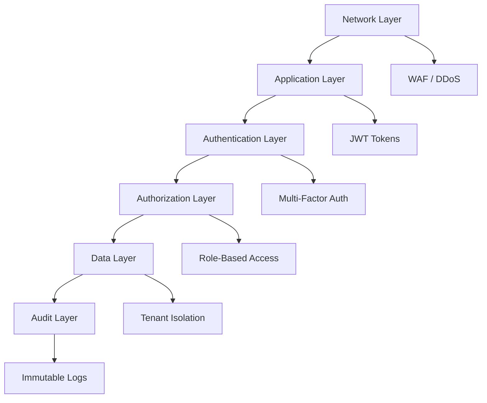
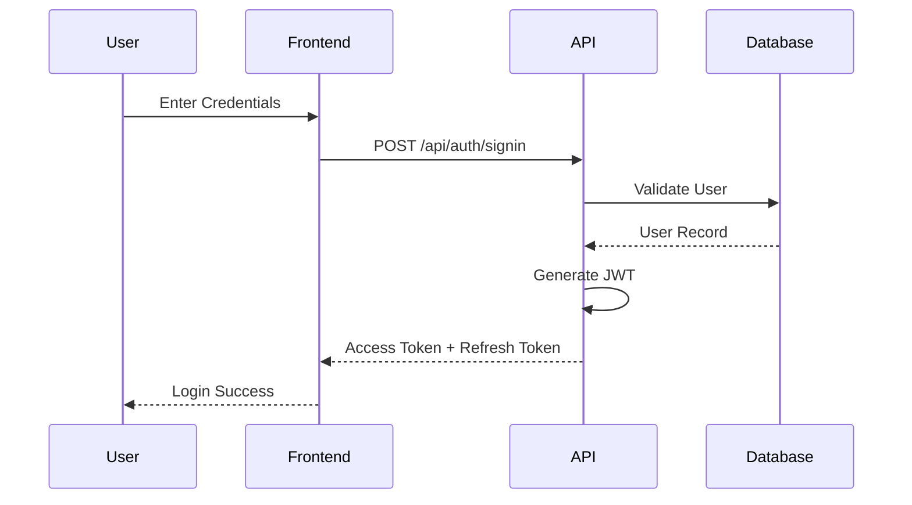
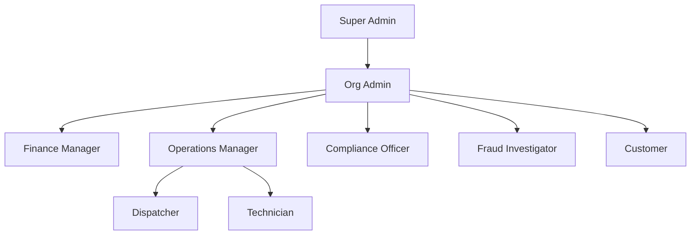
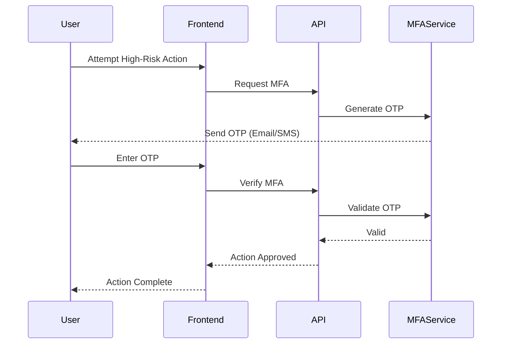
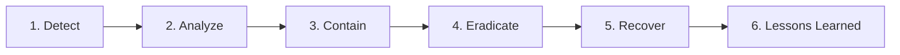

# Security and Access Control

**Guardian Flow v6.1.0**  
**Date:** November 1, 2025

---

## Table of Contents

1. [Security Overview](#security-overview)
2. [Authentication](#authentication)
3. [Authorization (RBAC)](#authorization-rbac)
4. [Application-Level Tenant Isolation](#application-level-tenant-isolation)
5. [Multi-Factor Authentication](#multi-factor-authentication)
6. [Audit Logging](#audit-logging)
7. [Data Protection](#data-protection)
8. [Network Security](#network-security)
9. [Compliance and Standards](#compliance-and-standards)
10. [Incident Response](#incident-response)

---

## Security Overview

Guardian Flow implements a **defense-in-depth** security strategy with multiple layers of protection:



### Security Principles

1. **Zero Trust**: Never trust, always verify
2. **Least Privilege**: Minimum necessary permissions
3. **Defense in Depth**: Multiple security layers
4. **Fail Secure**: Default deny, explicit allow
5. **Audit Everything**: Complete audit trail
6. **Encrypt Everything**: Data at rest and in transit

---

## Authentication

### JWT Token-Based Authentication

Guardian Flow uses JSON Web Tokens (JWT) for stateless authentication.

**Token Generation Flow**



### Token Structure

**Access Token (JWT)**
```json
{
  "sub": "user-uuid",
  "email": "user@example.com",
  "role": "authenticated",
  "aud": "authenticated",
  "iat": 1635724800,
  "exp": 1635728400
}
```

**Token Properties**
- **Algorithm**: HS256 (HMAC-SHA256)
- **Expiry**: 7 days (access token)
- **Issuer**: GuardianFlow Auth
- **Secret**: JWT_SECRET environment variable

### Authentication Methods

**Email/Password**
```typescript
const response = await fetch('/api/auth/signup', {
  method: 'POST',
  headers: { 'Content-Type': 'application/json' },
  body: JSON.stringify({
    email: 'user@example.com',
    password: 'secure_password',
    full_name: 'John Doe'
  })
});
```

**OAuth Providers** (Planned)
- Google
- Microsoft
- GitHub

**Magic Link** (Planned)
- Passwordless authentication via email

### Password Policy

**Requirements**
- Minimum 8 characters
- At least 1 uppercase letter
- At least 1 lowercase letter
- At least 1 number
- At least 1 special character

**Password Storage**
- Hashed using bcrypt
- Salt rounds: 10
- Never stored in plaintext

### Session Management

**Session Lifecycle**
1. User logs in → Access token issued
2. Token stored in memory (not localStorage for security)
3. Token included in Authorization header
4. Token expires → Use refresh token
5. User logs out → Token invalidated

**Token Refresh**
```typescript
const response = await fetch('/api/auth/refresh', {
  method: 'POST',
  headers: {
    'Content-Type': 'application/json',
    'Authorization': `Bearer ${refreshToken}`
  }
});
```

---

## Authorization (RBAC)

### Role Hierarchy



### Role Definitions

| Role | Description | Level |
|------|-------------|-------|
| **Super Admin** | Platform-wide administration | Platform |
| **Org Admin** | Organization management | Tenant |
| **Finance Manager** | Financial operations | Tenant |
| **Operations Manager** | Field operations | Tenant |
| **Compliance Officer** | Compliance and audit | Tenant |
| **Fraud Investigator** | Fraud detection and investigation | Tenant |
| **Dispatcher** | Work order dispatch | Tenant |
| **Technician** | Field technician | Tenant |
| **Customer** | Customer portal access | Tenant |

### Permission Model

**Permission Structure**: `resource:action`

**Example Permissions**
- `work_orders:create`
- `work_orders:read`
- `work_orders:update`
- `work_orders:delete`
- `invoices:approve`
- `audit_logs:read`
- `users:manage`

### Role-Permission Matrix

| Permission | Super Admin | Org Admin | Finance | Ops | Compliance | Fraud | Tech |
|-----------|------------|-----------|---------|-----|------------|-------|------|
| work_orders:create | ✅ | ✅ | ❌ | ✅ | ❌ | ❌ | ✅ |
| work_orders:delete | ✅ | ✅ | ❌ | ✅ | ❌ | ❌ | ❌ |
| invoices:approve | ✅ | ✅ | ✅ | ❌ | ❌ | ❌ | ❌ |
| audit_logs:read | ✅ | ✅ | ❌ | ❌ | ✅ | ✅ | ❌ |
| users:manage | ✅ | ✅ | ❌ | ❌ | ❌ | ❌ | ❌ |
| penalties:apply | ✅ | ✅ | ✅ | ❌ | ❌ | ❌ | ❌ |
| fraud:investigate | ✅ | ✅ | ❌ | ❌ | ❌ | ✅ | ❌ |

### Permission Checking

**Database Function**
```sql
CREATE OR REPLACE FUNCTION public.has_permission(
  _user_id uuid,
  _permission text
)
RETURNS boolean
LANGUAGE sql
STABLE
SECURITY DEFINER
SET search_path = public
AS $$
  SELECT EXISTS (
    SELECT 1
    FROM public.user_roles ur
    JOIN public.role_permissions rp ON rp.role = ur.role
    JOIN public.permissions p ON p.id = rp.permission_id
    WHERE ur.user_id = _user_id
      AND p.name = _permission
  )
$$;
```

**Frontend Check**
```typescript
const { hasPermission } = useActionPermissions();

if (hasPermission('work_orders:delete')) {
  // Show delete button
}
```

**Backend Check**
```typescript
const hasPermission = await checkPermission(user.id, 'work_orders:delete');
if (!hasPermission) {
  throw new Error('Permission denied');
}
```

---

## Application-Level Tenant Isolation

### Tenant Isolation Pattern

All tenant-scoped collections implement application-level tenant isolation.

**Standard Tenant Isolation Policy**
```sql
CREATE POLICY "tenant_isolation"
ON public.work_orders
FOR ALL
USING (
  tenant_id = (
    SELECT tenant_id
    FROM public.profiles
    WHERE id = auth.uid()
  )
);
```

### Permission-Based Tenant Isolation

Combine tenant isolation with permission checks.

```sql
CREATE POLICY "work_orders_delete"
ON public.work_orders
FOR DELETE
USING (
  tenant_id = (
    SELECT tenant_id
    FROM public.profiles
    WHERE id = auth.uid()
  )
  AND public.has_permission(auth.uid(), 'work_orders:delete')
);
```

### Tenant Isolation Performance

**Middleware Functions**
- Used to enforce tenant isolation at the middleware level
- Execute with service-level privileges
- Defined in `server/middleware/auth.js`

**Example**
```sql
CREATE OR REPLACE FUNCTION public.get_user_tenant_id(_user_id uuid)
RETURNS uuid
LANGUAGE sql
STABLE
SECURITY DEFINER
SET search_path = public
AS $$
  SELECT tenant_id
  FROM public.profiles
  WHERE id = _user_id
$$;
```

---

## Multi-Factor Authentication

### MFA for High-Risk Actions

Critical actions require MFA verification:
- Work order deletion
- Bulk data operations
- Permission changes
- Financial approvals

### MFA Flow



### OTP Generation

**Request MFA**
```typescript
POST /functions/v1/request-mfa
{
  "action": "delete_work_order",
  "context": {
    "work_order_id": "uuid"
  }
}
```

**Response**
```json
{
  "mfa_request_id": "uuid",
  "expires_at": "2025-11-01T10:05:00Z"
}
```

### OTP Verification

```typescript
POST /functions/v1/verify-mfa
{
  "code": "123456",
  "mfa_request_id": "uuid"
}
```

**OTP Properties**
- **Length**: 6 digits
- **Validity**: 5 minutes
- **Delivery**: Email (SMS planned)

---

## Audit Logging

### Comprehensive Audit Trail

All user actions are logged to an **immutable** audit log.

**Logged Events**
- Authentication (login, logout, failed attempts)
- Authorization (permission checks, role changes)
- Data mutations (create, update, delete)
- Configuration changes
- Security incidents

### Audit Log Structure

```sql
CREATE TABLE public.audit_logs (
  id UUID PRIMARY KEY,
  tenant_id UUID NOT NULL,
  user_id UUID,
  action TEXT NOT NULL,
  resource_type TEXT NOT NULL,
  resource_id UUID,
  old_values JSONB,
  new_values JSONB,
  ip_address INET,
  user_agent TEXT,
  correlation_id UUID,
  created_at TIMESTAMPTZ NOT NULL
);
```

### Immutability Enforcement

**Tenant Isolation Middleware**
```javascript
// Allow INSERT only
// Audit logs are append-only (immutable)
// No update or delete operations permitted

// Read access requires permission check
if (!hasPermission(user.id, 'audit_logs:read')) {
  throw new Error('Permission denied');
}
// Filter by tenant_id
const logs = await db.collection('audit_logs')
  .find({ tenant_id: user.tenant_id })
  .toArray();
```

### Audit Log Retention

- **Active**: 1 year in primary database
- **Archive**: 7 years in cold storage
- **Compliance**: SOC 2, ISO 27001 requirements

---

## Data Protection

### Encryption at Rest

**Database Encryption**
- Full database encryption via MongoDB Atlas
- AES-256 encryption algorithm
- Managed keys by MongoDB Atlas

**File Storage Encryption**
- S3-compatible storage with encryption
- Server-side encryption (SSE)

### Encryption in Transit

**TLS/SSL**
- TLS 1.3 for all connections
- HTTPS enforced for web traffic
- Certificate management via cloud provider

### Field-Level Encryption

For sensitive data (e.g., SSN, credit card):

```sql
-- Using pgcrypto extension
CREATE EXTENSION IF NOT EXISTS pgcrypto;

-- Encrypt field
UPDATE customers
SET ssn = pgp_sym_encrypt(ssn, 'encryption_key');

-- Decrypt field
SELECT pgp_sym_decrypt(ssn, 'encryption_key') AS ssn
FROM customers;
```

### Data Anonymization

**PII Masking**
```typescript
// Mask email
user@example.com → u***@example.com

// Mask phone
+1234567890 → +123***7890

// Mask SSN
123-45-6789 → ***-**-6789
```

### Data Deletion

**User Data Deletion**
- Soft delete: Mark as deleted, retain for 30 days
- Hard delete: Permanent removal after 30 days
- Cascade delete: Remove related records

**GDPR Compliance**
- Right to erasure (Article 17)
- Export user data on request
- Delete all personal data on request

---

## Network Security

### Web Application Firewall (WAF)

**Protection Against**
- SQL injection
- Cross-site scripting (XSS)
- Cross-site request forgery (CSRF)
- DDoS attacks

### Rate Limiting

**Per-User Limits**
- Anonymous: 10 req/min
- Authenticated: 100 req/min
- Admin: 1000 req/min

**Implementation**
```typescript
const rateLimit = {
  anonymous: 10,
  authenticated: 100,
  admin: 1000
};

// Check rate limit
if (requestCount > rateLimit[userType]) {
  throw new Error('Rate limit exceeded');
}
```

### CORS Configuration

```typescript
const corsHeaders = {
  'Access-Control-Allow-Origin': '*',
  'Access-Control-Allow-Headers': 
    'authorization, x-client-info, apikey, content-type',
  'Access-Control-Allow-Methods': 
    'POST, GET, PUT, DELETE, OPTIONS'
};
```

### Content Security Policy (CSP)

```http
Content-Security-Policy: 
  default-src 'self'; 
  script-src 'self' 'unsafe-inline'; 
  style-src 'self' 'unsafe-inline'; 
  img-src 'self' data: https:; 
  connect-src 'self' https://api.guardianflow.com;
```

---

## Compliance and Standards

### SOC 2 Type II

**Trust Service Criteria**
- **Security**: Access controls, encryption
- **Availability**: 99.9% uptime SLA
- **Processing Integrity**: Data validation
- **Confidentiality**: Data protection
- **Privacy**: PII handling

### ISO 27001

**Information Security Management**
- Risk assessment and treatment
- Security policies and procedures
- Incident management
- Business continuity
- Compliance monitoring

### GDPR

**Data Protection Principles**
- Lawfulness, fairness, transparency
- Purpose limitation
- Data minimization
- Accuracy
- Storage limitation
- Integrity and confidentiality

**User Rights**
- Right to access
- Right to rectification
- Right to erasure
- Right to data portability
- Right to object

---

## Incident Response

### Incident Response Plan



### Incident Severity Levels

| Level | Description | Response Time |
|-------|-------------|---------------|
| **Critical** | Data breach, system compromise | 15 minutes |
| **High** | Service outage, significant vulnerability | 1 hour |
| **Medium** | Performance degradation, minor vulnerability | 4 hours |
| **Low** | Cosmetic issues, non-urgent fixes | 24 hours |

### Security Incident Recording

```typescript
POST /functions/v1/record-security-incident
{
  "incident_type": "unauthorized_access_attempt",
  "severity": "high",
  "description": "Multiple failed login attempts detected",
  "affected_resource": "auth_system"
}
```

### Incident Communication

**Internal**
- Security team notified immediately
- Management briefed within 1 hour
- Engineering team engaged as needed

**External** (if required)
- Customer notification within 24 hours
- Regulatory reporting as required by law
- Public disclosure if data breach

---

## Security Best Practices

### Developer Guidelines

1. **Never log sensitive data** (passwords, tokens, PII)
2. **Always use parameterized queries** (prevent SQL injection)
3. **Validate all inputs** (prevent injection attacks)
4. **Use HTTPS** for all connections
5. **Implement rate limiting** on all endpoints
6. **Follow principle of least privilege**

### Code Review Checklist

- [ ] No hardcoded secrets
- [ ] Input validation implemented
- [ ] Output sanitization applied
- [ ] Authentication required
- [ ] Authorization checked
- [ ] Audit logging added
- [ ] Error messages don't leak sensitive info
- [ ] Rate limiting configured

### Security Testing

**Automated Testing**
- Static code analysis (SAST)
- Dependency vulnerability scanning
- Secret scanning in commits

**Manual Testing**
- Penetration testing (quarterly)
- Security code reviews
- Threat modeling

---

## Conclusion

Guardian Flow's security architecture provides:
- **Multi-layered Defense**: Network, application, data, audit
- **Zero Trust**: Continuous verification, least privilege
- **Compliance Ready**: SOC 2, ISO 27001, GDPR
- **Audit Trail**: Immutable logs, 7-year retention
- **Incident Response**: Rapid detection and response

Security is an ongoing process, continuously monitored and improved.
