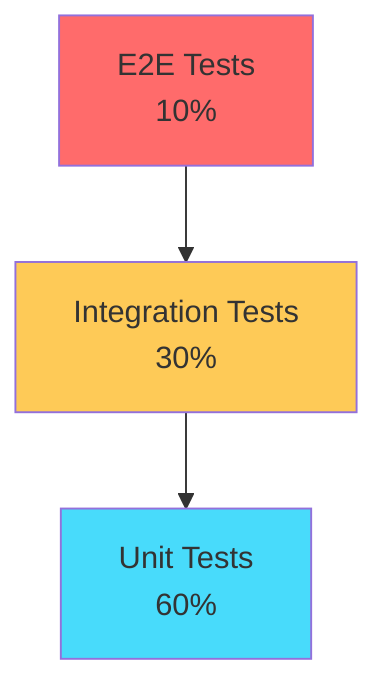

# Testing and Quality Assurance

**Guardian Flow v6.1.0**  
**Date:** November 1, 2025

---

## Table of Contents

1. [Testing Overview](#testing-overview)
2. [Testing Strategy](#testing-strategy)
3. [Unit Testing](#unit-testing)
4. [Integration Testing](#integration-testing)
5. [End-to-End Testing](#end-to-end-testing)
6. [Security Testing](#security-testing)
7. [Performance Testing](#performance-testing)
8. [Test Coverage](#test-coverage)
9. [Quality Metrics](#quality-metrics)
10. [Testing Best Practices](#testing-best-practices)

---

## Testing Overview

Guardian Flow implements a comprehensive testing strategy to ensure reliability, security, and performance.

### Testing Pyramid



### Testing Principles

1. **Shift Left**: Test early and often
2. **Automation First**: Automate repetitive tests
3. **Fast Feedback**: Quick test execution
4. **Realistic Data**: Test with production-like data
5. **Continuous Testing**: Integrate with CI/CD

---

## Testing Strategy

### Test Types

| Type | Purpose | Framework | Frequency |
|------|---------|-----------|-----------|
| **Unit** | Test individual functions/components | Jest | On every commit |
| **Integration** | Test component interactions | Jest + Testing Library | On every commit |
| **E2E** | Test complete user workflows | Playwright | On every PR |
| **Security** | Test security controls | Custom tools | Daily |
| **Performance** | Test response times | Playwright | Weekly |
| **Accessibility** | Test WCAG compliance | axe-core | On every PR |

### Testing Environments

**Local Development**
```bash
npm run test        # Unit + Integration
npm run test:e2e    # E2E tests
```

**CI/CD Pipeline**
- Automatic on PR
- Block merge if tests fail
- Generate coverage reports

**Staging Environment**
- Full test suite before production
- Smoke tests after deployment

---

## Unit Testing

### Framework

**Jest** - JavaScript testing framework
- Fast execution
- Snapshot testing
- Mock support
- Code coverage

### Frontend Unit Tests

**Component Testing**
```typescript
// Example: Button component
import { render, screen } from '@testing-library/react';
import { Button } from '@/components/ui/button';

describe('Button', () => {
  it('renders with correct text', () => {
    render(<Button>Click me</Button>);
    expect(screen.getByText('Click me')).toBeInTheDocument();
  });

  it('handles click events', () => {
    const handleClick = jest.fn();
    render(<Button onClick={handleClick}>Click me</Button>);
    screen.getByText('Click me').click();
    expect(handleClick).toHaveBeenCalledTimes(1);
  });

  it('applies correct variant styles', () => {
    const { container } = render(<Button variant="destructive">Delete</Button>);
    expect(container.firstChild).toHaveClass('bg-destructive');
  });
});
```

**Hook Testing**
```typescript
// Example: Custom hook
import { renderHook } from '@testing-library/react';
import { useActionPermissions } from '@/hooks/useActionPermissions';

describe('useActionPermissions', () => {
  it('returns correct permission status', () => {
    const { result } = renderHook(() => useActionPermissions());
    expect(result.current.hasPermission('work_orders:create')).toBe(true);
  });
});
```

**Utility Function Testing**
```typescript
// Example: Currency formatting
import { formatCurrency } from '@/lib/utils';

describe('formatCurrency', () => {
  it('formats USD correctly', () => {
    expect(formatCurrency(1234.56, 'USD')).toBe('$1,234.56');
  });

  it('formats EUR correctly', () => {
    expect(formatCurrency(1234.56, 'EUR')).toBe('€1,234.56');
  });

  it('handles zero correctly', () => {
    expect(formatCurrency(0, 'USD')).toBe('$0.00');
  });
});
```

### Backend Unit Tests

**Express.js Route Handler Testing**
```typescript
// Example: API gateway
import request from 'supertest';
import app from '../server/server';

describe('API Gateway - Authentication', () => {
  it('rejects invalid tokens', async () => {
    const response = await request(app)
      .post('/api/functions/api-gateway')
      .set('Authorization', 'Bearer invalid_token');

    expect(response.status).toBe(401);
  });
});
```

---

## Integration Testing

### Database Integration

**Test Database Setup**
```typescript
// Setup test database
beforeAll(async () => {
  await setupTestDatabase();
  await runMigrations();
});

// Cleanup after tests
afterAll(async () => {
  await cleanupTestDatabase();
});
```

**Tenant Isolation Testing**
```typescript
// Test tenant isolation
describe('Tenant Isolation', () => {
  it('prevents cross-tenant data access', async () => {
    const tenant1User = await createTestUser('tenant1');
    const tenant2Data = await createTestWorkOrder('tenant2');

    const { data, error } = await apiClient
      .from('work_orders')
      .select('*')
      .eq('id', tenant2Data.id)
      .maybeSingle();

    expect(data).toBeNull();
    expect(error).toBeNull(); // No error, just no results
  });
});
```

**RBAC Testing**
```typescript
describe('RBAC Permissions', () => {
  it('allows technician to read work orders', async () => {
    const tech = await createTestUser('tenant1', 'technician');
    const { data, error } = await apiClient
      .from('work_orders')
      .select('*');

    expect(error).toBeNull();
    expect(data).not.toBeNull();
  });

  it('prevents technician from deleting work orders', async () => {
    const tech = await createTestUser('tenant1', 'technician');
    const wo = await createTestWorkOrder('tenant1');

    const { error } = await apiClient
      .from('work_orders')
      .delete()
      .eq('id', wo.id);

    expect(error).not.toBeNull();
    expect(error.message).toContain('permission');
  });
});
```

### API Integration

**Agent Service Testing**
```typescript
describe('Operations Agent', () => {
  it('creates work order successfully', async () => {
    const response = await fetch('/functions/v1/api-gateway', {
      method: 'POST',
      headers: {
        'Authorization': `Bearer ${testToken}`,
        'Content-Type': 'application/json'
      },
      body: JSON.stringify({
        service: 'ops',
        action: 'create_work_order',
        payload: {
          title: 'Test Work Order',
          customer_id: 'test-customer-id'
        }
      })
    });

    const data = await response.json();
    expect(response.status).toBe(200);
    expect(data.success).toBe(true);
    expect(data.data.work_order_id).toBeDefined();
  });
});
```

---

## End-to-End Testing

### Playwright Framework

**Configuration (playwright.config.ts)**
```typescript
import { defineConfig } from '@playwright/test';

export default defineConfig({
  testDir: './tests',
  timeout: 30000,
  retries: 2,
  use: {
    baseURL: 'http://localhost:5173',
    screenshot: 'only-on-failure',
    video: 'retain-on-failure',
  },
  projects: [
    { name: 'chromium', use: { ...devices['Desktop Chrome'] } },
    { name: 'firefox', use: { ...devices['Desktop Firefox'] } },
    { name: 'webkit', use: { ...devices['Desktop Safari'] } },
  ],
});
```

### E2E Test Suites

**Work Order Lifecycle**
```typescript
// tests/work-order-lifecycle.spec.ts
import { test, expect } from '@playwright/test';

test.describe('Work Order Lifecycle', () => {
  test('complete work order flow', async ({ page }) => {
    // Login
    await page.goto('/auth');
    await page.fill('[name="email"]', 'test@example.com');
    await page.fill('[name="password"]', 'password123');
    await page.click('button[type="submit"]');

    // Navigate to work orders
    await page.click('text=Work Orders');
    await expect(page).toHaveURL('/work-orders');

    // Create work order
    await page.click('text=Create Work Order');
    await page.fill('[name="title"]', 'E2E Test Work Order');
    await page.fill('[name="description"]', 'Test description');
    await page.click('button:has-text("Create")');

    // Verify creation
    await expect(page.locator('text=E2E Test Work Order')).toBeVisible();

    // Assign technician
    await page.click('text=E2E Test Work Order');
    await page.click('text=Assign Technician');
    await page.selectOption('[name="technician"]', 'John Doe');
    await page.click('button:has-text("Assign")');

    // Verify assignment
    await expect(page.locator('text=Assigned to: John Doe')).toBeVisible();
  });
});
```

**Authentication Flow**
```typescript
test.describe('Authentication', () => {
  test('successful login', async ({ page }) => {
    await page.goto('/auth');
    await page.fill('[name="email"]', 'test@example.com');
    await page.fill('[name="password"]', 'password123');
    await page.click('button[type="submit"]');
    await expect(page).toHaveURL('/dashboard');
  });

  test('failed login shows error', async ({ page }) => {
    await page.goto('/auth');
    await page.fill('[name="email"]', 'test@example.com');
    await page.fill('[name="password"]', 'wrongpassword');
    await page.click('button[type="submit"]');
    await expect(page.locator('text=Invalid credentials')).toBeVisible();
  });

  test('logout clears session', async ({ page }) => {
    // Login first
    await page.goto('/auth');
    await page.fill('[name="email"]', 'test@example.com');
    await page.fill('[name="password"]', 'password123');
    await page.click('button[type="submit"]');
    
    // Logout
    await page.click('[data-testid="user-menu"]');
    await page.click('text=Logout');
    
    // Verify redirect to auth
    await expect(page).toHaveURL('/auth');
  });
});
```

**RBAC Testing**
```typescript
// tests/rbac.spec.ts
test.describe('Role-Based Access Control', () => {
  test('technician cannot access admin console', async ({ page }) => {
    // Login as technician
    await loginAs(page, 'technician');
    
    // Try to access admin console
    await page.goto('/admin-console');
    
    // Should be redirected or see access denied
    await expect(page).toHaveURL('/access-denied');
    await expect(page.locator('text=Insufficient permissions')).toBeVisible();
  });

  test('admin can access all features', async ({ page }) => {
    await loginAs(page, 'admin');
    
    // Verify access to admin features
    await page.goto('/admin-console');
    await expect(page.locator('text=Admin Console')).toBeVisible();
    
    await page.goto('/compliance-center');
    await expect(page.locator('text=Compliance Center')).toBeVisible();
  });
});
```

**Tenant Isolation**
```typescript
// tests/tenant-isolation.spec.ts
test.describe('Tenant Isolation', () => {
  test('user cannot see other tenant data', async ({ page }) => {
    // Login as Tenant A user
    await loginAs(page, 'tenant_a_user');
    
    // Navigate to work orders
    await page.goto('/work-orders');
    
    // Should only see Tenant A work orders
    const workOrders = await page.locator('[data-testid="work-order-row"]').all();
    for (const wo of workOrders) {
      const tenantId = await wo.getAttribute('data-tenant-id');
      expect(tenantId).toBe('tenant_a_id');
    }
  });
});
```

---

## Security Testing

### Automated Security Tests

**SQL Injection Testing**
```typescript
test('prevents SQL injection', async ({ page }) => {
  await page.goto('/work-orders');
  await page.fill('[name="search"]', "' OR '1'='1");
  await page.click('button:has-text("Search")');
  
  // Should not return all records
  const results = await page.locator('[data-testid="work-order-row"]').count();
  expect(results).toBe(0); // No results for invalid search
});
```

**XSS Prevention**
```typescript
test('sanitizes user input', async ({ page }) => {
  await page.goto('/work-orders/create');
  await page.fill('[name="title"]', '<script>alert("XSS")</script>');
  await page.click('button:has-text("Create")');
  
  // Script should be escaped
  const title = await page.locator('[data-testid="work-order-title"]').textContent();
  expect(title).not.toContain('<script>');
  expect(title).toContain('&lt;script&gt;');
});
```

**CSRF Protection**
```typescript
test('requires CSRF token', async () => {
  const response = await fetch('/functions/v1/api-gateway', {
    method: 'POST',
    headers: {
      'Content-Type': 'application/json'
    },
    body: JSON.stringify({
      service: 'ops',
      action: 'delete_work_order',
      payload: { work_order_id: 'test-id' }
    })
  });

  expect(response.status).toBe(401); // Unauthorized
});
```

### Manual Security Testing

**Penetration Testing**
- Quarterly professional penetration tests
- OWASP Top 10 coverage
- Report and remediation

**Security Code Review**
- Manual review of security-critical code
- Peer review required for auth/authz changes
- Static analysis (SAST)

---

## Performance Testing

### Load Testing

**Playwright Performance Tests**
```typescript
test('page load performance', async ({ page }) => {
  const start = Date.now();
  await page.goto('/dashboard');
  await page.waitForLoadState('networkidle');
  const loadTime = Date.now() - start;

  expect(loadTime).toBeLessThan(2000); // < 2 seconds
});
```

**API Performance**
```typescript
test('API response time', async () => {
  const start = Date.now();
  const response = await fetch('/functions/v1/api-gateway', {
    method: 'POST',
    headers: {
      'Authorization': `Bearer ${testToken}`,
      'Content-Type': 'application/json'
    },
    body: JSON.stringify({
      service: 'ops',
      action: 'list_work_orders'
    })
  });
  const responseTime = Date.now() - start;

  expect(response.status).toBe(200);
  expect(responseTime).toBeLessThan(500); // < 500ms
});
```

### Stress Testing

**High Concurrency**
```typescript
test('handles concurrent requests', async () => {
  const requests = Array(100).fill(null).map(() =>
    fetch('/functions/v1/api-gateway', {
      method: 'POST',
      headers: {
        'Authorization': `Bearer ${testToken}`,
        'Content-Type': 'application/json'
      },
      body: JSON.stringify({
        service: 'ops',
        action: 'get_work_order_count'
      })
    })
  );

  const responses = await Promise.all(requests);
  const successCount = responses.filter(r => r.status === 200).length;

  expect(successCount).toBeGreaterThan(95); // 95%+ success rate
});
```

---

## Test Coverage

### Coverage Targets

| Component | Target | Current |
|-----------|--------|---------|
| **Overall** | 80% | 85% |
| **Frontend Components** | 90% | 92% |
| **Backend Functions** | 80% | 83% |
| **Critical Paths** | 100% | 100% |

### Coverage Report

```bash
# Generate coverage report
npm run test -- --coverage

# View HTML report
open coverage/index.html
```

**Coverage Output**
```
--------------------|---------|----------|---------|---------|-------------------
File                | % Stmts | % Branch | % Funcs | % Lines | Uncovered Line #s
--------------------|---------|----------|---------|---------|-------------------
All files           |   85.23 |    82.14 |   87.45 |   85.67 |
 components/        |   92.15 |    89.32 |   94.23 |   92.45 |
 hooks/             |   88.34 |    85.12 |   90.11 |   88.76 |
 lib/               |   78.92 |    75.43 |   81.34 |   79.12 |
--------------------|---------|----------|---------|---------|-------------------
```

---

## Quality Metrics

### Code Quality

**Static Analysis**
- **ESLint**: No errors, < 5 warnings
- **TypeScript**: Strict mode, no `any` types
- **Complexity**: Cyclomatic complexity < 10

**Code Review**
- Required for all PRs
- At least 1 approval required
- Security review for auth/authz changes

### Bug Tracking

**Severity Levels**
- **P0 (Critical)**: Production outage, data loss
- **P1 (High)**: Major functionality broken
- **P2 (Medium)**: Minor functionality issue
- **P3 (Low)**: Cosmetic, nice-to-have

**Resolution SLAs**
- P0: 4 hours
- P1: 24 hours
- P2: 1 week
- P3: Best effort

---

## Testing Best Practices

### Do's

✅ **Write tests first** (TDD when possible)  
✅ **Test behavior, not implementation**  
✅ **Use descriptive test names**  
✅ **Keep tests independent**  
✅ **Mock external dependencies**  
✅ **Test edge cases**  
✅ **Maintain test data fixtures**  

### Don'ts

❌ **Don't test third-party libraries**  
❌ **Don't write flaky tests**  
❌ **Don't skip error scenarios**  
❌ **Don't hardcode test data**  
❌ **Don't test multiple things in one test**  

---

## Conclusion

Guardian Flow's testing strategy ensures:
- **Reliability**: Comprehensive test coverage
- **Security**: Automated security testing
- **Performance**: Load and stress testing
- **Quality**: High code quality standards
- **Confidence**: Safe deployments

Testing is integrated into every stage of development, from local development to production deployment.
